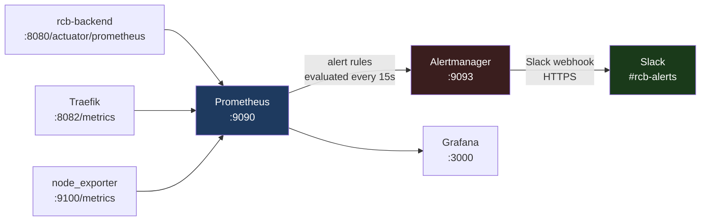

# Alertmanager Setup

Prometheus Alertmanager receives firing alerts from Prometheus and routes them to Slack.

---

## Alert Flow



:::note Internal Only
Prometheus (`:9090`) and Alertmanager (`:9093`) are on `rcb_internal` network only. They are **never** accessible from the internet.
:::

---

## Components

### Prometheus

**Image:** `prom/prometheus:v2.53.0`
**Config:** `infra/local/observability/prometheus/prometheus.yml`
**Data retention:** 30 days (`--storage.tsdb.retention.time=30d`)

Prometheus scrapes metrics from:
- `rcb-backend:8080/actuator/prometheus` — Spring Boot Micrometer metrics
- `rcb_traefik:8082/metrics` — Traefik request metrics
- `node_exporter:9100/metrics` — VPS system metrics (requires node_exporter deployment)

### Alertmanager

**Image:** `prom/alertmanager:v0.27.0`
**Config:** `infra/local/observability/alertmanager/alertmanager.yml` (generated — gitignored)
**Template:** `infra/local/observability/alertmanager/alertmanager.yml.template` (committed)

---

## Alert Rules

Defined in `infra/local/observability/prometheus/alert-rules.yml`:

### `ServiceDown` — Critical

```yaml
alert: ServiceDown
expr: up == 0
for: 2m
labels:
  severity: critical
annotations:
  summary: "RCB service {{ $labels.job }} is unreachable"
  description: >
    Prometheus cannot scrape {{ $labels.job }} at {{ $labels.instance }}.
    The service may be down or its health endpoint is failing.
    Check VPS: make status
```

**Fires when:** Prometheus cannot scrape any target for more than 2 minutes.
**Covers:** rcb-backend, Traefik, postgres-exporter.

---

### `High5xxRate` — Warning

```yaml
alert: High5xxRate
expr: |
  sum(rate(http_server_requests_seconds_count{outcome="SERVER_ERROR"}[5m]))
  /
  sum(rate(http_server_requests_seconds_count[5m])) > 0.01
for: 5m
labels:
  severity: warning
```

**Fires when:** More than 1% of backend requests return 5xx errors over 5 minutes.
**Metric source:** Spring Boot Micrometer `http_server_requests_seconds_count` with `outcome="SERVER_ERROR"`.

---

### `JvmHeapHigh` — Warning

```yaml
alert: JvmHeapHigh
expr: |
  jvm_memory_used_bytes{area="heap"}
  /
  jvm_memory_max_bytes{area="heap"} > 0.85
for: 5m
labels:
  severity: warning
```

**Fires when:** JVM heap exceeds 85% capacity for more than 5 minutes.
**Metric source:** Spring Boot JVM metrics via Micrometer.

---

### `DiskSpaceLow` — Warning

```yaml
alert: DiskSpaceLow
expr: |
  node_filesystem_avail_bytes{mountpoint="/"}
  /
  node_filesystem_size_bytes{mountpoint="/"} < 0.20
for: 10m
labels:
  severity: warning
```

**Fires when:** Root filesystem has less than 20% free space for more than 10 minutes.
**Requires:** `node_exporter` running and scraped by Prometheus.

---

## Alertmanager Configuration

### Template File (Committed to Git)

`infra/local/observability/alertmanager/alertmanager.yml.template`:

```yaml
global:
  resolve_timeout: 5m

route:
  group_by: ['alertname', 'job']
  group_wait: 30s        # wait before sending first alert in group
  group_interval: 5m     # wait between sending alerts for same group
  repeat_interval: 4h    # repeat firing alert every 4 hours
  receiver: 'slack-rcb'

receivers:
  - name: 'slack-rcb'
    slack_configs:
      - api_url: '${SLACK_WEBHOOK_URL}'
        channel: '#rcb-alerts'
        send_resolved: true
        title: '{{ if eq .Status "firing" }}🔴{{ else }}✅{{ end }} RCB Alert: {{ .GroupLabels.alertname }}'
        text: |
          {{ range .Alerts }}
          *Summary:* {{ .Annotations.summary }}
          *Details:* {{ .Annotations.description }}
          *Severity:* {{ .Labels.severity }}
          {{ end }}
        icon_emoji: ':rotating_light:'
        username: 'RCB Alertmanager'

inhibit_rules: []
```

### Generate the Real Config

```bash
# On VPS — SLACK_WEBHOOK_URL must be set in /opt/rcb/.env or exported
export SLACK_WEBHOOK_URL=$(grep '^SLACK_WEBHOOK_URL=' /opt/rcb/.env | cut -d'=' -f2)

envsubst < infra/local/observability/alertmanager/alertmanager.yml.template \
  > infra/local/observability/alertmanager/alertmanager.yml

# Verify
cat infra/local/observability/alertmanager/alertmanager.yml | grep api_url
# Should show real URL, NOT ${SLACK_WEBHOOK_URL}
```

---

## Prometheus Configuration

`infra/local/observability/prometheus/prometheus.yml` — key sections:

```yaml
# Alert rules loaded from file
rule_files:
  - "/etc/prometheus/alert-rules.yml"

# Alertmanager integration
alerting:
  alertmanagers:
    - static_configs:
        - targets:
            - alertmanager:9093

# Scrape targets
scrape_configs:
  - job_name: 'rcb-backend'
    metrics_path: /actuator/prometheus
    static_configs:
      - targets: ['rcb-backend:8080']

  - job_name: 'traefik'
    static_configs:
      - targets: ['rcb_traefik:8082']
```

---

## Docker Compose Service

```yaml
alertmanager:
  image: prom/alertmanager:v0.27.0
  container_name: rcb_alertmanager
  restart: unless-stopped
  volumes:
    - ../local/observability/alertmanager/alertmanager.yml:/etc/alertmanager/alertmanager.yml:ro
    - alertmanager_data:/alertmanager
  command:
    - '--config.file=/etc/alertmanager/alertmanager.yml'
    - '--storage.path=/alertmanager'
    - '--log.level=info'
  networks:
    - rcb_internal        # Internal only — never exposed to internet
  healthcheck:
    test: ["CMD-SHELL", "wget -qO- http://localhost:9093/-/healthy || exit 1"]
    interval: 30s
    timeout: 5s
    retries: 3
```

---

## Reload Without Restart

After modifying `alertmanager.yml` or `alert-rules.yml`, reload without downtime:

```bash
# Reload Alertmanager config
docker exec rcb_alertmanager kill -HUP 1

# Reload Prometheus rules
docker compose -f /opt/rcb/docker-compose.prod.yml kill -s HUP prometheus

# Or via HTTP API
curl -X POST http://localhost:9090/-/reload
```

---

## Verify Alert Rules

```bash
# Check Prometheus rules are loaded
curl -s http://localhost:9090/api/v1/rules | jq '.data.groups[].rules[].name'

# Check Alertmanager is receiving from Prometheus
curl -s http://localhost:9093/api/v2/status | jq '.versionInfo'

# Manually fire a test alert (useful for webhook testing)
curl -X POST http://localhost:9093/api/v2/alerts \
  -H 'Content-Type: application/json' \
  -d '[{"labels":{"alertname":"TestAlert","severity":"warning"},"annotations":{"summary":"Test from CLI","description":"This is a test alert."}}]'
```

---

## Troubleshooting

| Symptom | Likely cause | Fix |
|---------|-------------|-----|
| No alerts firing | `alertmanager.yml` has `${SLACK_WEBHOOK_URL}` not substituted | Re-run `envsubst` |
| Alerts fire but no Slack message | Wrong webhook URL | Check `SLACK_WEBHOOK_URL` in `.env` |
| `ServiceDown` firing for `node_exporter` | `node_exporter` not deployed | Deploy node_exporter or suppress the alert |
| `High5xxRate` has no data | Spring Boot not exposing `/actuator/prometheus` | Check `management.endpoints.web.exposure.include=prometheus` |
| Prometheus can't reach Alertmanager | Network misconfiguration | Ensure both on `rcb_internal`; check `docker network inspect rcb_internal` |
