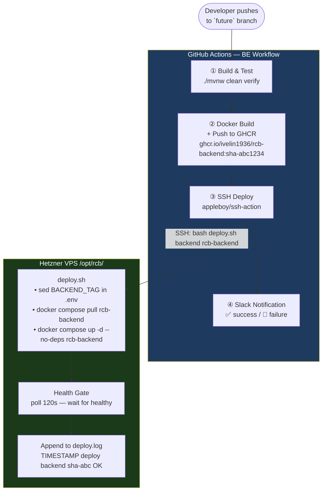
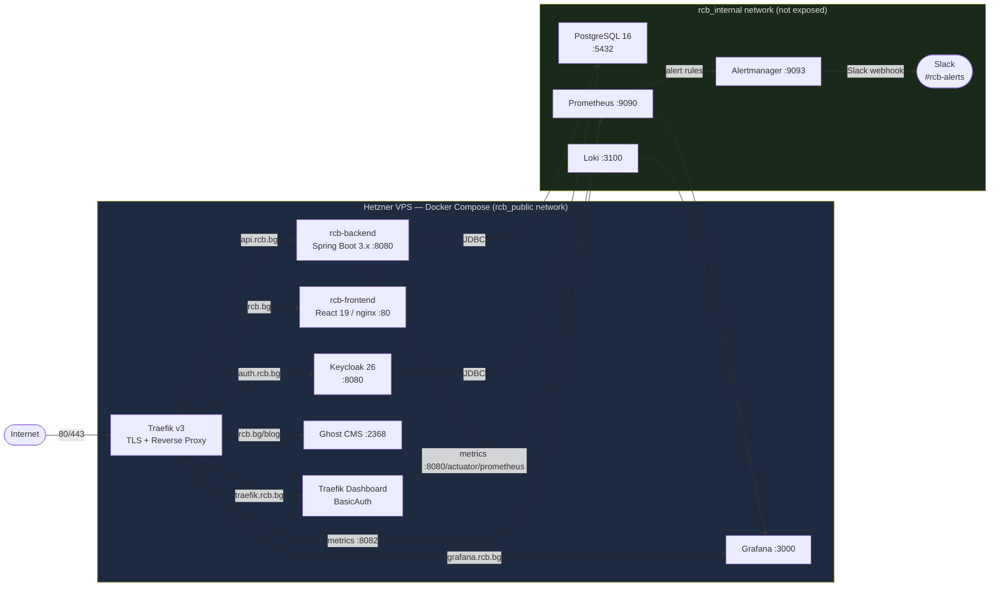
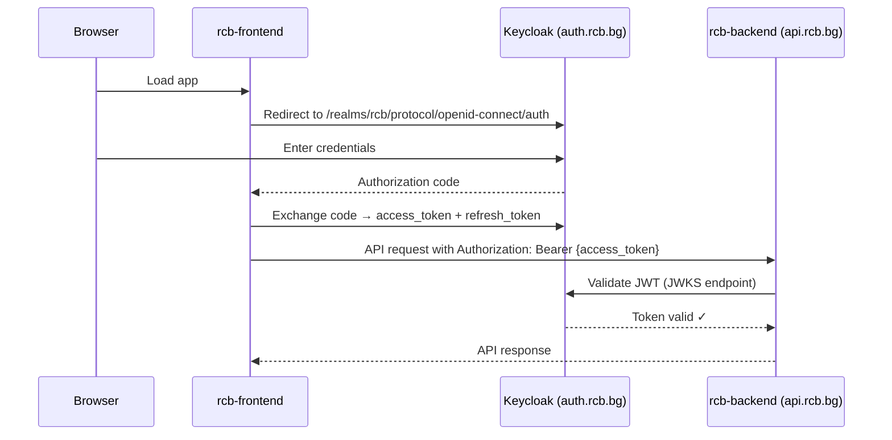

# Architecture Overview

This page describes the full production architecture: how source code flows from a developer's machine to a live URL, and how alerts are fired when something goes wrong.

---

## CI/CD Flow



---

## Production Stack



---

## Network Architecture

| Network | Purpose | Who's on it |
|---------|---------|-------------|
| `rcb_public` | Internet-facing; Traefik routes here | traefik, backend, frontend, keycloak, ghost, grafana |
| `rcb_internal` | Isolated; never exposed to internet | postgres, prometheus, alertmanager, loki, backend, keycloak, grafana |
| `ghost_internal` | Ghost-only isolation | ghost, ghost-db |

**Rule:** PostgreSQL, Prometheus, Alertmanager, and Loki are **never** on `rcb_public`. They cannot be reached from the internet.

---

## Authentication Flow



---

## Image Tagging Convention

Every Docker image is tagged with the short Git SHA at the time of the push:

```
ghcr.io/ivelin1936/rcb-backend:sha-abc1234
ghcr.io/ivelin1936/rcb-backend:future       ← branch tag (latest on future)
ghcr.io/ivelin1936/rcb-frontend:sha-abc1234
ghcr.io/ivelin1936/rcb-frontend:master
```

The SHA tag is used for rollback. The branch tag (`future` / `master`) is always the latest deployed image.

---

## Repositories

| Repo | Purpose | Branch |
|------|---------|--------|
| [`ivelin1936/Renault-Club-Bulgaria`](https://github.com/ivelin1936/Renault-Club-Bulgaria) | Spring Boot BE, infra scripts, backlog | `future` |
| [`ivelin1936/renault-club-bulgaria-fe`](https://github.com/ivelin1936/renault-club-bulgaria-fe) | React FE | `master` |
| [`ivelin1936/rcb-docusaurus`](https://github.com/ivelin1936/rcb-docusaurus) | This documentation site | `main` |
