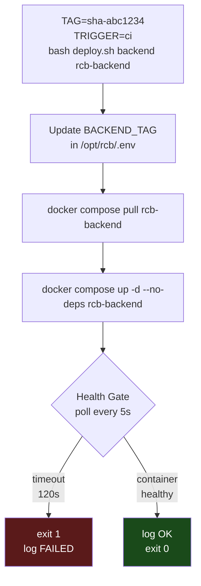
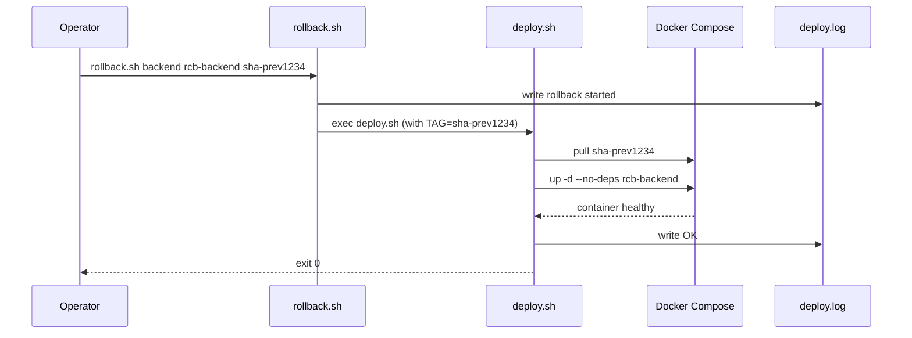

# Deploy & Rollback

Daily operations: deploying a new image, rolling back to a previous one, and verifying platform health.

---

## Deploy Flow



---

## `deploy.sh` — Script Reference

**Location:** `/opt/rcb/scripts/deploy.sh`

```bash
# Usage
TAG=sha-abc1234 TRIGGER=ci bash /opt/rcb/scripts/deploy.sh backend rcb-backend
TAG=sha-abc1234 TRIGGER=ci bash /opt/rcb/scripts/deploy.sh frontend rcb-frontend
```

**What it does:**

1. Updates `BACKEND_TAG` (or `FRONTEND_TAG`) in `/opt/rcb/.env` with `sed`
2. Pulls the new image: `docker compose pull <service>`
3. Restarts only the one service: `docker compose up -d --no-deps <service>`
4. Polls Docker health status every 5 seconds
5. Writes result to `/opt/rcb/deploy.log`

**Health gate timeouts:**

| Service | Timeout |
|---------|---------|
| `backend` (Spring Boot) | 120 seconds |
| `frontend` (nginx) | 60 seconds |

**Exit codes:**

| Code | Meaning |
|------|---------|
| `0` | Deploy succeeded, service is healthy |
| `1` | Health gate timed out or command failed |

---

## Makefile Targets

The `Makefile` at `/opt/rcb/Makefile` wraps the scripts for convenience:

```bash
# Deploy a specific image tag
make deploy-backend TAG=sha-abc1234
make deploy-frontend TAG=sha-def5678

# Rollback to a previous tag
make rollback-backend TAG=sha-prev1234
make rollback-frontend TAG=sha-prev5678

# Check platform health
make health

# Show container status
make status

# Tail logs
make logs              # all containers
make logs-backend
make logs-frontend

# Deploy audit log
make logs-deploy       # last 50 entries
make logs-deploy-full  # full log
```

---

## Rollback



**Rollback is a forward deploy with an older tag.** The `sha-` tags are immutable in GHCR.

```bash
# Find the previous tag from deploy.log
make logs-deploy
# Output example:
# 2026-02-27T14:00:00Z deploy backend sha-abc1234 trigger=ci OK
# 2026-02-27T12:30:00Z deploy backend sha-prev1234 trigger=ci OK  ← use this

# Rollback backend to previous image
make rollback-backend TAG=sha-prev1234

# Rollback frontend
make rollback-frontend TAG=sha-prev5678
```

:::tip Find tags from GHCR
If `deploy.log` is missing, find all available tags at:
`https://github.com/ivelin1936?tab=packages` → select the package → Tags.
:::

---

## Health Check

```bash
make health
```

Runs `scripts/health-check.sh` which verifies:

| Check | What it verifies |
|-------|-----------------|
| Container health | `docker inspect` → `State.Health.Status == healthy` |
| Frontend HTTPS | `https://rcb.bg` returns 2xx |
| Backend actuator | `https://api.rcb.bg/actuator/health` returns `{"status":"UP"}` |
| Keycloak OIDC | `https://auth.rcb.bg/realms/rcb/.well-known/openid-configuration` accessible |
| TLS certificate | curl strict mode — cert is valid and not expired |

---

## Deploy Audit Log

Every deploy writes a line to `/opt/rcb/deploy.log`:

```
2026-02-27T14:00:00Z deploy backend sha-abc1234 trigger=ci STARTED
2026-02-27T14:01:45Z deploy backend sha-abc1234 trigger=ci OK
2026-02-27T14:05:00Z deploy frontend sha-def5678 trigger=ci STARTED
2026-02-27T14:05:30Z deploy frontend sha-def5678 trigger=ci OK
```

`trigger=ci` — deployed by GitHub Actions
`trigger=manual` — deployed by an operator

---

## Manual Deploy (Emergency)

To deploy without triggering GitHub Actions:

```bash
ssh deploy@<VPS_IP>
cd /opt/rcb

# Pull latest image manually
echo "$GHCR_TOKEN" | docker login ghcr.io -u ivelin1936 --password-stdin

# Deploy specific tag
TAG=sha-abc1234 TRIGGER=manual bash scripts/deploy.sh backend rcb-backend

# Or use make
make deploy-backend TAG=sha-abc1234
```

---

## Checking Container Status

```bash
make status
# Output:
# NAME              STATUS                    IMAGE
# rcb_traefik       Up 5 hours (healthy)      traefik:v3.2
# rcb_backend       Up 5 hours (healthy)      ghcr.io/ivelin1936/rcb-backend:sha-abc1234
# rcb_frontend      Up 5 hours (healthy)      ghcr.io/ivelin1936/rcb-frontend:sha-def5678
# rcb_keycloak      Up 5 hours (healthy)      quay.io/keycloak/keycloak:26.0
# rcb_postgres      Up 5 hours (healthy)      postgres:16-alpine
# rcb_prometheus    Up 5 hours                prom/prometheus:v2.53.0
# rcb_alertmanager  Up 5 hours (healthy)      prom/alertmanager:v0.27.0
# rcb_grafana       Up 5 hours                grafana/grafana:11.0.0
# rcb_loki          Up 5 hours                grafana/loki:3.0.0
# rcb_ghost         Up 5 hours                ghost:5-alpine
```

---

## Disk Space Maintenance

Docker images accumulate over time. Clean up periodically:

```bash
# Remove images older than 7 days (safe — running images are protected)
docker image prune -a --filter "until=168h"

# See what's using disk
df -h /
docker system df
```

The `DiskSpaceLow` Prometheus alert fires when root filesystem drops below 20% free.
