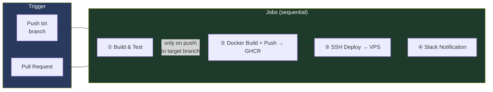

# GitHub Actions CI/CD

The RCB platform uses GitHub Actions for automated build, test, Docker image publishing, and deployment to the Hetzner VPS.

---

## Pipeline Overview



---

## Backend Pipeline

**Repo:** `ivelin1936/Renault-Club-Bulgaria`
**Target branch:** `future`
**Workflow file:** `.github/workflows/ci.yml`

### Triggers

```yaml
on:
  push:
    branches: [ "future" ]
  pull_request:
    branches: [ "future" ]
```

- **Pull requests** → runs `build` job only (lint + test, no deploy)
- **Push to `future`** → runs full pipeline: build → docker → deploy → slack

### Job 1: Build & Test

```yaml
- uses: actions/setup-java@v4
  with:
    java-version: '21'
    distribution: 'temurin'
    cache: maven

- name: Build and test with Maven
  run: ./mvnw -B clean verify --file pom.xml
```

Runs `./mvnw clean verify` — compiles, runs unit tests, integration tests, ArchUnit checks.

### Job 2: Docker Build & Push

```yaml
- name: Extract short SHA
  run: echo "short=$(git rev-parse --short HEAD)" >> $GITHUB_OUTPUT

- name: Build and push image
  uses: docker/build-push-action@v6
  with:
    context: .
    file: infra/prod/Dockerfile
    platforms: linux/amd64
    push: true
    tags: |
      ghcr.io/ivelin1936/rcb-backend:sha-<SHORT_SHA>
      ghcr.io/ivelin1936/rcb-backend:future
```

Pushes two tags:
- `sha-<short-git-sha>` — immutable, used for deploys and rollbacks
- `future` — mutable branch tag (always latest on `future`)

### Job 3: SSH Deploy

```yaml
- uses: appleboy/ssh-action@v1.0.3
  with:
    host: ${{ secrets.VPS_HOST }}
    username: ${{ secrets.VPS_USER }}
    key: ${{ secrets.VPS_SSH_KEY }}
    script: |
      cd /opt/rcb
      echo "${{ secrets.GHCR_TOKEN }}" | docker login ghcr.io -u ivelin1936 --password-stdin
      TRIGGER=ci TAG=sha-${{ needs.docker.outputs.image_sha }} \
        bash /opt/rcb/scripts/deploy.sh backend rcb-backend
```

The `deploy.sh` script:
1. Updates `BACKEND_TAG` in `/opt/rcb/.env`
2. Pulls the new image: `docker compose pull rcb-backend`
3. Restarts the service: `docker compose up -d --no-deps rcb-backend`
4. Polls health gate for up to **120 seconds**
5. Writes audit entry to `/opt/rcb/deploy.log`

### Job 4: Slack Notification

```yaml
- name: Notify Slack — Deploy Success
  if: success()
  uses: slackapi/slack-github-action@v2.0.0
  with:
    webhook: ${{ secrets.SLACK_WEBHOOK_URL }}
    webhook-type: incoming-webhook
    payload: |
      {"text": "✅ *RCB Backend deployed successfully*\n• Tag: `sha-...`\n• Branch: `future`"}

- name: Notify Slack — Deploy Failure
  if: failure()
  uses: slackapi/slack-github-action@v2.0.0
  ...
```

---

## Frontend Pipeline

**Repo:** `ivelin1936/renault-club-bulgaria-fe`
**Target branch:** `master`
**Workflow file:** `.github/workflows/ci.yml`

### Triggers

```yaml
on:
  push:
    branches: [master, future, feature/**]
  pull_request:
    branches: [master, future]
```

### Job 1: Lint · Test · Build

```yaml
- name: Install dependencies
  run: npm ci --prefer-offline || npm ci

- name: Lint
  run: npm run lint

- name: Type check
  run: npm run type-check

- name: Unit tests
  run: npm run test -- --coverage

- name: Build
  run: npm run build
  env:
    VITE_KEYCLOAK_URL: http://localhost:8180
    VITE_KEYCLOAK_REALM: rcb
    VITE_KEYCLOAK_CLIENT_ID: rcb-frontend
    VITE_API_BASE_URL: http://localhost:8080
```

### Job 2: Docker Build & Push

Same as BE — pushes `sha-<short-sha>` and `master` tags to GHCR.

### Job 3: SSH Deploy

```bash
TRIGGER=ci TAG=sha-${{ needs.docker.outputs.image_sha }} \
  bash /opt/rcb/scripts/deploy.sh frontend rcb-frontend
```

Health gate timeout is **60 seconds** (nginx starts much faster than Spring Boot).

### Job 4: Slack Notification

Same pattern as BE — success/failure notifications to `#rcb-alerts`.

---

## Required GitHub Secrets

| Secret | Repos | Description |
|--------|-------|-------------|
| `VPS_HOST` | BE, FE | VPS IP address or hostname |
| `VPS_USER` | BE, FE | SSH username on VPS |
| `VPS_SSH_KEY` | BE, FE | SSH private key (full key, including headers) |
| `GHCR_TOKEN` | BE, FE | GitHub PAT with `read:packages` scope |
| `SLACK_WEBHOOK_URL` | BE, FE | Slack incoming webhook URL |

`GITHUB_TOKEN` is automatically provided by GitHub Actions — used for GHCR push (`write:packages`).

---

## Environments

Both pipelines use a `production` **GitHub Environment** on the deploy job:

```yaml
deploy:
  environment: production
```

This allows you to require manual approval before deployments by adding protection rules in **Settings → Environments → production**.

---

## Image Tags Convention

| Tag | Example | Meaning |
|-----|---------|---------|
| `sha-<7-char-sha>` | `sha-abc1234` | Immutable — exact commit deployed |
| branch name | `future` / `master` | Mutable — always latest on that branch |

Use the `sha-` tag for rollbacks — the branch tag changes on every push.

---

## Dependency Submission (BE only)

The BE workflow runs `advanced-security/maven-dependency-submission-action` after build to improve Dependabot alert quality in the security tab.

---

## Story 018 — Security & E2E Jobs

Story 018 added new CI jobs to the frontend pipeline and a standalone weekly security workflow to the backend.

### FE CI — New `e2e` Job (between `lint-test-build` and `docker`)

The frontend `ci.yml` now has a 3-job sequence:

```
lint-test-build → e2e → docker → deploy → slack
```

The `e2e` job runs Playwright end-to-end tests against the locally-started dev server. It runs only **Desktop Chrome** and **Phone (375px)** device projects to keep CI time under 5 minutes:

```yaml
e2e:
  needs: lint-test-build
  runs-on: ubuntu-latest
  steps:
    - uses: actions/checkout@v4
    - uses: actions/setup-node@v4
      with:
        node-version: '20'
        cache: 'npm'
    - run: npm ci
    - run: npx playwright install chromium --with-deps
    - name: Run E2E tests
      run: npx playwright test --project="Desktop Chrome" --project="Phone (375px)"
      env:
        PLAYWRIGHT_BASE_URL: http://localhost:5173
        KEYCLOAK_URL: http://localhost:8180
        KEYCLOAK_REALM: rcb
        KEYCLOAK_CLIENT_ID: rcb-frontend-test
        TEST_USER_PASSWORD: ${{ secrets.TEST_USER_PASSWORD }}
        TEST_ADMIN_PASSWORD: ${{ secrets.TEST_ADMIN_PASSWORD }}
        TEST_MOD_PASSWORD: ${{ secrets.TEST_MOD_PASSWORD }}
    - name: Upload Playwright HTML report
      if: always()
      uses: actions/upload-artifact@v4
      with:
        name: playwright-report
        path: playwright-report/
        retention-days: 30
```

**Docker job now requires both `lint-test-build` AND `e2e`:**

```yaml
docker:
  needs: [lint-test-build, e2e]   # ← both must pass before image is built
  ...
```

This means a failing E2E test blocks the Docker build and prevents deployment.

### FE CI — Additional GitHub Secrets Required

The following secrets must be added to the FE repo for E2E tests to authenticate via Keycloak:

| Secret | Description |
|--------|-------------|
| `TEST_USER_PASSWORD` | Password for `testuser@rcb.bg` (regular member role) |
| `TEST_ADMIN_PASSWORD` | Password for `testadmin@rcb.bg` (admin role) |
| `TEST_MOD_PASSWORD` | Password for `testmod@rcb.bg` (moderator role) |

### BE — New Weekly `security-scan.yml` Workflow

A new standalone workflow file `.github/workflows/security-scan.yml` runs every Saturday at 02:00 UTC independently of the main `ci.yml` pipeline. It does not build or deploy anything — it only scans.

The workflow has 4 parallel jobs:

| Job | Tool | Fails On |
|-----|------|----------|
| `dependency-check` | OWASP Maven plugin | CVSS ≥ 9.0 in any dependency |
| `npm-audit` | `npm audit` | Any `critical` npm vulnerability |
| `zap-scan` | OWASP ZAP baseline | Any FAIL-configured alert in `.zap/rules.tsv` |
| `security-headers` | `curl` + `grep` | Any required header missing from `/api/v1/home` |

See [Weekly Security Scan](../security/weekly-security-scan) for the full workflow configuration.

---

## Adding a New Service to CI/CD

1. Add a Docker image build step with `docker/build-push-action`
2. Add a deploy step calling `deploy.sh <service-name> <compose-service-name>`
3. Ensure the service has a `healthcheck` in `docker-compose.prod.yml`
4. Add a `SLACK_WEBHOOK_URL` notification step (copy the success/failure pattern)
