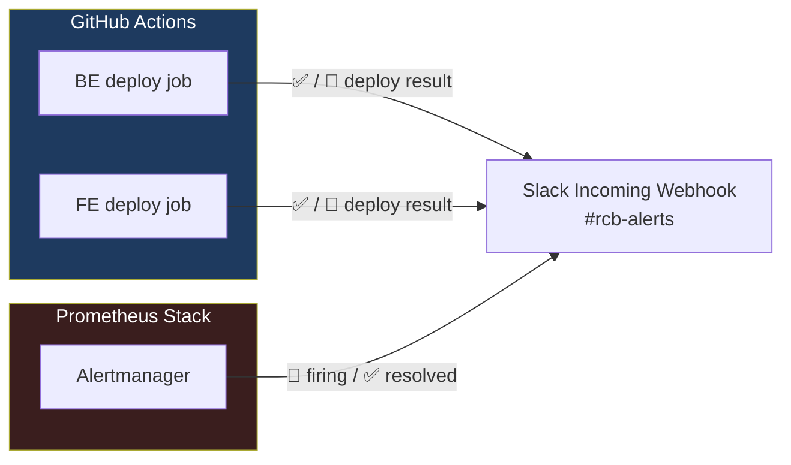

# Slack Notifications

The RCB platform sends two types of notifications to Slack:

1. **Deploy notifications** — sent by GitHub Actions on deploy success or failure
2. **Infrastructure alerts** — sent by Prometheus Alertmanager when service is down / degraded

Both use the **same Slack channel** (`#rcb-alerts`) and the **same webhook URL** (`SLACK_WEBHOOK_URL`).

---

## Notification Flow



---

## Step 1 — Create a Slack App & Incoming Webhook

1. Go to [api.slack.com/apps](https://api.slack.com/apps) → **Create New App** → **From scratch**
2. Name: `RCB Alertmanager`, workspace: your Slack workspace
3. In the left sidebar → **Incoming Webhooks** → toggle **Activate Incoming Webhooks** ON
4. Click **Add New Webhook to Workspace**
5. Select the channel `#rcb-alerts` (create it first if it doesn't exist)
6. Click **Allow**
7. Copy the webhook URL — it looks like:
   ```
   https://hooks.slack.com/services/T.../B.../...
   ```

:::warning Keep this URL secret
The webhook URL grants anyone the ability to post to your Slack channel. Never commit it to git.
:::

---

## Step 2 — Add to VPS `.env`

```bash
# /opt/rcb/.env
SLACK_WEBHOOK_URL=https://hooks.slack.com/services/T.../B.../...
```

---

## Step 3 — Regenerate Alertmanager Config

After setting `SLACK_WEBHOOK_URL` in `.env`, regenerate the Alertmanager config:

```bash
export SLACK_WEBHOOK_URL=$(grep '^SLACK_WEBHOOK_URL=' /opt/rcb/.env | cut -d'=' -f2)

envsubst < /opt/rcb/infra/local/observability/alertmanager/alertmanager.yml.template \
  > /opt/rcb/infra/local/observability/alertmanager/alertmanager.yml

# Reload Alertmanager
docker exec rcb_alertmanager kill -HUP 1
```

---

## Step 4 — Add to GitHub Actions Secrets

Add `SLACK_WEBHOOK_URL` as a repository secret in **both** repos:

- `ivelin1936/Renault-Club-Bulgaria` → Settings → Secrets → Actions
- `ivelin1936/renault-club-bulgaria-fe` → Settings → Secrets → Actions

---

## Step 5 — Test the Webhook

```bash
# Test directly
curl -X POST -H 'Content-type: application/json' \
  --data '{"text":"✅ RCB webhook test — if you see this, Slack is configured correctly"}' \
  $SLACK_WEBHOOK_URL
```

Expected: message appears in `#rcb-alerts`.

---

## Message Examples

### GitHub Actions — Deploy Success

```
✅ *RCB Backend deployed successfully*
• Tag: `sha-abc1234`
• Branch: `future`
• View run → https://github.com/.../actions/runs/...
```

### GitHub Actions — Deploy Failure

```
🔴 *RCB Backend deploy FAILED*
• Branch: `future`
• Tag: `sha-abc1234`
• View failed run → https://github.com/.../actions/runs/...
```

### Alertmanager — Firing Alert

```
🔴 RCB Alert: ServiceDown

*Summary:* RCB service rcb-backend is unreachable
*Details:* Prometheus cannot scrape rcb-backend at rcb-backend:8080.
           The service may be down or its health endpoint is failing.
           Check VPS: make status
*Severity:* critical
```

### Alertmanager — Resolved Alert

```
✅ RCB Alert: ServiceDown

*Summary:* RCB service rcb-backend is unreachable
*Details:* ...
*Severity:* critical
```

---

## GitHub Actions Notification Configuration

The `slackapi/slack-github-action@v2.0.0` action is used in both BE and FE pipelines:

```yaml
- name: Notify Slack — Deploy Success
  if: success()
  uses: slackapi/slack-github-action@v2.0.0
  with:
    webhook: ${{ secrets.SLACK_WEBHOOK_URL }}
    webhook-type: incoming-webhook
    payload: |
      {
        "text": "✅ *RCB Backend deployed successfully*\n• Tag: `sha-${{ needs.docker.outputs.image_sha }}`\n• Branch: `future`\n• <${{ github.server_url }}/${{ github.repository }}/actions/runs/${{ github.run_id }}|View run>"
      }

- name: Notify Slack — Deploy Failure
  if: failure()
  uses: slackapi/slack-github-action@v2.0.0
  with:
    webhook: ${{ secrets.SLACK_WEBHOOK_URL }}
    webhook-type: incoming-webhook
    payload: |
      {
        "text": "🔴 *RCB Backend deploy FAILED*\n• Branch: `future`\n• Tag: `sha-${{ needs.docker.outputs.image_sha }}`\n• <${{ github.server_url }}/${{ github.repository }}/actions/runs/${{ github.run_id }}|View failed run>"
      }
```

`if: success()` and `if: failure()` evaluate the entire job status — not just the previous step.

---

## Alertmanager Notification Configuration

The Alertmanager Slack config (from `alertmanager.yml.template`):

```yaml
receivers:
  - name: 'slack-rcb'
    slack_configs:
      - api_url: '${SLACK_WEBHOOK_URL}'
        channel: '#rcb-alerts'
        send_resolved: true          # also notify when alert resolves
        title: '{{ if eq .Status "firing" }}🔴{{ else }}✅{{ end }} RCB Alert: {{ .GroupLabels.alertname }}'
        text: |
          {{ range .Alerts }}
          *Summary:* {{ .Annotations.summary }}
          *Details:* {{ .Annotations.description }}
          *Severity:* {{ .Labels.severity }}
          {{ end }}
        icon_emoji: ':rotating_light:'
        username: 'RCB Alertmanager'
```

**Key settings:**
- `send_resolved: true` — sends a green `✅` message when the issue clears
- `group_by: ['alertname', 'job']` — groups related alerts into one Slack message
- `repeat_interval: 4h` — re-notifies if alert is still firing after 4 hours

---

## Troubleshooting

| Symptom | Fix |
|---------|-----|
| No messages in Slack | Verify `SLACK_WEBHOOK_URL` with the curl test above |
| `channel_not_found` error | Create `#rcb-alerts` channel in Slack, then re-add webhook |
| Alerts not sent but webhook works | Check Prometheus → Alertmanager connection: `curl http://localhost:9093/api/v2/status` |
| Duplicate alert messages | Check `group_interval` and `repeat_interval` in `alertmanager.yml` |
| Old webhook URL (rotated) | Update `.env`, re-run `envsubst`, reload Alertmanager, update GitHub secret |
