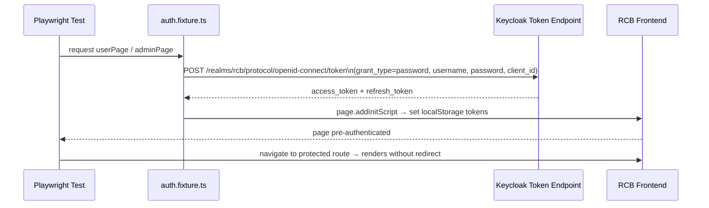
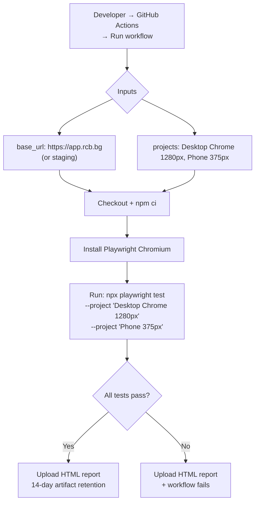

# E2E Testing (Playwright)

The RCB frontend uses **Playwright** for end-to-end tests covering all major user flows across multiple viewports. Tests run against a live application (local dev server or deployed environment).

---

## Overview

| Item | Detail |
|------|--------|
| **Framework** | Playwright (`@playwright/test`) |
| **Location** | `renault-club-bulgaria-fe/e2e/` |
| **Browsers** | Chromium only (6 viewport configurations) |
| **Auth** | Keycloak ROPC flow via REST API fixture |
| **CI trigger** | Manual (workflow_dispatch) |

---

## Test Files

| File | What it covers |
|------|----------------|
| `home.spec.ts` | Home page structure, hero section, navigation links |
| `auth.spec.ts` | Authentication guards, protected routes, public routes, 404 handling |
| `events.spec.ts` | Event listing, detail page navigation |
| `news.spec.ts` | News listing and detail pages |
| `gallery.spec.ts` | Gallery album rendering |
| `campaigns.spec.ts` | Campaigns page rendering |
| `cars.spec.ts` | Car catalog flows |
| `membership.spec.ts` | Membership page layout |
| `contact.spec.ts` | Contact form validation, responsive layout |
| `partners.spec.ts` | Partners page rendering |
| `newsletter.spec.ts` | Newsletter subscription flows |
| `admin.spec.ts` | Admin route access control, responsive tables |
| `responsive.spec.ts` | Full responsive design validation (6 viewports) |

---

## Viewports

| Project name | Width |
|-------------|-------|
| Desktop Chrome (1280px) | 1280 × 720 |
| Wide Desktop (1920px) | 1920 × 1080 |
| Tablet Landscape (1024px) | 1024 × 768 |
| Tablet Portrait (768px) | 768 × 1024 |
| Phone (375px) | 375 × 812 |
| Phone Small (320px) | 320 × 568 |

---

## Authentication Fixture

Tests that require a logged-in user use the custom auth fixture at `e2e/fixtures/auth.fixture.ts`.

**How it works:** Keycloak ROPC (Resource Owner Password Credentials) — calls the Keycloak token endpoint directly, stores tokens in `localStorage`, bypassing the browser login UI.



**Environment variables for fixtures:**

| Variable | Default | Purpose |
|----------|---------|---------|
| `KEYCLOAK_URL` | `http://localhost:8180` | Keycloak base URL |
| `KEYCLOAK_REALM` | `rcb` | Realm name |
| `KEYCLOAK_CLIENT_ID` | `rcb-frontend` | OIDC client |
| `TEST_USER_USERNAME` | `user@rcb.bg` | Regular user credentials |
| `TEST_USER_PASSWORD` | `Test1234!` | |
| `TEST_ADMIN_USERNAME` | `admin@rcb.bg` | Admin credentials |
| `TEST_ADMIN_PASSWORD` | `Test1234!` | |

If Keycloak is not reachable, `isKeycloakAvailable()` returns `false` and auth-dependent tests are skipped gracefully.

---

## How to Run

### Prerequisites

```bash
cd renault-club-bulgaria-fe
npm ci
npx playwright install chromium
```

### Commands

```bash
# Run all E2E tests (starts dev server automatically)
npm run e2e

# Run with browser visible (headed mode)
npm run e2e:headed

# Open Playwright Inspector UI
npm run e2e:ui

# View HTML report from last run
npm run e2e:report
```

### Against a deployed environment

```bash
# Override base URL (no dev server started — uses remote)
PLAYWRIGHT_BASE_URL=https://staging.rcb.bg npx playwright test
```

---

## Playwright Config (`playwright.config.ts`)

| Setting | Local | CI |
|---------|-------|-----|
| Base URL | `http://localhost:5173` (override via `PLAYWRIGHT_BASE_URL`) | From workflow input |
| Parallel | `fullyParallel: true` | `workers: 1` (sequential) |
| Retries | 0 | 2 |
| Screenshots | On failure | On failure |
| Traces | Off | On first retry |
| Web server | `npm run dev` (auto-started) | Not started (remote target) |
| Timeout | 120s startup | — |

---

## CI Workflow

E2E tests are **not** run on every push. They are triggered **manually** via GitHub Actions.



**Workflow file:** `.github/workflows/e2e.yml`

**Inputs:**

| Input | Default | Description |
|-------|---------|-------------|
| `base_url` | `https://app.rcb.bg` | Target environment URL |
| `projects` | `Desktop Chrome (1280px),Phone (375px)` | Comma-separated Playwright project names |

---

## Application Properties

No backend properties needed for E2E tests. All configuration is frontend environment variables.

---

## Security Notes

- ROPC grant is used **only for E2E test automation** — never in production user flows
- Test credentials (`TEST_USER_USERNAME`, `TEST_ADMIN_USERNAME`) are stored as GitHub Actions secrets
- E2E tests run against staging/production over HTTPS — no direct DB access
- `isKeycloakAvailable()` prevents test failures when running in environments without Keycloak

---

## QA Checklist

- [ ] `npm run e2e` passes locally with dev server running
- [ ] All 13 spec files complete without failures
- [ ] Auth fixture authenticates successfully (Keycloak available locally)
- [ ] `responsive.spec.ts` passes on all 6 viewport sizes
- [ ] `admin.spec.ts` passes — admin routes redirect non-admins correctly
- [ ] HTML report opens and shows all test results: `npm run e2e:report`
- [ ] CI workflow runs successfully on target environment via workflow_dispatch
