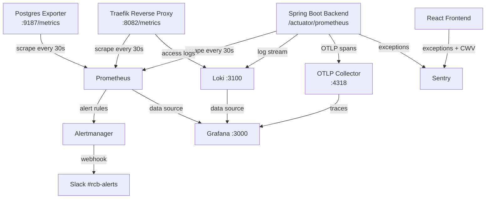
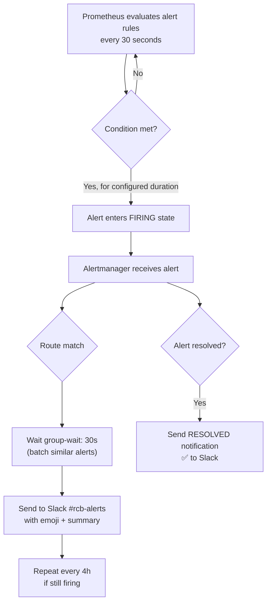
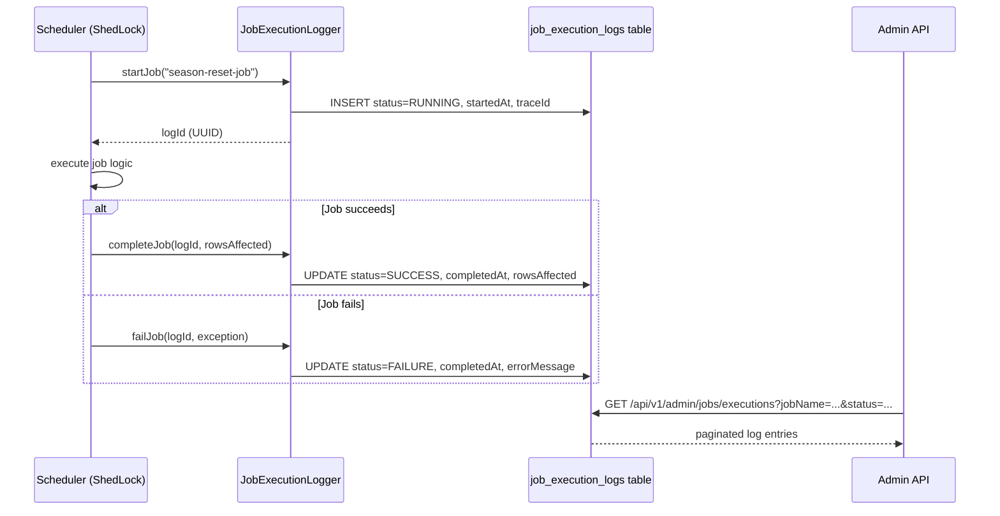

# Monitoring & Observability

The RCB platform uses a full open-source observability stack: **Prometheus** (metrics), **Grafana** (dashboards), **Loki** (logs), **Alertmanager** (alerts → Slack), and **Sentry** (error tracking for both BE and FE).

---

## Architecture



---

## Components

| Component | Image | Port | Purpose |
|-----------|-------|------|---------|
| Prometheus | `prom/prometheus:v2.53.0` | 9090 | Metrics collection, evaluation, alert firing |
| Grafana | `grafana/grafana:11.0.0` | 3000 | Dashboards, visualization |
| Loki | `grafana/loki:v3.0.0` | 3100 | Log aggregation and querying |
| Alertmanager | `prom/alertmanager:v0.27.0` | 9093 | Alert routing → Slack |
| Sentry (SaaS) | — | — | Error monitoring + performance tracing |

---

## Spring Boot Actuator & Metrics

The backend exposes metrics via Spring Boot Actuator + Micrometer.

**Actuator base path:** `/api/v1/actuator`

| Endpoint | URL | Auth required | Description |
|----------|-----|---------------|-------------|
| Health | `/api/v1/actuator/health` | No (summary) | UP/DOWN status |
| Liveness | `/api/v1/actuator/health/liveness` | No | Kubernetes liveness probe |
| Readiness | `/api/v1/actuator/health/readiness` | No | Kubernetes readiness probe |
| Prometheus | `/api/v1/actuator/prometheus` | Internal only | All Micrometer metrics in Prometheus format |
| Info | `/api/v1/actuator/info` | No | Git commit, build info |

All metrics are tagged with `application=rcb-backend` for Grafana label filtering.

**Tracing:** Micrometer + OpenTelemetry bridge exports spans to Grafana Tempo (or any OTLP-compatible collector) at `OTEL_EXPORTER_OTLP_ENDPOINT` (default: `http://localhost:4318/v1/traces`).

**Sentry BE:** Configured via `SENTRY_DSN` env var. Captures unhandled exceptions. 10% traces sample rate in production.

---

## Prometheus

**Config file:** `infra/local/observability/prometheus/prometheus.yml`

### Scrape targets

| Job | Target | Metrics path |
|-----|--------|--------------|
| `rcb-backend` | `rcb-backend:8080` | `/api/v1/actuator/prometheus` |
| `traefik` | `traefik:8082` | `/metrics` |
| `postgres-exporter` | `postgres-exporter:9187` | `/metrics` |

- Scrape interval: **30 seconds**
- Metrics retention: **30 days**
- Alert rules file: `/etc/prometheus/alert-rules.yml`

### Reload alert rules without restart

```bash
docker compose kill -s HUP prometheus
```

---

## Alert Rules

**Config file:** `infra/local/observability/prometheus/alert-rules.yml`

| Alert | Severity | Condition | For |
|-------|----------|-----------|-----|
| `ServiceDown` | CRITICAL | Prometheus cannot scrape a target | 2 min |
| `High5xxRate` | WARNING | > 1% of HTTP requests return 5xx | 5 min |
| `JvmHeapHigh` | WARNING | JVM heap usage > 85% | 5 min |
| `DiskSpaceLow` | WARNING | Root filesystem free space < 20% | 10 min |

### Alert flow



---

## Alertmanager

**Template:** `infra/local/observability/alertmanager/alertmanager.yml.template`

Slack webhook URL is injected via `${SLACK_WEBHOOK_URL}` at VPS bootstrap time (never stored in git).

| Setting | Value |
|---------|-------|
| Channel | `#rcb-alerts` |
| Group by | alert name + job |
| Group wait | 30 seconds |
| Group interval | 5 minutes |
| Repeat interval | 4 hours |
| Firing indicator | 🔴 |
| Resolved indicator | ✅ |

---

## Loki (Log Aggregation)

**Config:** `infra/local/observability/loki/loki-config.yaml`

| Setting | Value |
|---------|-------|
| HTTP port | 3100 |
| Storage | Filesystem (`/loki/chunks`) |
| Schema | v13 (TSDB) from 2024-01-01 |
| Index period | 24 hours |
| Retention | 30 days |

Logs are queried in Grafana using **LogQL**. Each Spring Boot log line includes `traceId` and `spanId` (MDC) for correlation with distributed traces.

---

## Grafana

**Production URL:** `https://grafana.rcb.bg` (behind Traefik HTTPS)

**Admin password:** Injected via `GRAFANA_ADMIN_PASSWORD` env var (not in git).

**Data sources provisioned:**
- Prometheus (metrics)
- Loki (logs)

**Sign-up:** Disabled (`GF_USERS_ALLOW_SIGN_UP=false`).

---

## Frontend — Sentry

Sentry is initialized in `src/app/main.tsx` when `VITE_SENTRY_DSN` is set.

| Setting | Value |
|---------|-------|
| Traces sample rate | 10% (production) |
| Environment | `import.meta.env.MODE` |
| Source maps | Uploaded in CI via `@sentry/vite-plugin` |
| Error boundary | `ErrorBoundary` calls `Sentry.captureException()` |

Sentry is **disabled in local development** (empty `VITE_SENTRY_DSN`).

---

## Scheduled Job Execution Logs

All scheduled jobs instrument themselves via `JobExecutionLogger`. Results are persisted to the `job_execution_logs` table and exposed via an Admin REST endpoint.



### Admin API endpoint

```
GET /api/v1/admin/jobs/executions
```

**Auth:** `ROLE_ADMIN` or `ROLE_ROOT_ADMIN` required.

**Query parameters:**

| Parameter | Type | Required | Description |
|-----------|------|----------|-------------|
| `jobName` | string | No | Filter by exact job name |
| `status` | string | No | `RUNNING` / `SUCCESS` / `FAILURE` |
| `page` | integer | No (default 0) | Zero-based page number |
| `size` | integer | No (default 20) | Page size |

**Example:**

```bash
curl -H "Authorization: Bearer <JWT>" \
  "https://api.rcb.bg/api/v1/admin/jobs/executions?status=FAILURE&page=0&size=10"
```

**Response fields:**

| Field | Description |
|-------|-------------|
| `jobName` | ShedLock job identifier |
| `status` | `RUNNING` / `SUCCESS` / `FAILURE` |
| `startedAt` | ISO-8601 start timestamp |
| `completedAt` | ISO-8601 completion timestamp |
| `durationMs` | Computed duration in milliseconds |
| `rowsAffected` | DB rows modified by the job |
| `errorMessage` | Exception stack trace (max 2000 chars) |
| `traceId` | MDC trace ID for Sentry/Loki correlation |

---

## Application Properties

| Property | Default | When to change |
|----------|---------|----------------|
| `management.endpoints.web.base-path` | `/api/v1/actuator` | Never (security boundary) |
| `management.tracing.sampling.probability` | `1.0` (local), `0.1` (prod) | Lower in prod to reduce OTLP volume |
| `SENTRY_DSN` (env) | `` (empty) | Set in prod/staging deployments |
| `OTEL_EXPORTER_OTLP_ENDPOINT` (env) | `http://localhost:4318/v1/traces` | Set to Grafana Tempo endpoint in prod |
| `SLACK_WEBHOOK_URL` (env) | — | Set at VPS bootstrap, never in git |
| `GRAFANA_ADMIN_PASSWORD` (env) | — | Set at VPS bootstrap |

---

## Security Notes

- Prometheus and Alertmanager are on the internal `rcb_internal` Docker network — not internet-exposed
- Grafana is behind Traefik with HTTPS at `grafana.rcb.bg` — no HTTP access
- `/api/v1/actuator/prometheus` is only reachable from within the Docker network (Prometheus scrapes it internally)
- `GET /api/v1/admin/jobs/executions` requires `ROLE_ADMIN` — no public access
- Slack webhook URL and Grafana admin password are injected at runtime — never committed to git

---

## QA Checklist

- [ ] `GET /api/v1/actuator/health` returns `{"status":"UP"}`
- [ ] Prometheus targets page shows `rcb-backend` target as UP (green)
- [ ] Grafana loads at `http://localhost:3000` (local) or `https://grafana.rcb.bg` (prod)
- [ ] Alert rules visible in Prometheus UI under Alerts
- [ ] `GET /api/v1/admin/jobs/executions` returns paginated job log entries (with valid JWT)
- [ ] Sentry receives test error in staging (`Sentry.captureMessage("test")`)
- [ ] Alertmanager fires test alert to Slack `#rcb-alerts` channel
