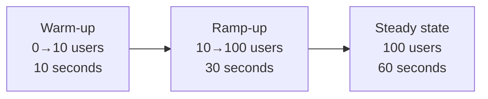
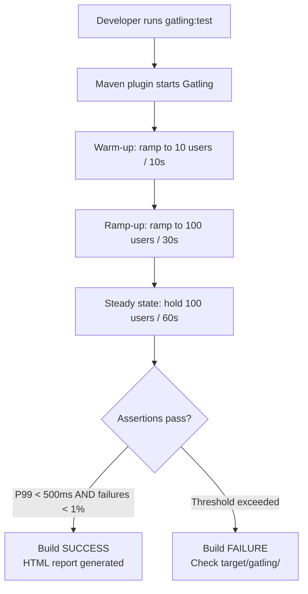
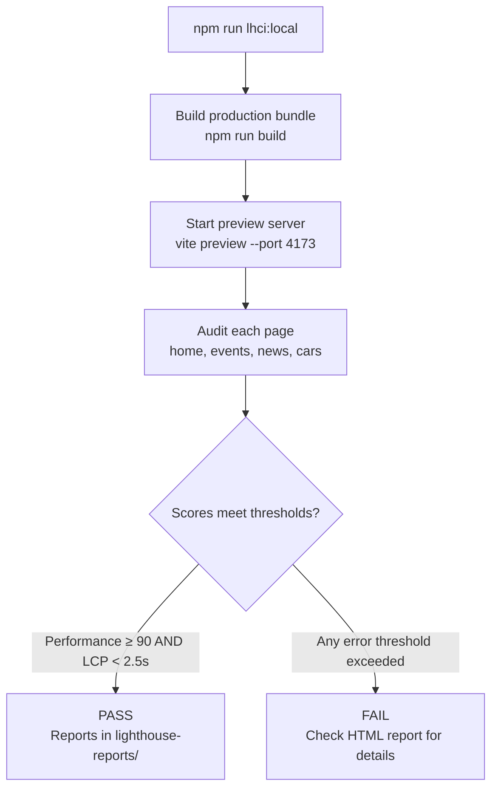

# Performance Testing

The RCB platform uses two complementary performance testing tools: **Gatling** for backend load testing and **Lighthouse CI** for frontend Core Web Vitals auditing.

---

## Overview

| Tool | Scope | What it tests |
|------|-------|---------------|
| **Gatling 3.13.5** | Backend (Spring Boot) | Load throughput, P99 latency, failure rate under concurrent users |
| **Lighthouse CI** | Frontend (React SPA) | Core Web Vitals (LCP, CLS, INP), performance score, accessibility, SEO |
| **web-vitals (runtime)** | Frontend (production) | Real-user CWV monitoring via browser instrumentation |

---

## Backend — Gatling Load Tests

### Location

```
renault-club-bulgaria-be/
└── perf-tests/
    ├── pom.xml                     ← Gatling Maven plugin config
    └── src/test/scala/com/rcb/perf/
        └── RcbReadEndpointsSimulation.scala
```

### What is tested

The `RcbReadEndpointsSimulation` exercises all public read endpoints under realistic load:

| Endpoint | Description |
|----------|-------------|
| `GET /api/v1/home` | Home page stats |
| `GET /api/v1/events?page=0&size=12` | Event listing |
| `GET /api/v1/news?page=0&size=12` | News listing |
| `GET /api/v1/partners` | Partners list |
| `GET /api/v1/campaigns?page=0&size=12` | Campaigns listing |
| `GET /api/v1/gallery?page=0&size=12` | Gallery albums |
| `GET /api/v1/cars?page=0&size=12` | Car catalog |

Also validates security headers on every response:
- `X-Content-Type-Options: nosniff`
- `X-Frame-Options: DENY`
- `Content-Security-Policy` (presence check)

### Load profile



### Thresholds (NFR)

| Assertion | Threshold | What happens on failure |
|-----------|-----------|------------------------|
| P99 response time | < 500 ms | Build fails |
| Request failure rate | < 1% | Build fails |

### How to run

```bash
# Against local backend (default: http://localhost:8080)
cd renault-club-bulgaria-be/perf-tests
../mvnw gatling:test

# Against staging
cd renault-club-bulgaria-be/perf-tests
../mvnw gatling:test -DbaseUrl=https://staging.rcb.bg
```

Reports are generated in `perf-tests/target/gatling/` as HTML.

### Workflow



---

## Frontend — Lighthouse CI

### Location

```
renault-club-bulgaria-fe/
├── lighthouserc.js       ← Lighthouse CI configuration
└── lighthouse-reports/   ← Generated reports (gitignored)
```

### Pages audited

| Page | URL |
|------|-----|
| Home | `/` |
| Events | `/events` |
| News | `/news` |
| Garage | `/cars` |

### Thresholds

| Category | Min Score | On Fail |
|----------|-----------|---------|
| Performance | ≥ 90 | ❌ Error (hard fail) |
| Accessibility | ≥ 85 | ⚠️ Warning |
| Best Practices | ≥ 85 | ⚠️ Warning |
| SEO | ≥ 80 | ⚠️ Warning |

### Core Web Vitals assertions

| Metric | Threshold | Level |
|--------|-----------|-------|
| LCP (Largest Contentful Paint) | < 2.5s | Error |
| CLS (Cumulative Layout Shift) | < 0.1 | Error |
| TBT (Total Blocking Time, proxy for INP) | < 300ms | Warning |
| Total page weight | < 1.5 MB | Warning |

### How to run

```bash
cd renault-club-bulgaria-fe

# Run Lighthouse CI locally (builds and previews the app first)
npm run lhci:local

# Reports saved to lighthouse-reports/
```

### Workflow



---

## Frontend — Runtime Web Vitals Monitoring

`src/shared/monitoring/webVitals.ts` uses the `web-vitals` v5 library to measure real-user performance in production.

**Metrics tracked:**

| Metric | What it measures |
|--------|-----------------|
| **CLS** | Layout stability — visual shifts after load |
| **FCP** | Time until first content is painted |
| **INP** | Interaction responsiveness (replaced FID) |
| **LCP** | Time until largest content element is painted |
| **TTFB** | Network latency — time to first byte from server |

Metrics are logged to the console in development. In production they can be forwarded to an analytics endpoint via `navigator.sendBeacon('/api/v1/analytics/vitals')`.

---

## Application Properties

| Property | Default | Description |
|----------|---------|-------------|
| `gatling.baseUrl` (Maven `-D`) | `http://localhost:8080` | Target URL for Gatling simulation |
| `PLAYWRIGHT_BASE_URL` (env) | `http://localhost:5173` | Overrides base URL for Playwright (not Gatling) |

---

## Security Notes

- Gatling runs **read-only** requests — no writes, no authentication required, no data is modified
- Lighthouse CI runs against the **built static bundle** — no backend connection needed
- Never run load tests against production without prior capacity planning approval

---

## QA Checklist

- [ ] Gatling simulation passes locally against `http://localhost:8080` (P99 < 500ms, failures < 1%)
- [ ] Gatling HTML report generated in `perf-tests/target/gatling/`
- [ ] Lighthouse CI passes locally (Performance ≥ 90, LCP < 2.5s, CLS < 0.1)
- [ ] All 4 pages audited: home, events, news, cars
- [ ] No new critical regression in bundle size (total < 1.5 MB)
