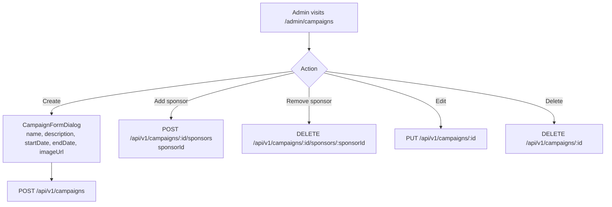

# Campaign Management

## Overview

Admins manage time-limited campaigns with banner images, descriptions, and associated sponsors. Campaigns are publicly visible only within their date range.

---

## Workflow

---

## Step-by-Step: Create a Campaign

1. Navigate to **Admin → Campaigns** (`/admin/campaigns`).
2. Click **"Create Campaign"**.
3. Fill in: name, description, start date, end date, optional banner image URL.
4. Click **"Save"**.
5. The campaign is visible to the public from `startDate` to `endDate`.

---

## Step-by-Step: Add Sponsors to a Campaign

1. Open the campaign in admin view.
2. Navigate to the **Sponsors** tab.
3. Click **"Add Sponsor"** and select an existing partner from the list.
4. The sponsor appears on the public campaign detail page.

---

## Application Properties

| Property | Default | Description |
|----------|---------|-------------|
| `cloudinary.cloud-name` | `renaultclubbulgaria` | Campaign image storage |

---

## Security Notes

- **ADMIN only** for all campaign operations.
- Date-range filtering is server-side — campaigns outside their date range are not returned by the API.

---

## QA Checklist

- [ ] Create campaign with future startDate → not visible until startDate
- [ ] Campaign within date range → visible publicly
- [ ] Campaign past endDate → not visible in public list
- [ ] Add sponsor → sponsor shown on campaign detail page
- [ ] Remove sponsor → sponsor removed from campaign
- [ ] Delete campaign → removed from all lists
