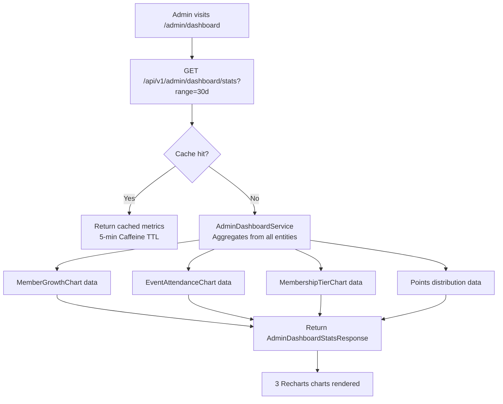

# Admin Dashboard & Metrics

## Overview

The admin dashboard provides **KPI charts and metrics** for the platform. Metrics are calculated on-demand, cached for 5 minutes, and exportable as CSV. Three time ranges are supported: 7 days, 30 days, and 90 days.

---

## Workflow

---

## Available Metrics

| Metric | Chart Type | Description |
|--------|-----------|-------------|
| Member Growth | Line chart | New members per day |
| Event Attendance | Bar chart | Attendance count per event |
| Membership Tier Distribution | Pie chart | NORMAL / SILVER / GOLDEN breakdown |
| Points Distributed | Line chart | Daily RP + КТ awarded |
| Chat Activity | Line chart | Messages per day |

---

## Step-by-Step: View Dashboard

1. Navigate to **Admin → Dashboard** (`/admin/dashboard`).
2. Select the **time range**: 7d / 30d / 90d using the range selector.
3. Three charts load: Member Growth, Event Attendance, Membership Tiers.
4. Key KPIs are shown as stat cards above the charts (total members, new this period, events held, etc.).

---

## Step-by-Step: Export CSV

1. On the dashboard, click **"Export CSV"**.
2. Select the range (7d / 30d / 90d).
3. Click **"Download"**.
4. A CSV file is streamed directly: `member-growth-30d.csv`.
5. The file contains one row per day with date and member count.

---

## Application Properties

| Property | Default | Description |
|----------|---------|-------------|
| `rcb.async.core-pool-size` | `4` | Thread pool for async aggregation |

---

## Security Notes

- **ADMIN only** — all dashboard endpoints require ADMIN role.
- Dashboard data is **aggregate only** — no individual user data exposed (GDPR-safe).
- CSV export uses **StreamingResponseBody** — no large in-memory buffer. Safe for large datasets.
- Cache is per-range (7d/30d/90d) with 5-minute TTL.

---

## QA Checklist

- [ ] View dashboard as ADMIN → all three charts render with data
- [ ] Switch range to 7d → charts update with 7-day window
- [ ] Switch range to 90d → charts update with 90-day window
- [ ] Export CSV (30d) → file downloads with correct headers and data
- [ ] Access dashboard as non-admin → 403 Forbidden
