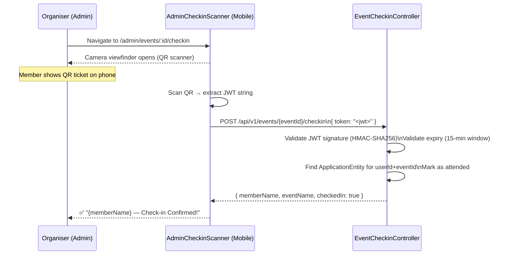

# Event Check-in Scanner (Admin)

## Overview

At physical events, admins and organisers use the **Admin Check-in Scanner** to validate member QR tickets and mark attendance. The scanner validates the signed JWT token from the member's QR and records attendance in the database.

---

## Workflow

---

## Step-by-Step: Scan a Member's Check-in QR

1. Navigate to the event's **Admin Check-in** page (`/admin/events/:id/checkin` or open the `AdminCheckinScanner`).
2. The camera opens automatically (requires camera permission in browser).
3. Point the camera at the **member's QR code** displayed on their phone.
4. The scanner validates the QR immediately.
5. Result:
   - ✅ **Success**: Member name and "Check-in Confirmed" displayed.
   - ❌ **Expired**: "QR code expired — ask member to refresh their ticket."
   - ❌ **Invalid**: "Invalid QR code — not a valid check-in ticket."
   - ❌ **Already scanned**: Idempotent — re-scanning a valid ticket does not create a duplicate.

---

## Application Properties

| Property | Default | Description | When to Change |
|----------|---------|-------------|---------------|
| `rcb.security.checkin-jwt-secret` | *(base64, ≥32 bytes)* | HMAC key for check-in JWT signing | Rotate if compromised; invalidates all outstanding tickets |

---

## Security Notes

- **ADMIN / ORGANISER** role required for the check-in endpoint.
- The JWT **cannot be forged** — it is signed with the server's HMAC secret.
- The 15-minute expiry prevents reuse of old screenshots.
- Check-in is **idempotent** — scanning the same valid ticket twice marks attendance once only.
- No PII is stored in the QR token — only `eventId` and `userId` (UUIDs).

---

## QA Checklist

- [ ] Scan valid, fresh QR → check-in confirmed, member name shown
- [ ] Scan expired QR (>15 min old) → "expired" error shown
- [ ] Scan QR for non-existent event → error shown
- [ ] Scan same valid QR twice → first scan succeeds, second is idempotent
- [ ] Access endpoint as non-admin → 403 Forbidden
- [ ] Member with REJECTED application tries to generate QR → 403 (cannot get QR without ACCEPTED application)
