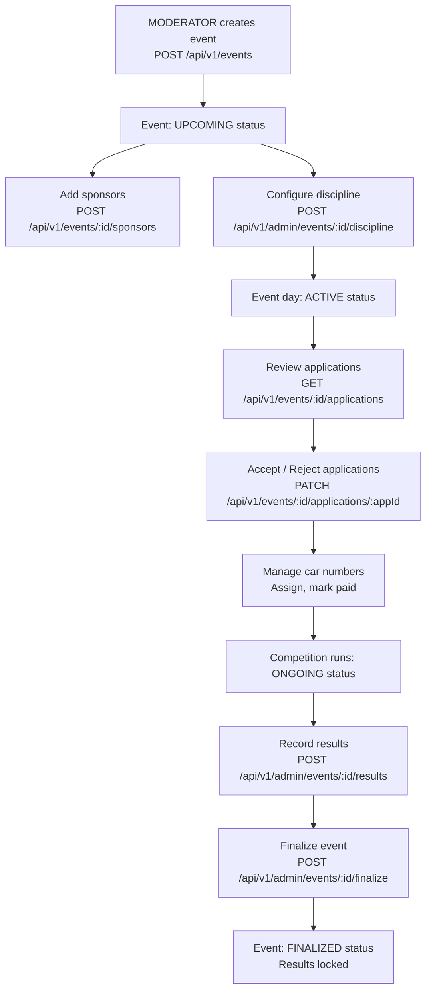

# Event Management (Admin)

## Overview

MODERATOR and ADMIN roles can create and manage club events end-to-end: create event, add sponsors, manage applications, configure competition discipline, record results, and finalize.

---

## Event Management Workflow

---

## Step-by-Step: Create an Event

1. Navigate to **Admin → Events** (`/admin/events`).
2. Click **"Create Event"**.
3. Fill in:
   - **Name**, **Description**
   - **Date** and **Location**
   - **Entry Fee** and **Membership Fee**
   - **Organizer** name
4. Click **"Save"**. Event status: UPCOMING.

---

## Step-by-Step: Add Sponsors

1. Open the event from the admin list.
2. Navigate to the **Sponsors** tab.
3. Click **"Add Sponsor"** → enter sponsor name, logo URL, and website.
4. Sponsors appear on the public event detail page.

---

## Step-by-Step: Configure Discipline

1. Open the event admin page.
2. Navigate to the **Discipline** tab.
3. Select the **event type**: DRAG_RACE, AUTOCROSS, GYMKHANA, REGULARITY_RALLY, TRACK_DAY, or SHOW_SHINE.
4. Select the **scoring model**: BEST_TIME_WINS, F1_POINTS, REGULARITY_SCORE, or JUDGE_POINTS.
5. Save the configuration.

---

## Step-by-Step: Manage Applications

1. Open the event and navigate to **Applications** tab.
2. See all PENDING applications.
3. Click **"Accept"** or **"Reject"** for each.
4. The member receives an email notification either way.
5. Accepted applicants can proceed to request a car number.

---

## Step-by-Step: Assign Car Numbers

1. Navigate to **Car Numbers** tab on the event admin page.
2. See all car number requests from accepted applicants.
3. Click **"Assign"** and enter the car number.
4. Click **"Mark Paid"** when entry fee is confirmed.
5. Click **"Reject"** to decline a specific car.

---

## Step-by-Step: Record Competition Results

1. After competition, navigate to **Results** tab.
2. Click **"Record Result"** for each participant.
3. Enter: run times (best time), DNF flag, penalties.
4. The `ScoringCalculator` computes rankings based on the discipline configuration.
5. Preview the full scoreboard.

---

## Step-by-Step: Finalize an Event

1. Confirm all results are correct.
2. Click **"Finalize Event"** → confirm the dialog.
3. Status changes to FINALIZED.
4. Results are **locked** — no further edits allowed.
5. Points are awarded to participants (via PointsTriggerService).

---

## Step-by-Step: Manage Event Tasks (Kanban)

1. Navigate to **Admin → Events → [event name] → Kanban** (`/admin/events/:id/kanban`).
2. Add tasks for event preparation (e.g., "Book venue", "Arrange catering").
3. Drag tasks between columns: TODO / IN PROGRESS / DONE.
4. Track completion status in real time.

---

## Application Properties

| Property | Default | Description |
|----------|---------|-------------|
| `rcb.sendgrid.application-accepted-template-id` | *(template ID)* | Email template for accepted applications |
| `rcb.sendgrid.application-rejected-template-id` | *(template ID)* | Email template for rejected applications |

---

## Security Notes

- **Event creation**: MODERATOR+
- **Event cancellation**: ADMIN+
- **Results management**: ADMIN+
- Author is always resolved from the JWT `sub` claim — clients cannot forge authorship.

---

## QA Checklist

- [ ] Create event → appears in public event list with UPCOMING status
- [ ] Accept application → member receives email, status ACCEPTED
- [ ] Reject application → member receives email, status REJECTED
- [ ] Assign car number → number visible to applicant
- [ ] Record results → scoreboard populated correctly per scoring model
- [ ] Finalize event → status FINALIZED, edit buttons hidden
- [ ] Cancel event → status CANCELLED, visible to public
