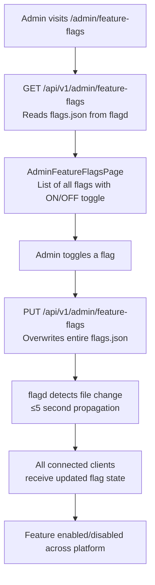

# Feature Flags

## Overview

Feature flags allow admins to **toggle platform features at runtime** without code changes or redeployments. The system uses **OpenFeature** with a **flagd** provider. Flag state is stored in a JSON file watched by the flagd daemon — changes propagate within 5 seconds.

---

## Workflow



---

## Flag Structure (`flags.json`)

```json
{
  "flags": {
    "chat-enabled": {
      "state": "ENABLED",
      "defaultVariant": "on",
      "variants": { "on": true, "off": false }
    },
    "polls-enabled": {
      "state": "ENABLED",
      "defaultVariant": "on",
      "variants": { "on": true, "off": false }
    }
  }
}
```

---

## Step-by-Step: Toggle a Feature Flag

1. Navigate to **Admin → Feature Flags** (`/admin/feature-flags`).
2. The current flag list is shown with ON/OFF toggles.
3. Toggle the desired flag.
4. Click **"Save"**.
5. Changes propagate within **5 seconds** — no server restart required.

---

## Frontend Integration

The frontend uses the `useFeatureFlag(flagKey)` hook:
```tsx
const chatEnabled = useFeatureFlag('chat-enabled');
if (!chatEnabled) return null; // Hide feature
```

The `OpenFeatureProvider` wraps the app and provides real-time flag updates.

---

## Application Properties

| Property | Default | Description | When to Change |
|----------|---------|-------------|---------------|
| `rcb.flagd.host` | `localhost` | flagd server hostname | In Docker, use service name |
| `rcb.flagd.port` | `8013` | flagd gRPC port | Only if port conflicts |
| `rcb.flagd.tls` | `false` | TLS for flagd connection | Enable in production |
| `rcb.flagd.flags-file-path` | `infra/flagd/flags.json` | Path to flags file | Use absolute path in production |

---

## Security Notes

- **ADMIN only** for viewing and editing feature flags.
- Flags file is written **server-side** — clients cannot directly modify the flags file.
- Disabling a feature flag removes the feature from the UI **and** blocks the backend API endpoint.
- No restart required — flagd watches the file and propagates changes automatically.

---

## QA Checklist

- [ ] Toggle flag OFF → feature hidden from all users within 5 seconds
- [ ] Toggle flag ON → feature restored within 5 seconds
- [ ] Access admin flags as non-admin → 403 Forbidden
- [ ] flagd server down → FeatureFlagService returns configured default (typically `false`) — fail-safe
