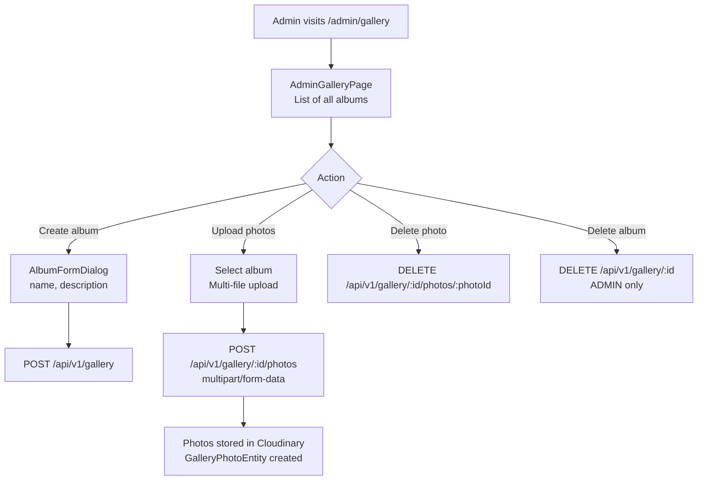

# Gallery Management

## Overview

MODERATOR and ADMIN roles manage photo albums: create albums, upload photos (stored in Cloudinary CDN), and delete content.

---

## Workflow

---

## Step-by-Step: Create an Album and Upload Photos

1. Navigate to **Admin → Gallery** (`/admin/gallery`).
2. Click **"Create Album"** → enter name and optional description.
3. Open the album and click **"Upload Photos"**.
4. Select multiple image files from your device.
5. Photos are uploaded to **Cloudinary** and appear in the album immediately.

---

## Step-by-Step: Set Cover Image

1. Open an album in the admin view.
2. Click any photo and select **"Set as Cover"**.
3. The selected photo becomes the album's cover image shown in the gallery grid.

---

## Application Properties

| Property | Default | Description |
|----------|---------|-------------|
| `cloudinary.cloud-name` | `renaultclubbulgaria` | Cloudinary cloud for image hosting |
| `cloudinary.api-key` | *(Jasypt-encrypted)* | Cloudinary API key |
| `cloudinary.api-secret` | *(Jasypt-encrypted)* | Cloudinary API secret |

---

## Security Notes

- **Upload / manage**: MODERATOR+
- **Delete album**: ADMIN only
- Images are stored in **Cloudinary** — no binary files in the database.
- Deleted photos are removed from Cloudinary storage (no orphaned images).

---

## QA Checklist

- [ ] Create album → appears in public gallery
- [ ] Upload photos → appear in album, served from Cloudinary CDN
- [ ] Set cover image → cover updates in gallery grid
- [ ] Delete photo → removed from album
- [ ] Delete album as ADMIN → album removed with all photos
- [ ] Attempt to delete album as MODERATOR → 403 Forbidden
