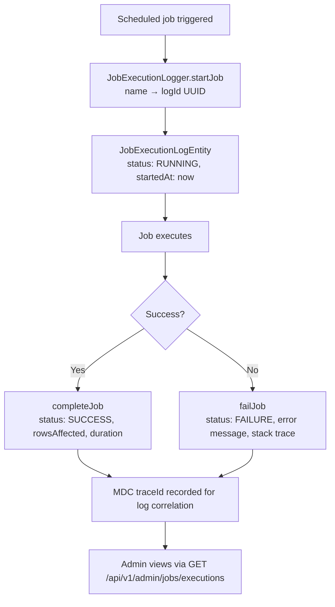

# Job Execution Logs

## Overview

Every **scheduled job** on the platform is instrumented to record its execution in `JobExecutionLogEntity`. Admins can view the full history, filter by job name and status, and investigate failures. Logs older than 30 days are automatically purged.

---

## Scheduled Jobs Reference

| Job Name | Schedule | Purpose |
|----------|----------|---------|
| `member-auto-reinstate` | Daily 01:00 UTC | Auto-reinstate expired suspensions |
| `poll-auto-close` | Daily 00:30 UTC | Close expired polls |
| `peer-badge-award` | Hourly | Award peer badges (≥3 nominations) |
| `rank-recalculation` | Daily 02:00 UTC | Recalculate member ranks |
| `season-reset` | Jan 1 00:05 UTC | Archive RP + reset seasonal scores |
| `season-reset-reminder` | Dec 25 12:00 UTC | Notify members of upcoming season end |
| `job-execution-cleanup` | Daily 03:00 UTC | Delete logs older than 30 days |
| `gdpr-purge` | Daily 04:00 UTC | Delete PII for soft-deleted users |

---

## Workflow

---

## Step-by-Step: View Job Execution History

1. Navigate to **Admin → Job Logs** (`/admin/jobs`).
2. The paginated list shows all job executions, newest first.
3. Use the **filter** to narrow by:
   - **Job Name** (e.g., `rank-recalculation`)
   - **Status** (RUNNING / SUCCESS / FAILURE)
4. Each row shows: job name, status, start time, duration, rows affected.
5. Click a row to see the full log entry including error message and trace ID.

---

## Step-by-Step: Investigate a Failure

1. Filter by **Status: FAILURE**.
2. Click the failed job entry.
3. Read the **error message** and **stack trace**.
4. Note the **traceId** — use it to search application logs (Grafana Loki) for the correlated log lines.

---

## Application Properties

| Scheduler | Schedule | Lock | Description |
|-----------|----------|------|-------------|
| `JobExecutionLogCleanupScheduler` | Daily 03:00 UTC | `job-execution-cleanup` | Deletes logs older than 30 days |

---

## Security Notes

- **ADMIN only** for all job log endpoints.
- Logs are **append-only** — cannot be modified or deleted via API (only by the cleanup scheduler).
- `traceId` in each log entry links to distributed traces in Jaeger / Grafana Tempo for full context.

---

## QA Checklist

- [ ] Trigger a scheduled job manually (or wait for schedule) → new entry created with RUNNING status
- [ ] Job completes successfully → status updates to SUCCESS with duration + rowsAffected
- [ ] Job fails → status FAILURE with error message
- [ ] Filter by job name → only matching entries shown
- [ ] Filter by FAILURE → only failed jobs shown
- [ ] traceId in log → can be used to search Loki logs
- [ ] Access as non-admin → 403 Forbidden
