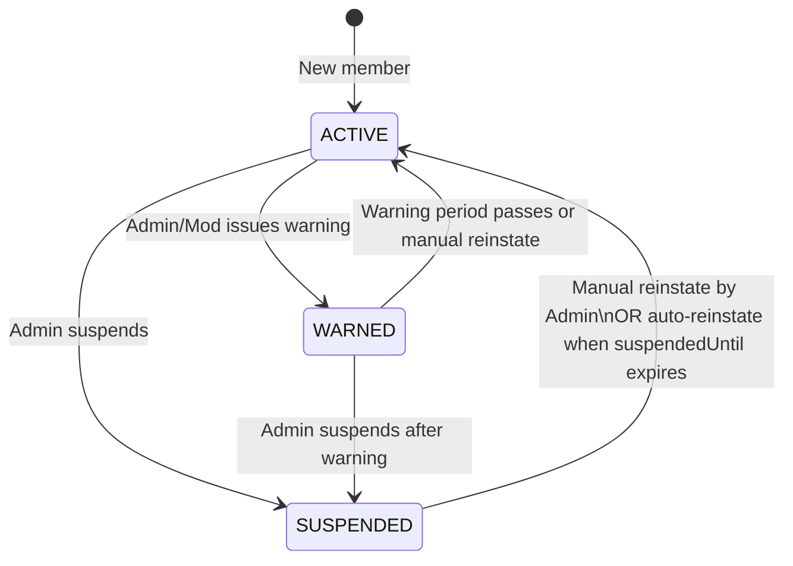
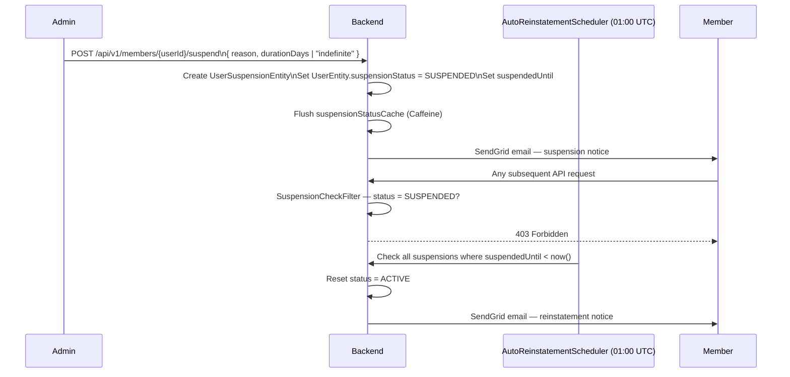

# Member Lifecycle Management

## Overview

Admins and Moderators can manage the disciplinary status of members. Actions include: **warning** (advisory), **suspending** (blocks platform access), and **reinstating** (restores access). All actions trigger email notifications and are logged in the suspension history.

---

## Member Status Flow

| Status | Access | Who Can Set |
|--------|--------|-------------|
| ACTIVE | Full access | Auto on account creation |
| WARNED | Full access (advisory only) | ADMIN, ROOT_ADMIN, MODERATOR |
| SUSPENDED | Blocked from all content creation | ADMIN, ROOT_ADMIN |

---

## Workflow: Suspend a Member

---

## Step-by-Step: Suspend a Member

1. Navigate to **Admin → User Management** and open the member's profile.
2. Click **"Suspend Member"**.
3. Enter the **reason** (required, shown in email to member).
4. Specify **duration**: number of days, or check "Indefinite" for permanent suspension.
5. Click **"Confirm Suspension"**.
6. The member receives an email notification and is immediately blocked (next request returns 403).

---

## Step-by-Step: Issue a Warning

1. Open the member's profile.
2. Click **"Issue Warning"**.
3. Enter the **reason**.
4. Click **"Confirm Warning"**.
5. The member receives a warning email. **They retain full access** — warnings are advisory only.

---

## Step-by-Step: Manually Reinstate a Member

1. Open a SUSPENDED member's profile.
2. Click **"Reinstate Member"**.
3. The member's status is immediately set to ACTIVE.
4. The member receives a reinstatement email.
5. The suspension status cache is flushed.

---

## Automatic Reinstatement

The `UserSuspensionAutoReinstatementScheduler` runs **daily at 01:00 UTC**:

1. Queries all members with `suspensionStatus = SUSPENDED` and `suspendedUntil < now()`.
2. Updates their status to ACTIVE.
3. Sends reinstatement email to each affected member.

Indefinite suspensions (`suspendedUntil = 9999-12-31`) are never auto-reinstated.

---

## Suspension History

Every suspension, warning, and reinstatement creates a `UserSuspensionEntity` record visible to ADMIN / ROOT_ADMIN / MODERATOR:

1. Navigate to the member's profile.
2. Click **"Suspension History"** tab.
3. See the full history: action, reason, actor, dates.

---

## Application Properties

| Property | Default | Description |
|----------|---------|-------------|
| `rcb.sendgrid.suspension-notice-template-id` | *(template ID)* | Email template for suspensions |
| `rcb.sendgrid.warning-notice-template-id` | *(template ID)* | Email template for warnings |
| `rcb.sendgrid.reinstate-notice-template-id` | *(template ID)* | Email template for reinstatements |

| Scheduler | Schedule | Lock | Description |
|-----------|----------|------|-------------|
| `UserSuspensionAutoReinstatementScheduler` | Daily 01:00 UTC | `member-auto-reinstate` (PT1H max) | Auto-reinstates expired suspensions |

---

## Security Notes

- `SuspensionCheckFilter` runs on **every request** — suspended users get 403 immediately.
- Status is cached in **Caffeine** (5-min TTL) for performance — on reinstate, cache is bulk-flushed.
- Only `ADMIN` / `ROOT_ADMIN` can suspend. `MODERATOR` can only warn.
- Indefinite suspensions require manual admin intervention to lift.

---

## QA Checklist

- [ ] Suspend member with 7-day duration → member gets 403 on next request
- [ ] Member receives suspension email with reason
- [ ] Manually reinstate → member access restored immediately
- [ ] Auto-reinstatement after duration expires → status reset by scheduler
- [ ] Issue warning → member still has access, receives email
- [ ] View suspension history → all actions listed with actor and timestamps
- [ ] Indefinite suspension → not auto-reinstated
