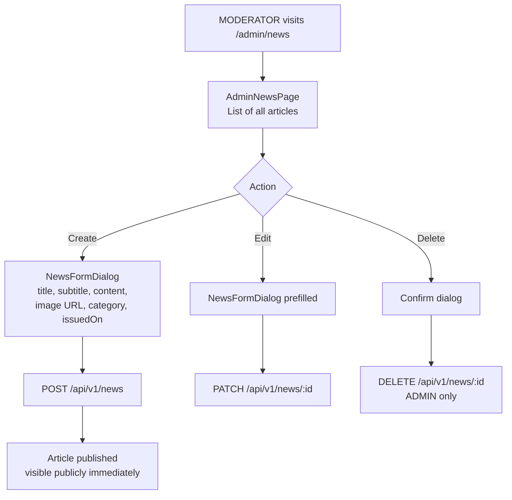

# News Management

## Overview

MODERATOR and ADMIN roles can create, edit, and delete news articles. Articles are published with a category and are immediately visible to the public.

---

## Workflow

---

## News Categories

| Category | Use Case |
|----------|----------|
| ANNOUNCEMENT | Club announcements and notices |
| RULE_CHANGE | Updates to club rules or regulations |
| EVENT_RECAP | Post-event summaries and highlights |
| SPONSORS | Sponsor news and partnerships |
| GENERAL | General club news |

---

## Step-by-Step: Create a News Article

1. Navigate to **Admin → News** (`/admin/news`).
2. Click **"Create Article"**.
3. Fill in:
   - **Title** (required)
   - **Subtitle** (optional)
   - **Content** (rich text or markdown)
   - **Image URL** (optional, Cloudinary URL)
   - **Category** (select from list)
   - **Published Date** (`issuedOn`, defaults to today)
4. Click **"Publish"**.
5. The article appears immediately in the public news list.

---

## Security Notes

- **Author is server-side only** — resolved from JWT `sub` claim. Clients cannot forge authorship.
- **MODERATOR**: create and edit only.
- **ADMIN**: create, edit, and delete.
- Deletion is **permanent** (hard delete, not soft).

---

## QA Checklist

- [ ] Create article as MODERATOR → visible in public news list
- [ ] Edit article → changes reflected immediately
- [ ] Delete article as ADMIN → removed from public list
- [ ] Attempt to delete as MODERATOR → 403 Forbidden
- [ ] Author shown correctly → matches logged-in user, not editable by client
