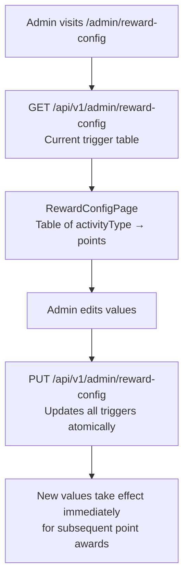

# Reward Configuration

## Overview

Admins configure the **point trigger values** for each platform activity. The `RewardConfigEntity` defines how many RP and/or КТ points are awarded for each action (event attendance, poll vote, comment, etc.).

---

## Workflow

---

## Default Activity Triggers

| Activity Type | Point Type | Typical Default |
|--------------|-----------|-----------------|
| `EVENT_ATTENDANCE` | КТ | 10 |
| `EVENT_ATTENDANCE` | RP | 10 |
| `POLL_VOTE` | RP | 2 |
| `COMMENT_POSTED` | RP | 1 |
| `PEER_BADGE_AWARDED` | КТ | 15 |
| `FIRST_EVENT` | КТ | 20 |

*Actual values are configurable and may differ from above.*

---

## Step-by-Step: Update Point Values

1. Navigate to **Admin → Reward Config** (`/admin/reward-config`).
2. The current trigger table is displayed.
3. Edit any **points** value in the table.
4. Click **"Save All"**.
5. New values apply to all point awards from this moment forward.
6. **Past awards are not retroactively changed** — the ledger is immutable.

---

## Application Properties

No separate properties — rewards are managed via the database `RewardConfigEntity`.

---

## Security Notes

- **ADMIN only** can view and edit reward configuration.
- Changes are **not retroactive** — only future awards use the new values.
- The ledger records `RewardConfigEntity` values at the time of award (implied by `referenceId`).

---

## QA Checklist

- [ ] View reward config → current trigger table displayed
- [ ] Change event attendance points from 10 to 15 → next attendance awards 15 points
- [ ] Previous ledger entries unchanged → old records still show original point values
- [ ] Access as non-admin → 403 Forbidden
