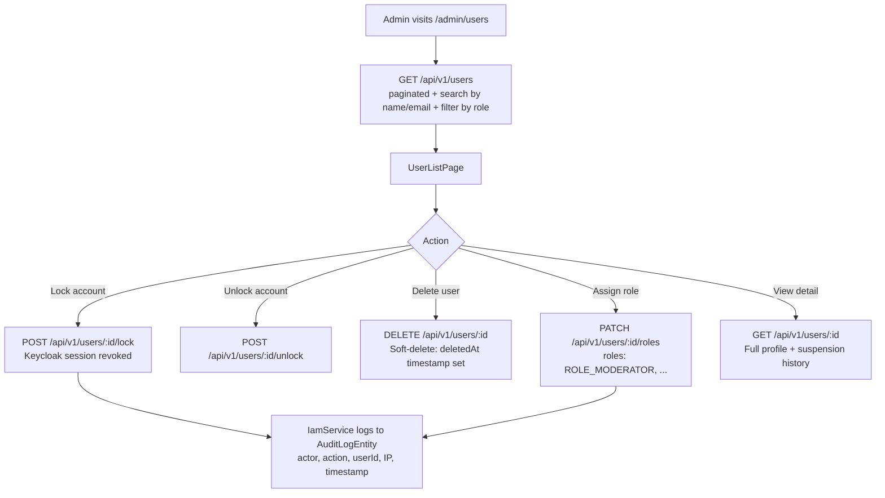

# User Management

## Overview

Admins can view, search, filter, lock/unlock, delete, and assign roles to all registered members. User accounts are linked to Keycloak and maintain a local `UserEntity` for profile and platform data.

---

## Workflow

---

## Step-by-Step: Search and Filter Users

1. Navigate to **Admin → User Management** (`/admin/users`).
2. Use the **search box** to find users by name or email.
3. Use the **role filter** dropdown to filter by ROLE_USER, ROLE_MODERATOR, ROLE_ADMIN.
4. Results are paginated — use next/previous to navigate.

---

## Step-by-Step: Lock / Unlock an Account

1. Find the user in the list and click their row to open the detail view.
2. Click **"Lock Account"** to prevent login.
   - The Keycloak session is revoked immediately.
   - The user cannot log in until unlocked.
3. Click **"Unlock Account"** to restore access.

---

## Step-by-Step: Assign Roles

1. Open the user detail view.
2. Click **"Edit Roles"**.
3. Toggle the desired roles: USER, MODERATOR, ADMIN.
4. Click **"Save"**.
5. Role changes are logged in `AuditLogEntity` with actor, IP, and timestamp.

:::warning ROOT_ADMIN role
The `ROOT_ADMIN` role **cannot be assigned or revoked via the API**. It must be managed directly in the Keycloak admin console.
:::

---

## Step-by-Step: Soft-Delete a User

1. Open the user detail view.
2. Click **"Delete User"** → confirm the dialog.
3. The user's `deletedAt` timestamp is set (soft-delete).
4. The user is excluded from all queries, leaderboards, and member lists.
5. GDPR: personal data is retained for the legally required period, then purged by the nightly GDPR purge job (daily 04:00 UTC).

---

## Application Properties

No custom properties. Role changes are governed by:

| Property | Default | Description |
|----------|---------|-------------|
| `rcb.security.trusted-jwt-issuers` | Keycloak realm URL | JWT validation |

---

## Security Notes

- All role changes are logged to `AuditLogEntity` with: actor (who made the change), target user, action, IP address, timestamp. Full audit trail for GDPR compliance.
- `ROOT_ADMIN` cannot be modified via API — Keycloak-only.
- Locked accounts cannot authenticate — Keycloak session is revoked on lock.
- Soft-deleted users are completely invisible in all platform queries.

---

## QA Checklist

- [ ] Search user by email → correct user found
- [ ] Filter by MODERATOR role → only moderators listed
- [ ] Lock user → user cannot log in
- [ ] Unlock user → user can log in again
- [ ] Assign MODERATOR role → user gains moderator permissions
- [ ] Remove MODERATOR role → user loses moderator permissions
- [ ] Delete user → user excluded from all lists and leaderboards
- [ ] Role change logged in AuditLogEntity → visible with actor, action, timestamp
