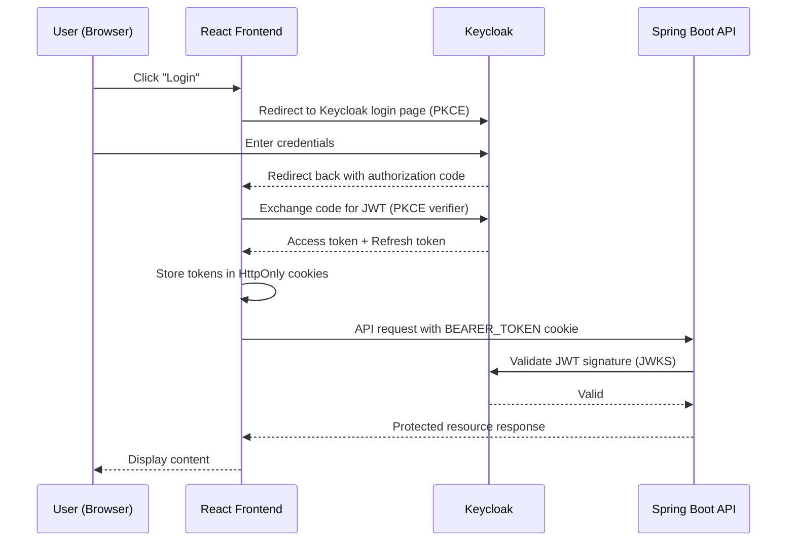

# Login & Logout

## Overview

Authentication is handled by **Keycloak**, an enterprise-grade identity provider. The frontend uses the **OpenID Connect** protocol with **PKCE** (Proof Key for Code Exchange). After login, access and refresh tokens are stored in **HttpOnly cookies** — they are never accessible to JavaScript, which protects against XSS attacks.

---

## Workflow

---

## Step-by-Step: Login

1. Navigate to the RCB platform homepage.
2. Click **"Login"** in the top navigation bar.
3. You are redirected to the Keycloak login page.
4. Enter your **email** and **password**.
5. Click **"Sign In"**.
6. You are redirected back to the platform and logged in.

:::tip First-time users
If you don't have an account, click **"Register"** on the Keycloak login page and complete the registration form.
:::

---

## Step-by-Step: Logout

1. Click your **profile avatar** in the top navigation.
2. Select **"Logout"** from the dropdown.
3. Your session is terminated in both the frontend and Keycloak.
4. Auth cookies (`BEARER_TOKEN`, `REFRESH_TOKEN`) are cleared.

---

## Automatic Token Refresh

The `CookieTokenRefreshFilter` automatically refreshes the access token when it expires, using the refresh token cookie. You do not need to log in again unless the refresh token also expires.

---

## Application Properties

| Property | Default | Description |
|----------|---------|-------------|
| `rcb.security.trusted-jwt-issuers` | `http://localhost:8180/realms/rcb` | Keycloak realm URL(s) for JWT validation |
| `rcb.security.cors-allowed-origins` | `http://localhost:5173` | Allowed frontend origins for CORS |
| `rcb.keycloak.token-uri` | `http://localhost:8180/realms/rcb/protocol/openid-connect/token` | Keycloak token endpoint |
| `rcb.keycloak.client-id` | `rcb-backend` | OAuth2 backend client ID |
| `rcb.security.keycloak-internal-base-url` | `http://rcb-keycloak:8080` | Internal Docker Keycloak URL (for JWK validation in Docker network) |

---

## Security Notes

- Tokens are stored in **HttpOnly SameSite cookies** — not in `localStorage` or `sessionStorage`.
- The `BearerTokenResolver` reads tokens in priority order: (1) refreshed-token attribute, (2) `BEARER_TOKEN` cookie, (3) `Authorization` header.
- **Keycloak session revocation** is triggered on logout — the Keycloak server-side session is also terminated.
- CORS is strictly configured; only the origins in `rcb.security.cors-allowed-origins` are allowed.
- JWT signatures are validated against Keycloak's **JWKS endpoint** on every request.

---

## QA Checklist

- [ ] Login with valid credentials → redirected to homepage, user avatar visible
- [ ] Login with wrong password → Keycloak error displayed
- [ ] Access protected route while logged out → redirected to login
- [ ] Logout → cookies cleared, protected routes inaccessible
- [ ] Token refresh → API calls succeed after access token expires without re-login
