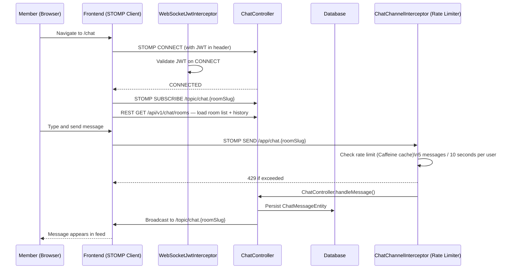

# Live Chat

## Overview

The RCB platform includes **real-time chat rooms** powered by **STOMP over WebSocket**. Members can join topic-based rooms (general, model-specific, members-only) and exchange messages in real time.

---

## Workflow

---

## Room Types

| Type | Who Can Join |
|------|-------------|
| PUBLIC | Everyone |
| MEMBERS_ONLY | Active members only |
| MODEL_SPECIFIC | Members with that Renault model |

---

## Step-by-Step: Join a Chat Room

1. Log in and navigate to **Chat** (`/chat`).
2. The room list is shown on the left sidebar.
3. Click a room to join it.
4. Message history (last 30 messages) is loaded.
5. Type a message in the input box and press **Enter** or click **Send**.

---

## Step-by-Step: Understand Rate Limiting

Messages are rate-limited to prevent spam:
- **5 messages per 10 seconds** per user per room.
- If exceeded, the message is rejected with an error notification.
- The rate limit resets automatically after the window passes.

---

## Application Properties

| Property | Default | Description | When to Change |
|----------|---------|-------------|---------------|
| `rcb.async.core-pool-size` | `4` | Thread pool for async message handling | Increase for high-concurrency deployments |
| `rcb.async.max-pool-size` | `10` | Max async threads | Tune based on server capacity |
| `rcb.async.queue-capacity` | `500` | Message queue capacity | Increase if messages are dropped under load |

---

## Security Notes

- **JWT validated on STOMP CONNECT** — unauthorized clients are rejected before subscribing.
- **Rate limiting** via `ChatChannelInterceptor` (Caffeine cache, per-user sliding window).
- **Banned users** cannot send or receive messages in any room.
- Message content is **not encrypted in transit beyond HTTPS/WSS** — use HTTPS in production.
- Admin can **soft-delete messages** (marked `isDeleted = true`) — clients see them as removed in real time.

---

## QA Checklist

- [ ] Navigate to `/chat` while logged in → room list displayed
- [ ] Join room → message history loaded
- [ ] Send message → appears for all connected users in real time
- [ ] Send 6 messages in 10 seconds → 6th rejected with rate limit error
- [ ] Banned user tries to send → rejected
- [ ] Logout → WebSocket connection closed, messages no longer received
- [ ] Admin deletes message → removed from other users' feeds in real time
