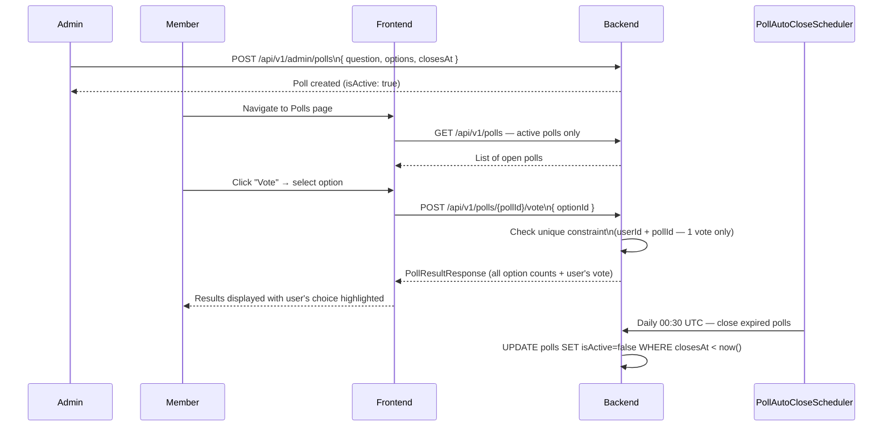

# Polls & Voting

## Overview

Admins create time-limited polls with multiple options. Active members can vote once per poll and immediately see the results. Polls close automatically when their expiry time is reached.

---

## Workflow

---

## Step-by-Step: Vote in a Poll

1. Log in and navigate to **Polls** (or see active polls on relevant pages).
2. Active polls are displayed as `PollCard` components.
3. Read the question and the available options.
4. Click your preferred option.
5. Results are shown immediately after voting: bar chart with vote counts per option, and your choice is highlighted.
6. You **cannot change your vote** after submitting.

---

## Application Properties

No custom configuration — poll auto-close uses a scheduled job:

| Scheduler | Schedule | Lock | Description |
|-----------|----------|------|-------------|
| `PollAutoCloseScheduler` | Daily 00:30 UTC | `poll-auto-close` | Sets `isActive=false` for all polls where `closesAt < now()` |

---

## Security Notes

- Only **authenticated members** (ROLE_USER+) can vote.
- **One vote per member per poll** — enforced via unique constraint at the database level.
- **Admin** can create, edit, and delete polls. Members can only vote and view.
- Closed polls (isActive=false) are **hidden from the member view** — only admins can view closed polls.
- The `closesAt` timestamp is **not exposed to non-admin users** — prevents gaming by waiting until just before close.

---

## QA Checklist

- [ ] View active polls while logged in → polls listed
- [ ] Vote on poll → results shown immediately with user's vote highlighted
- [ ] Vote again on same poll → 409 Conflict (already voted)
- [ ] Poll passes closesAt → auto-closed by scheduler (within 24 hours)
- [ ] Closed poll → not visible in member poll list
- [ ] Admin creates poll → appears immediately in member list
- [ ] Admin deletes poll → removed from list
