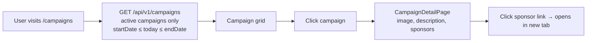

# Campaigns

## Overview

Campaigns are time-limited club initiatives and promotions. Each campaign can have associated sponsors and a banner image. Campaigns are publicly visible during their active date range.

---

## Workflow

---

## Step-by-Step: Browse Campaigns

1. Navigate to **Campaigns** (`/campaigns`).
2. Active campaigns are shown (those within their date range).
3. Click a campaign card to view full details: description, image, and associated sponsors.
4. Click a sponsor link to visit their website.

---

## Application Properties

| Property | Default | Description |
|----------|---------|-------------|
| `cloudinary.cloud-name` | `renaultclubbulgaria` | Campaign image storage |

---

## Security Notes

- **Public read** — no login required.
- **ADMIN** required to create, update, or delete campaigns and manage sponsors.
- Date-range filtering is server-side — clients cannot access unpublished/expired campaigns via the API (returns empty result for out-of-range dates).

---

## QA Checklist

- [ ] Visit `/campaigns` → active campaigns displayed
- [ ] Expired campaign → not shown in list
- [ ] Upcoming campaign (future startDate) → not shown in list
- [ ] Click campaign → details page with sponsors
- [ ] Click sponsor link → external site opens in new tab
