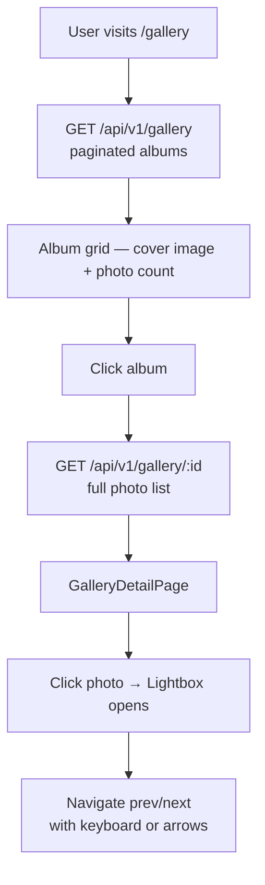

# Photo Gallery

## Overview

The gallery organizes event and club photos into **albums**. Members can browse albums, open a photo lightbox, and navigate through images. Admins/Moderators manage album creation and photo uploads.

---

## Workflow

---

## Step-by-Step: Browse Gallery

1. Navigate to **Gallery** (`/gallery`).
2. Albums are shown as cards with a cover image and photo count.
3. Click an album to view all photos.
4. Click any photo to open the **fullscreen lightbox**.
5. Navigate through photos using:
   - Left/Right arrow buttons
   - Keyboard ← → arrow keys
   - Thumbnail strip at the bottom

---

## Application Properties

| Property | Default | Description |
|----------|---------|-------------|
| `cloudinary.cloud-name` | `renaultclubbulgaria` | Cloudinary CDN for image hosting |
| `cloudinary.api-key` | *(Jasypt-encrypted)* | Cloudinary API key |
| `cloudinary.api-secret` | *(Jasypt-encrypted)* | Cloudinary API secret |

---

## Security Notes

- **Public read** — no login required to view albums and photos.
- **MODERATOR/ADMIN** required to create albums and upload photos.
- **ADMIN only** can delete entire albums.
- Images are stored and served via **Cloudinary CDN** — no binary data stored in the database.

---

## QA Checklist

- [ ] Visit `/gallery` without login → album grid visible
- [ ] Click album → photos shown
- [ ] Click photo → lightbox opens, navigation works
- [ ] Upload photos as ADMIN → photos appear in album
- [ ] Delete photo as ADMIN → photo removed from album
- [ ] Delete album as ADMIN → album removed from list
