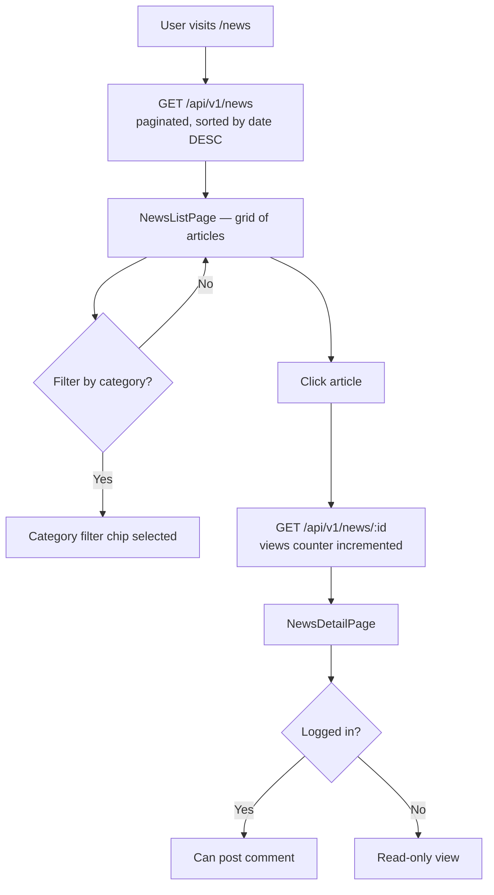

# News & Articles

## Overview

The News section publishes club announcements, event recaps, rule changes, sponsor news, and general updates. Articles are publicly accessible — no login required to read. Authenticated members can leave comments.

---

## Workflow

---

## Step-by-Step: Browse News

1. Navigate to **News** (`/news`).
2. Articles are displayed in a paginated grid, newest first.
3. Use **category filter chips** to narrow results:
   - ANNOUNCEMENT
   - RULE_CHANGE
   - EVENT_RECAP
   - SPONSORS
   - GENERAL
4. Click an article card to open the full article.

---

## Step-by-Step: Comment on an Article

1. Open an article.
2. Scroll to the **Comments** section.
3. If logged in, type your comment and click **"Post"**.
4. Your comment appears immediately.

---

## Application Properties

| Property | Default | Description |
|----------|---------|-------------|
| *(no custom properties)* | — | News view counter uses REQUIRES_NEW transaction |

---

## Security Notes

- **Public read** — no authentication required to view news or comments.
- **MODERATOR** role required to create/edit articles. Author is resolved server-side from JWT — clients cannot forge authorship.
- **ADMIN** role required to delete articles.
- View counter increments in a separate `REQUIRES_NEW` transaction — a downstream failure never loses the view count.

---

## QA Checklist

- [ ] Visit `/news` without login → articles listed
- [ ] Select category filter → list filtered correctly
- [ ] Click article → full content displayed, view count incremented
- [ ] Post comment while logged in → comment appears
- [ ] Attempt to post comment while logged out → login prompt shown
- [ ] Create news as MODERATOR → article visible publicly
- [ ] Delete news as ADMIN → article removed
