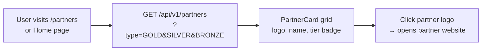

# Club Partners

## Overview

Club Partners are official sponsors supporting the Renault Club Bulgaria. Partners are categorized by tier (BRONZE / SILVER / GOLD) and displayed across the platform — on the home page partner strip and the dedicated Partners page.

---

## Workflow

---

## Partner Tiers

| Tier | Description |
|------|-------------|
| GOLD | Top-tier sponsors — featured prominently |
| SILVER | Mid-tier sponsors |
| BRONZE | Entry-level sponsors |

---

## Step-by-Step: View Partners

1. Navigate to **Partners** (`/partners`) or scroll to the **Partners Strip** on the home page.
2. Partners are shown with their logo, name, and tier.
3. Click a partner logo to open their website in a new tab.
4. Use tier filter buttons to narrow by BRONZE / SILVER / GOLD.

---

## Application Properties

| Property | Default | Description |
|----------|---------|-------------|
| `cloudinary.cloud-name` | `renaultclubbulgaria` | Partner logo storage |

---

## Security Notes

- **Public read** — no login required.
- **ADMIN** required to create, update, or delete partners and upload logos.
- Partner logos are served via **Cloudinary CDN**.

---

## QA Checklist

- [ ] Visit `/partners` → partner grid visible with logos
- [ ] Filter by tier → only that tier shown
- [ ] Click partner logo → external site opens in new tab
- [ ] Create partner as ADMIN → appears in list
- [ ] Delete partner as ADMIN → removed from list
