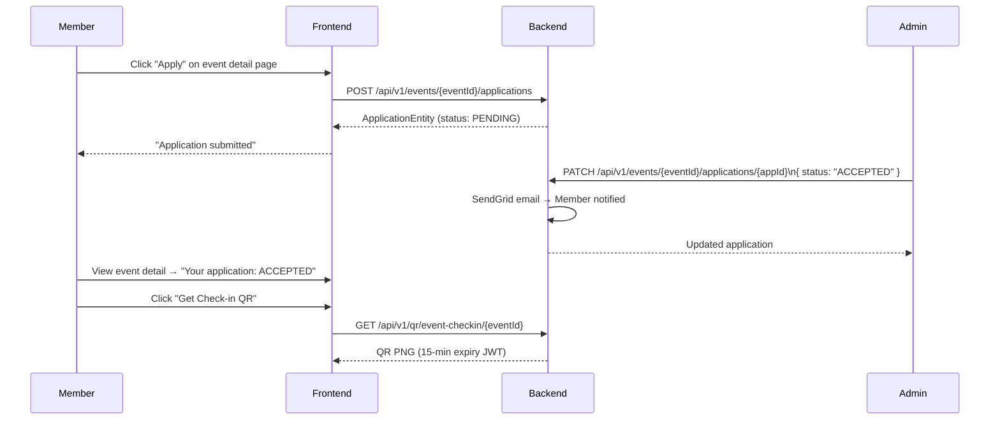

# Applying to Events

## Overview

Authenticated members can apply to upcoming events. Applications go through an approval workflow: PENDING → ACCEPTED or REJECTED. Approved applicants can also request a car number for competition events.

---

## Application Workflow

---

## Step-by-Step: Apply to an Event

1. Log in and navigate to an event detail page.
2. Click **"Apply to Event"**.
3. Your application is submitted with status **PENDING**.
4. Wait for the admin to review. You will receive an **email notification** when accepted or rejected.
5. View your application status on the event detail page.

---

## Step-by-Step: Withdraw Application

1. Navigate to the event detail page.
2. If your application is PENDING, click **"Withdraw Application"**.
3. The application is removed.

---

## Step-by-Step: Request a Car Number

For competition events, approved participants can request a car number:

1. After your application is ACCEPTED, the **Car Number** section appears on the event detail page.
2. Select the car from your garage that you will compete with.
3. Click **"Request Car Number"**.
4. The admin assigns a number. You will be notified when it is assigned and when payment is confirmed.

---

## Application Properties

| Property | Default | Description |
|----------|---------|-------------|
| `rcb.sendgrid.application-accepted-template-id` | *(SendGrid template ID)* | Email sent when application is accepted |
| `rcb.sendgrid.application-rejected-template-id` | *(SendGrid template ID)* | Email sent when application is rejected |

---

## Security Notes

- Only authenticated members (ROLE_USER+) can apply.
- A member **cannot apply to the same event twice** (unique constraint).
- Car number assignment is admin-only.

---

## QA Checklist

- [ ] Apply to event while logged in → status PENDING shown
- [ ] Apply again to same event → error (already applied)
- [ ] Apply while logged out → redirect to login
- [ ] Admin accepts application → member receives email, status updates to ACCEPTED
- [ ] Admin rejects application → member receives email, status updates to REJECTED
- [ ] Withdraw PENDING application → application removed
- [ ] Request car number after acceptance → request submitted
- [ ] Admin assigns car number → member sees assigned number
