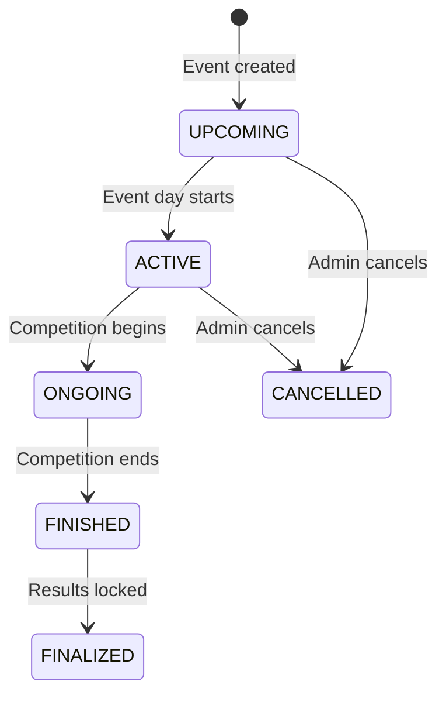

# Browsing Events

## Overview

The events list shows all club events filtered by status. Events progress through a defined lifecycle from planning to finalization.

---

## Event Lifecycle

| Status | Meaning |
|--------|---------|
| UPCOMING | Event is scheduled but hasn't started |
| ACTIVE | It is the event day |
| ONGOING | Competition is actively in progress |
| FINISHED | Competition ended, results recorded |
| FINALIZED | Results locked — no further changes |
| CANCELLED | Event was cancelled |

---

## Step-by-Step: Browse Events

1. Navigate to **Events** (`/events`).
2. Use the **status filter** tabs: UPCOMING / ACTIVE / FINISHED.
3. Each event card shows: name, date, location, participant count, and status badge.
4. Click an event card to open the full **Event Detail Page**.
5. The detail page shows:
   - Event description, date, location, organizer
   - Entry fee and membership fee
   - Number of approved participants
   - Results tab (when FINISHED or later)
   - Comments section

---

## Application Properties

No custom properties — events are filtered server-side by status and date.

---

## Security Notes

- Event listing and detail are **public** — no login required.
- Event **creation and management** requires MODERATOR or ADMIN role.

---

## QA Checklist

- [ ] Visit `/events` without login → event list visible
- [ ] Filter by UPCOMING → only upcoming events shown
- [ ] Filter by FINISHED → past events shown
- [ ] Click event → detail page opens with full info
- [ ] Cancelled event → visible in list with CANCELLED badge
