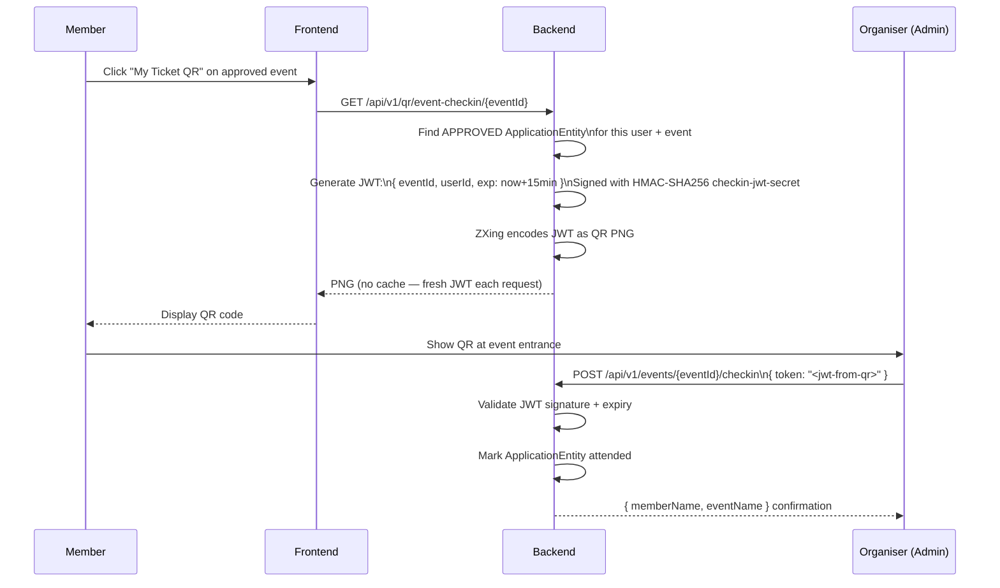

# Event Check-in QR Code (Member)

## Overview

Approved event applicants receive a **time-limited QR code ticket** that serves as their check-in pass at the physical event. The QR contains a signed JWT (15-minute expiry) that the event organiser scans on arrival.

---

## Workflow

---

## Step-by-Step: Get Your Check-in Ticket

1. Navigate to the event detail page for an event **you are accepted to**.
2. Click **"My Ticket QR"** (or "Show Check-in QR").
3. The `MyTicketQrModal` opens with your QR code.
4. **The QR is valid for 15 minutes only.** If it expires before being scanned, click the refresh button to generate a new one.
5. Show the QR to the event organiser at the entrance for scanning.

:::warning QR Expiry
Each QR ticket expires in **15 minutes** to prevent ticket sharing or screenshot reuse from prior events. Always generate a fresh QR when arriving at the event.
:::

---

## Application Properties

| Property | Default | Description | When to Change |
|----------|---------|-------------|---------------|
| `rcb.security.checkin-jwt-secret` | *(base64, ≥32 bytes)* | HMAC secret for signing check-in JWTs | Rotate if compromised; all outstanding tickets become invalid |

---

## Security Notes

- The QR is **not cached** (`Cache-Control: no-cache`) — every request generates a fresh JWT.
- JWT is signed with `rcb.security.checkin-jwt-secret` — cannot be forged without the secret.
- Only members with an **APPROVED application** can generate a check-in QR for that event.
- The 15-minute expiry prevents replay attacks from old screenshots or shared tickets.
- The scan is **idempotent** — scanning the same valid ticket twice marks attendance once.

---

## QA Checklist

- [ ] Accepted applicant generates QR → QR displayed successfully
- [ ] Non-applicant tries to generate QR for event → 403 Forbidden
- [ ] QR older than 15 min → scan returns "expired token" error
- [ ] Valid QR scanned → attendance marked, member name returned
- [ ] Scan same valid QR twice → idempotent (no duplicate record)
- [ ] Rejected applicant tries to generate QR → 403 Forbidden
