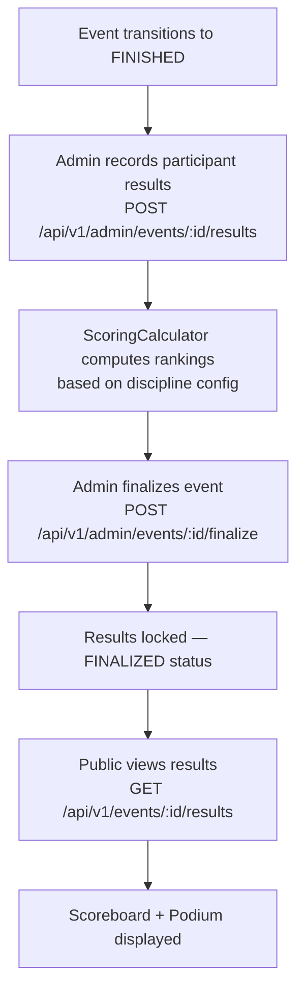

# Event Results & Scoreboard

## Overview

Once an event is FINISHED or FINALIZED, competition results are published on the event detail page. The scoreboard shows rankings, times, and the top-3 podium. Different **discipline scoring models** are supported.

---

## Workflow

---

## Scoring Disciplines

| Discipline | Scoring Model | Description |
|-----------|---------------|-------------|
| DRAG_RACE | BEST_TIME_WINS | Fastest time wins |
| AUTOCROSS | BEST_TIME_WINS | Fastest clean run |
| GYMKHANA | BEST_TIME_WINS | Precision + speed |
| REGULARITY_RALLY | REGULARITY_SCORE | Closest to target time wins |
| TRACK_DAY | BEST_TIME_WINS | Lap time comparison |
| SHOW_SHINE | JUDGE_POINTS | Judged scoring |
| *(F1-style)* | F1_POINTS | Points by finishing position |

---

## Step-by-Step: View Results

1. Navigate to an event with status FINISHED or FINALIZED.
2. Click the **"Results"** tab on the event detail page.
3. View the **Podium** (top 3 with medals).
4. Scroll down for the **full Scoreboard** with all ranked participants.
5. Each row shows: position, member name, car, time/score.

---

## Security Notes

- Results are **public** — no login required to view.
- Only **ADMIN** can record and finalize results.
- Once FINALIZED, results are **locked** — no further edits.

---

## QA Checklist

- [ ] Navigate to FINISHED event → Results tab visible
- [ ] Results tab shows podium (top 3) + full scoreboard
- [ ] View results without login → accessible
- [ ] Admin records result → score calculated correctly per discipline
- [ ] Admin finalizes event → status changes to FINALIZED, edit button hidden
