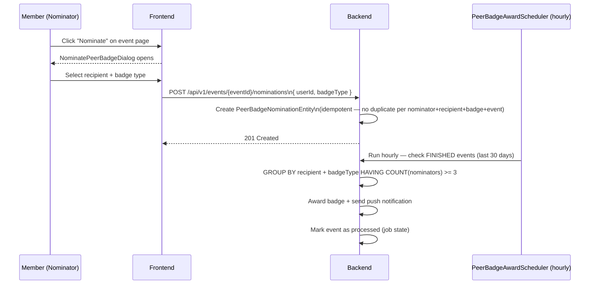

# Peer Badge Nominations

## Overview

After attending an event, members can **nominate fellow participants** for recognition badges. When a participant receives **3 or more nominations** for the same badge type from different nominators within 7 days of the event, the badge is automatically awarded.

---

## Workflow

---

## Badge Types

| Badge | Meaning |
|-------|---------|
| MOST_HELPFUL | Helped others at the event |
| BEST_SPIRIT | Best attitude and sportsmanship |
| *(additional types may be configured)* | |

---

## Step-by-Step: Nominate a Peer

1. Navigate to a **FINISHED** event you attended.
2. Click **"Nominate a Peer"** button.
3. The `NominatePeerBadgeDialog` opens.
4. Select a **participant** from the event.
5. Select the **badge type** you want to nominate them for.
6. Click **"Submit Nomination"**.
7. Your nomination is recorded. You cannot nominate the same person for the same badge at the same event more than once.

---

## Award Process (Automatic)

The `PeerBadgeAwardScheduler` runs **every hour**:

1. Scans FINISHED events from the past 30 days that haven't been processed yet.
2. Counts nominations: `GROUP BY recipientId, badgeType HAVING COUNT(DISTINCT nominatorId) >= 3`.
3. For qualifying recipients: awards the badge and sends a push notification.
4. Marks the event as processed to prevent double-awarding.

---

## Security Notes

- Only authenticated members with an **ACCEPTED application** for the event can nominate.
- Nominations are **immutable** — cannot be withdrawn after submission.
- The award threshold (≥3 nominators) prevents one person from gaming the system.
- A member cannot nominate themselves.

---

## QA Checklist

- [ ] Nominate peer at FINISHED event → nomination recorded (201)
- [ ] Nominate same peer again → 409 Conflict (already nominated)
- [ ] 3 different members nominate same peer for same badge → badge awarded within 1 hour
- [ ] View awarded badges on peer's profile → badge shown
- [ ] Non-attendee tries to nominate → 403 Forbidden
