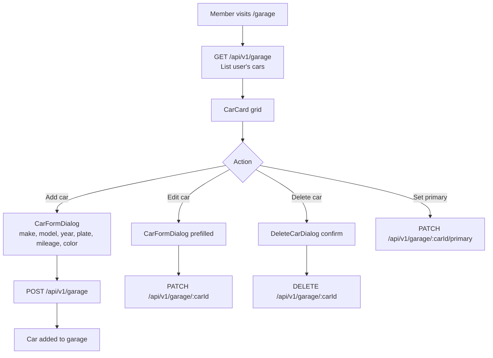

# Car Management

## Overview

Each member can add multiple cars to their personal garage. One car can be marked as **primary** — used for event applications and the leaderboard car rating.

---

## Workflow

---

## Step-by-Step: Add a Car

1. Log in and navigate to **Garage** (`/garage`).
2. Click **"Add Car"**.
3. Fill in the form:
   - **Make** (e.g., Renault, Dacia, Alpine)
   - **Model** (e.g., Clio, Sandero)
   - **Year**
   - **License Plate / Registration Number**
   - **Mileage**
   - **Color** (optional)
4. Click **"Save"**.
5. The car appears in your garage.

---

## Step-by-Step: Set Primary Car

1. In your garage, find the car you want to mark as primary.
2. Click the **"★ Set as Primary"** button on the car card.
3. The primary badge appears on the selected car.
4. Only one car can be primary at a time — changing primary updates the previous one.

---

## Security Notes

- **Ownership enforced via SpEL**: `@garageSecurityService.isOwner(carId, auth)` — accessing another user's car returns 403.
- All car operations require authentication (ROLE_USER minimum).
- Deleting a car also removes associated maintenance alerts.

---

## QA Checklist

- [ ] Add car → appears in garage
- [ ] Edit car details → changes saved
- [ ] Set car as primary → primary badge shown, previous primary unmarked
- [ ] Delete car → removed from garage
- [ ] Access another user's car via API → 403 Forbidden
- [ ] View garage without login → 401 Unauthorized
