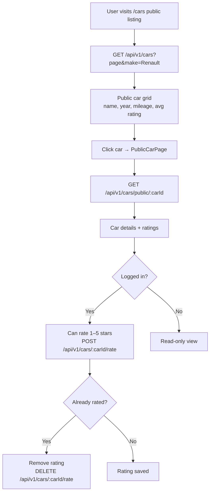

# Public Car Profiles & Ratings

## Overview

Members can opt to make their cars **publicly visible** with a profile page. Other members and guests can view car details and leave a 1–5 star rating. Car average ratings feed into the **Leaderboard's Car Rating** board.

---

## Workflow

---

## Step-by-Step: Browse Public Cars

1. Navigate to **Public Cars** (`/cars`).
2. Use the **make filter** (Renault, Dacia, Alpine, etc.) to narrow results.
3. Each card shows: owner name, make/model/year, mileage, star rating, and review count.
4. Click a car to open its full profile page.

---

## Step-by-Step: Rate a Car

1. Log in and open a car's public profile page.
2. Click the **star rating** (1–5 stars).
3. Your rating is saved immediately.
4. To remove your rating, click the same star again (toggle off) or click **"Remove Rating"**.

---

## Security Notes

- Public cars are visible to **everyone** (no login required to view).
- **Rating requires authentication** (ROLE_USER minimum).
- Each member can rate a specific car **once** (enforced via unique constraint).
- Only the **car owner** can toggle whether their car is publicly visible (via garage settings).

---

## QA Checklist

- [ ] Browse `/cars` without login → public cars listed
- [ ] Filter by make → only that make shown
- [ ] Rate a car while logged in → rating applied, average updates
- [ ] Rate same car again → previous rating replaced or removed
- [ ] Remove rating → car average recalculated
- [ ] View car profile without login → no rating controls shown
