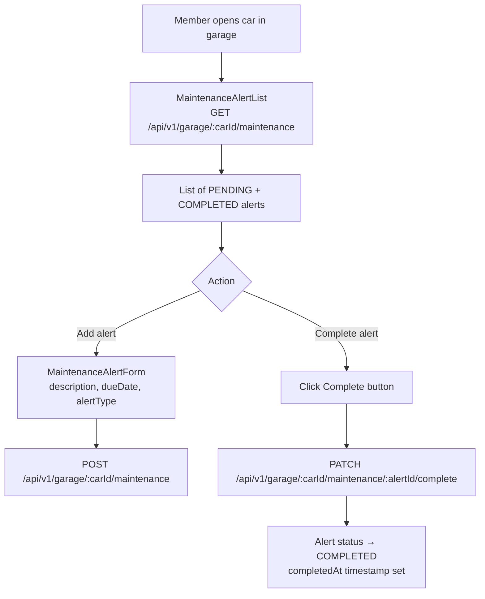

# Maintenance Alerts

## Overview

Maintenance alerts are reminders attached to specific cars. Members can log upcoming maintenance tasks (oil change, tyre rotation, etc.) with a due date, and mark them complete when done.

---

## Workflow

---

## Alert Types

| Type | Example |
|------|---------|
| OIL_CHANGE | Engine oil + filter |
| TYRE_ROTATION | Swap front/rear tyres |
| INSPECTION | Annual roadworthiness check |
| BRAKE_SERVICE | Brake pads / fluid |
| CUSTOM | Any other reminder |

---

## Step-by-Step: Add a Maintenance Alert

1. In your garage, click a car to open its detail view.
2. Navigate to the **Maintenance** tab.
3. Click **"Add Alert"**.
4. Fill in: type, description, due date.
5. Click **"Save"**.
6. The alert appears in the PENDING list with days-until-due countdown.

---

## Step-by-Step: Complete an Alert

1. Find the alert in the PENDING list.
2. Click **"Mark Complete"**.
3. The alert moves to the COMPLETED section with a timestamp.

---

## Security Notes

- Only the **car owner** can view or modify their car's maintenance alerts (same `@garageSecurityService.isOwner` check).

---

## QA Checklist

- [ ] Add maintenance alert → appears in PENDING list
- [ ] Mark alert complete → moves to COMPLETED with timestamp
- [ ] View alerts for another user's car → 403 Forbidden
- [ ] Delete car → associated alerts also removed
