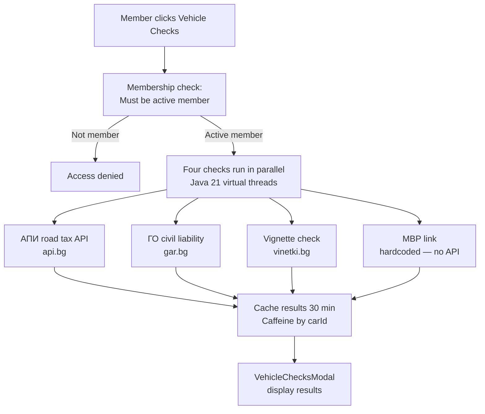

# Vehicle Checks (MOT, Road Tax, Vignette)

## Overview

Members can check the **legal status** of their vehicles via Bulgarian government and semi-official APIs. Three checks are available: АПИ road tax, ГО civil liability insurance, and electronic vignette. Results are cached for 30 minutes per vehicle.

---

## Supported Checks

| Check | Bulgarian Name | Source API | Status |
|-------|---------------|-----------|--------|
| Road Tax | АПИ данък МПС | api.bg | ✅ Available |
| Civil Liability | ГО застраховка | gar.bg | ✅ Available |
| Electronic Vignette | Виньетка | АППИ (vinetki.bg) | ✅ Available |
| Traffic Obligations (МВР) | Задължения КАТ | e-uslugi.mvr.bg | ❌ No public API — link provided |

---

## Workflow

---

## Step-by-Step: Run a Vehicle Check

1. In your garage, open a car's detail view.
2. Click **"Vehicle Checks"**.
3. Results for all three checks load simultaneously (parallel requests).
4. Results show: status (VALID / EXPIRED / UNKNOWN), expiry date if applicable.
5. For МВР (traffic obligations), a direct link to the government website is provided.

:::note Cache
Results are cached for **30 minutes** per car. If you renew your vignette or pay road tax, wait 30 minutes and then refresh for updated results.
:::

---

## Application Properties

| Property | Default | Description | When to Change |
|----------|---------|-------------|---------------|
| `rcb.vehicle-checks.api-bg.url` | `https://api.bg/...` | АПИ road tax endpoint | If the API URL changes |
| `rcb.vehicle-checks.go.url` | `https://gar.bg/...` | ГО insurance endpoint | If the API URL changes |
| `rcb.vehicle-checks.vignette.url` | `https://vinetki.bg/...` | Vignette check endpoint | If the API URL changes |
| `rcb.mvr.url` | `https://e-uslugi.mvr.bg/...` | МВР link (deep link, not API) | If MVR URL structure changes |

---

## Security Notes

- Vehicle checks require **active membership** (membership gate).
- External API calls use **Resilience4j circuit breakers** — if an external service is down, a graceful fallback is returned (UNKNOWN status), not a 500 error.
- Results are cached to reduce load on external APIs and avoid rate limiting.
- Only the **car owner** can run checks on their car.

---

## QA Checklist

- [ ] Run vehicle check as active member → results displayed for all 3 checks
- [ ] Run check as non-member → access denied
- [ ] External API unavailable (simulate 500) → UNKNOWN status shown, no error thrown
- [ ] Run check twice within 30 min → second call returns cached results (no external API call)
- [ ] МВР check → link to government website shown
