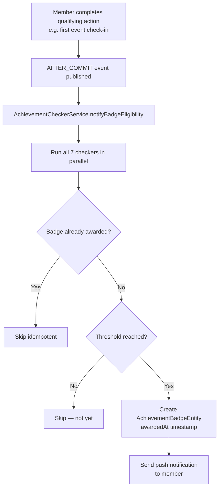

# Achievement Badges

## Overview

Achievement badges are automatically awarded when a member reaches a specific milestone. They are checked **after-commit** using `@TransactionalEventListener` to avoid blocking the main transaction. Each badge is awarded only once per member (idempotent).

---

## Badge Types

| Badge | Trigger | Description |
|-------|---------|-------------|
| FIRST_EVENT | First event check-in | Attended your first club event |
| EVENT_VETERAN | 10+ event check-ins | Attended 10 club events |
| CHAMPION | Competition result rank 1 | Won a competition event |
| TROPHY_HUNTER | 5+ top-3 results | Reached podium 5 times |
| COMMUNITY_VOICE | 50+ comments | Active community contributor |
| COMMENT_STARTER | First comment posted | Posted your first comment |
| POLL_VOTER | First poll vote | Cast your first vote |

---

## Workflow

---

## Step-by-Step: View Your Badges

1. Navigate to your **Profile** page.
2. The **Achievement Badge Shelf** (`AchievementBadgeShelf`) displays all earned badges.
3. Each badge shows its icon, title, and award date.
4. Badges are also visible on your **public profile** (accessible to all users).

---

## Security Notes

- Badges are **awarded server-side only** — never client-triggered.
- Once awarded, badges are **immutable** — cannot be removed.
- Badge checking uses `AFTER_COMMIT` (not `BEFORE_COMMIT`) to ensure the triggering action is fully committed before awarding.

---

## QA Checklist

- [ ] Attend first event → FIRST_EVENT badge awarded (within seconds of check-in)
- [ ] Post first comment → COMMENT_STARTER badge awarded
- [ ] Cast first vote → POLL_VOTER badge awarded
- [ ] View badge shelf → all earned badges displayed with dates
- [ ] View another member's profile → their badges visible publicly
- [ ] Trigger same achievement twice → only one badge awarded (idempotent)
