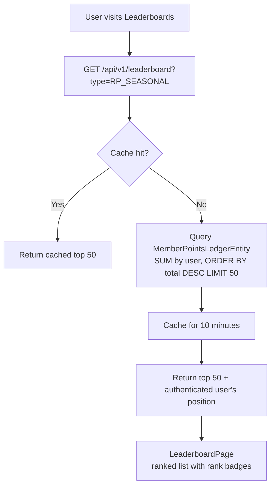

# Leaderboards

## Overview

The leaderboard ranks members by their points balance. Multiple leaderboard types are available: seasonal RP, all-time КТ, and community car ratings. Results are **cached for 10 minutes** and evicted nightly after rank recalculation.

---

## Leaderboard Types

| Type | Sorted By | Resets |
|------|-----------|--------|
| RP_SEASONAL | Current season RP | Annually (January 1st) |
| KT_ALLTIME | All-time КТ total | Never |
| CAR_RATING | Average car star rating | Never |
| SEASON_ARCHIVE | RP from past seasons | Historical view |

---

## Workflow

---

## Step-by-Step: View the Leaderboard

1. Navigate to **Leaderboard** (`/leaderboard`).
2. Select the leaderboard type from the tabs: Seasonal RP / All-time КТ / Car Ratings.
3. The top 50 members are shown with rank badge, name, and score.
4. If you are logged in, your position is shown **even if you are outside the top 50**.
5. For past seasons, select **Season Archive** and choose the year.

---

## Seasonal Reset

Every **January 1st at 00:05 UTC**, the `SeasonResetService` runs:

1. Archives each member's current RP to `SeasonArchiveEntity` (one row per user per year).
2. Resets all RP balances to 0.
3. A **reminder notification** is sent December 25th at 12:00 UTC: "The season ends in 7 days — earn more points before the reset!".

---

## Application Properties

| Scheduler | Schedule | Lock | Description |
|-----------|----------|------|-------------|
| `RankCalculationService` | Daily 02:00 UTC | `rank-recalculation` | Evicts leaderboard cache after rank updates |
| `SeasonResetService` | Jan 1 00:05 UTC | `season-reset` | Archives RP + resets seasonal scores |
| `SeasonResetReminderJob` | Dec 25 12:00 UTC | `season-reset-reminder` | Notifies members of upcoming season end |

---

## Security Notes

- Leaderboards are **public** — no login required to view the top 50.
- **Authenticated users** see their own position (even if outside top 50).
- Results are cached to prevent leaderboard queries from being used as a DoS vector.
- Car leaderboard shows aggregate ratings only — no individual rating breakdown.

---

## QA Checklist

- [ ] View leaderboard without login → top 50 shown, no personal position
- [ ] View leaderboard while logged in → personal position shown below top 50 if not in it
- [ ] Switch between leaderboard types → correct data for each type
- [ ] View seasonal archive for past year → historical rankings shown
- [ ] January 1st → RP balances reset, archived data accessible via season archive
