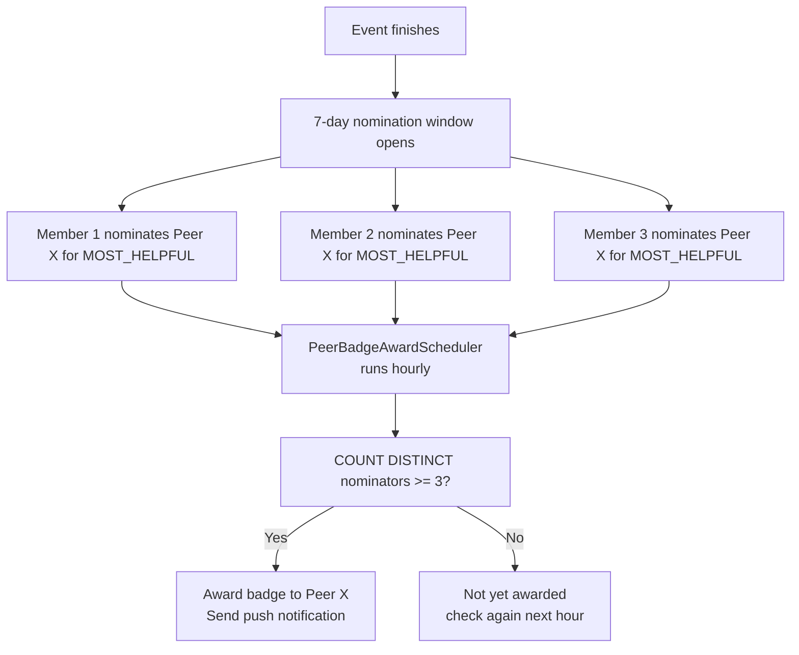

# Peer Badges

## Overview

Peer badges are **community-nominated** recognition awards. Unlike achievement badges (which are automatic), peer badges require **3 or more different members** to nominate the same person for the same badge type at the same event before it is awarded.

---

## How Peer Badge Award Works

---

## Step-by-Step: Nominate a Peer

See the detailed guide in [Peer Badge Nominations](../events/peer-badge-nominations).

---

## Step-by-Step: View Peer Badges

1. Navigate to a member's **profile** page.
2. The **Peer Badges** section (`PeerBadgesSection`) shows all awarded peer badges.
3. Each badge shows: type, event name, and award date.

---

## Scheduler

| Scheduler | Schedule | Lock | Description |
|-----------|----------|------|-------------|
| `PeerBadgeAwardScheduler` | Hourly | `peer-badge-award` (PT30M lock) | Awards badges where ≥3 nominations received |

---

## Security Notes

- A member **cannot nominate themselves**.
- Each nominator can nominate a specific person for a specific badge at a specific event **only once** (unique constraint).
- Awards are **immutable** — once awarded, a peer badge cannot be revoked.
- The minimum threshold (3 nominators) prevents manipulation by a single person.

---

## QA Checklist

- [ ] 3 members nominate Peer X for same badge → badge awarded within 1 hour
- [ ] 2 members nominate only → not yet awarded (need 1 more)
- [ ] Same member nominates Peer X twice → 409 Conflict
- [ ] View peer badges on profile → correctly displayed
- [ ] Peer badge notification received → push notification with badge name and event
