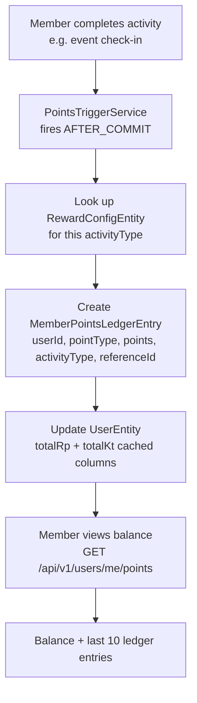

# Points & Currency (RP / КТ)

## Overview

The RCB reward system uses two point currencies:

| Currency | Name | Type | Resets |
|----------|------|------|--------|
| **RP** | Renault Points | Seasonal | Resets January 1st each year |
| **КТ** | Клубни Точки (Club Points) | All-time | Never resets |

Points are earned through platform activities (attending events, commenting, voting, etc.) based on the **Reward Config** set by admins. The ledger is **immutable** — every award is a permanent record.

---

## Workflow

---

## Activities That Earn Points

Points are configured by admins via `RewardConfigEntity`. Typical activities include:

| Activity | Point Type | Typical Points |
|----------|-----------|---------------|
| Event attendance (check-in) | КТ + RP | 10 |
| Poll vote | RP | 2 |
| Comment posted | RP | 1 |
| First event attended | КТ | 20 (bonus) |
| Peer badge awarded | КТ | 15 |

*Exact values are configurable — see [Reward Configuration](../admin/reward-config).*

---

## Step-by-Step: View Your Points

1. Log in and navigate to your **Profile** or **Rewards** section.
2. Your current **RP** and **КТ** balances are displayed.
3. The last 10 ledger entries show: date, activity type, and points earned.
4. Click **"View All History"** to see the full immutable ledger.

---

## Application Properties

| Property | Default | Description |
|----------|---------|-------------|
| `rcb.async.core-pool-size` | `4` | Thread pool for async point award events |

---

## Security Notes

- Points are **awarded server-side only** — clients cannot trigger point awards directly.
- The ledger is **append-only** (immutable) — no point can be removed or modified after award.
- Only **ADMIN** can modify the `RewardConfigEntity` (point trigger values).
- **Season reset** runs January 1st — archives all RP to `SeasonArchiveEntity` and resets RP to 0. КТ is never reset.

---

## QA Checklist

- [ ] Complete a point-eligible activity → points appear in ledger within seconds
- [ ] View balance → correct RP + КТ totals shown
- [ ] View ledger entries → each entry has date, activity, and points
- [ ] January 1st season reset → RP balance resets to 0, КТ unchanged
- [ ] Attempt to award points via direct API call as member → 403 Forbidden
