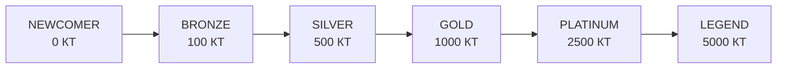
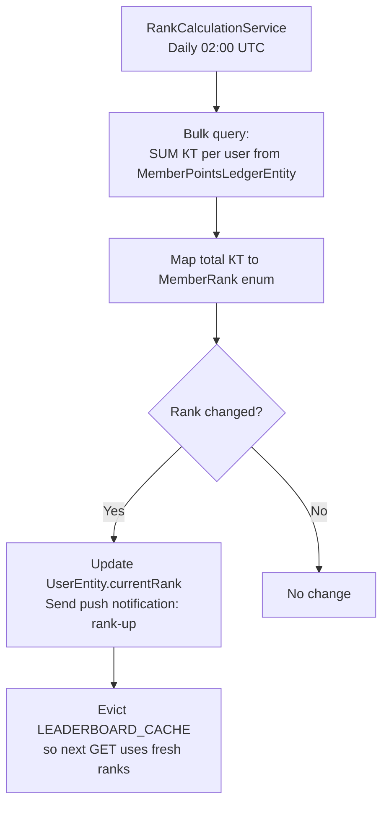

# Ranks & Level Up

## Overview

Member ranks are calculated based on **КТ (Клубни Точки / Club Points)** — the all-time currency. As members earn КТ, they progress through 6 rank tiers. The `RankCalculationService` runs nightly to update ranks and send level-up notifications.

---

## Rank Tiers

| Rank | КТ Required | Badge Color |
|------|------------|-------------|
| NEWCOMER | 0 | Grey |
| BRONZE | 100 | Bronze |
| SILVER | 500 | Silver |
| GOLD | 1000 | Gold |
| PLATINUM | 2500 | Platinum |
| LEGEND | 5000 | Diamond |

---

## Workflow

---

## Step-by-Step: View Your Rank

1. Log in and navigate to your **Profile** page.
2. Your current rank badge is displayed below your name.
3. See your КТ balance and how many КТ remain until the next rank.
4. The `RankBadge` component shows your rank with the corresponding icon and color.

---

## Application Properties

| Scheduler | Schedule | Lock Name | Max Lock Time | Description |
|-----------|----------|-----------|---------------|-------------|
| `RankCalculationService` | Daily 02:00 UTC | `rank-recalculation` | PT2H | Recalculates all member ranks, sends notifications, evicts cache |

---

## Security Notes

- Rank calculation is **server-only** — clients cannot set their own rank.
- Rank is stored as a **cached column** on `UserEntity` (updated nightly) — fast reads, eventual consistency (up to 24h lag).
- A member's rank is **visible publicly** (shown on profile and leaderboard).

---

## QA Checklist

- [ ] Member earns enough КТ for next rank → rank updates after nightly job
- [ ] View rank on profile → correct rank badge displayed
- [ ] Push notification received on rank-up → correct rank name in notification
- [ ] View КТ-to-next-rank progress → accurate calculation shown
