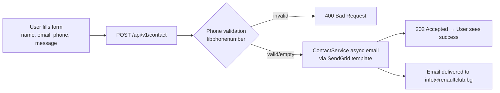

# Contact Form

## Overview

The contact form lets any visitor (no login required) send an inquiry directly to the club. Messages are delivered via **SendGrid** to the club's inbox. No data is stored in the database — GDPR-friendly by design.

---

## Workflow

---

## Step-by-Step: Send an Inquiry

1. Navigate to **Contact** (`/contact`) — no login required.
2. Fill in:
   - **Name** (required)
   - **Email** (required, valid format)
   - **Phone** (optional, international format e.g. `+359888123456`)
   - **Message** (required)
3. Click **"Send"**.
4. A success confirmation is shown. The club receives the email immediately.

---

## Application Properties

| Property | Default | Description |
|----------|---------|-------------|
| `rcb.sendgrid.contact-form-template-id` | *(SendGrid template ID)* | Email template for contact inquiries |
| `rcb.sendgrid.contact-recipient-email` | `info@renaultclub.bg` | Where contact emails are sent |

---

## Security Notes

- **No PII stored** — form data is sent directly to SendGrid and never persisted in the database.
- Phone validation uses **libphonenumber** (Google) — accepts standard international formats.
- The endpoint is **public** (no auth required).
- GDPR: since no personal data is stored, no data retention policy applies to this endpoint.

---

## QA Checklist

- [ ] Submit valid form → 202 Accepted, success message displayed
- [ ] Submit with invalid email format → validation error shown
- [ ] Submit with invalid phone number → 400 error shown
- [ ] Submit without name or message → required field error shown
- [ ] Access endpoint from unauthenticated browser → works (public)
