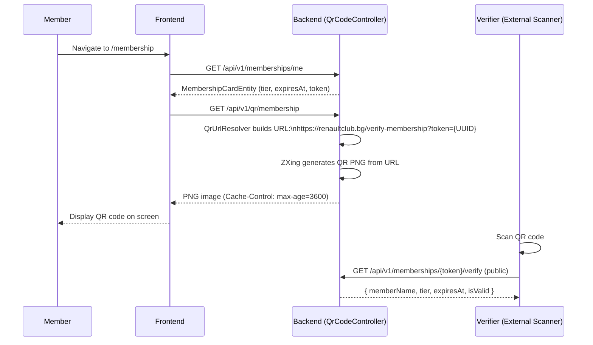

# Digital Membership Card

## Overview

Every member with an active membership card can generate a **QR-code digital membership card**. The QR code encodes a public verification URL. When scanned, it shows the member's name, membership tier, and expiry status — without requiring any login.

---

## Workflow

---

## Step-by-Step: View Your Membership Card

1. Log in and navigate to **Membership** (`/membership`).
2. Your active membership card details are shown (tier, expiry date).
3. Click **"Show QR Code"** to generate the QR PNG.
4. The QR code is cached for 1 hour — subsequent requests within that window use the cached PNG.
5. Use the **Share** button to share via the `ShareQrModal` (copy link, download PNG, native share API).

---

## Step-by-Step: Verify a Membership Card (Scanning)

1. Scan the member's QR code with any QR reader.
2. The URL opens the public **Membership Verification Page** (`/verify-membership`).
3. The page shows: member name, tier (NORMAL / SILVER / GOLDEN), expiry date, and validity status.
4. **No login required** to verify — it's a public endpoint.

---

## Membership Tiers

| Tier | Description |
|------|-------------|
| NORMAL | Standard member |
| SILVER | Premium member with additional benefits |
| GOLDEN | VIP member with full benefits |

---

## Application Properties

| Property | Default | Description |
|----------|---------|-------------|
| `rcb.membership.tiers` | `[NORMAL, SILVER, GOLDEN]` | Configured tier features and pricing |

---

## Security Notes

- The QR URL contains a **random UUID token** (not the user ID) — prevents enumeration attacks.
- The verification endpoint is **public** but exposes only: member name, tier, and validity. No PII (email, phone, address) is disclosed.
- A member can only generate **their own** QR code (JWT sub checked server-side).
- Admin can **revoke** a membership card (`revokedAt` set) — the verification page will show "REVOKED".

---

## QA Checklist

- [ ] Navigate to `/membership` → membership card details displayed
- [ ] Click "Show QR Code" → QR PNG loaded
- [ ] Scan QR with phone → opens verification URL, shows member info
- [ ] Verify revoked card → shows "REVOKED" status
- [ ] Access `GET /api/v1/qr/membership` without auth → 401 Unauthorized
- [ ] Verify endpoint without a valid token UUID → 404 Not Found
