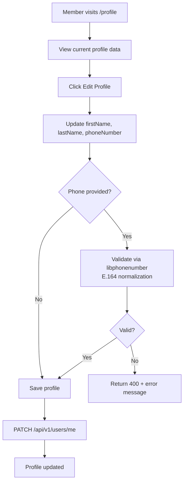

# Profile Management

## Overview

Every authenticated member has a profile that stores their personal information. Profile data is used across the platform (event applications, leaderboards, membership cards, etc.).

---

## Workflow

---

## Step-by-Step: Edit Profile

1. Log in and click your **avatar** in the top navigation bar.
2. Select **"Edit Profile"** (or navigate to `/profile`).
3. The `EditProfileDialog` opens with current values pre-filled.
4. Update any of: **First Name**, **Last Name**, **Phone Number**.
5. Click **Save**.
6. Changes are reflected immediately across the platform.

:::note Phone number validation
Phone numbers are validated using the international **libphonenumber** library and stored in E.164 format (e.g., `+359888123456`). Invalid formats are rejected with a clear error message.
:::

---

## Step-by-Step: Directory Visibility

The member directory is **opt-in** by default (privacy-first, GDPR Article 25).

1. Go to your **Profile** page.
2. Toggle **"Show in Member Directory"**.
3. When enabled, your name appears in the members directory visible to all authenticated users.
4. When disabled, your profile is hidden from the directory.

---

## Application Properties

| Property | Default | Description |
|----------|---------|-------------|
| *(no custom properties)* | — | Phone validation is library-only |

---

## Security Notes

- Users can only update **their own profile** — the server resolves the user from the JWT subject, not from a URL parameter. No IDOR risk.
- Admin can view all user profiles via `GET /api/v1/users` and can **lock**, **unlock**, or **delete** accounts.
- Soft-delete: deleted accounts have `deletedAt` set and are excluded from all queries.

---

## QA Checklist

- [ ] Update first/last name → changes visible immediately
- [ ] Enter valid international phone → saved in E.164 format
- [ ] Enter invalid phone (e.g., `abc123`) → error shown, not saved
- [ ] Toggle directory visibility → appears/disappears from member directory
- [ ] Attempt to update another user's profile via API → 403 Forbidden
