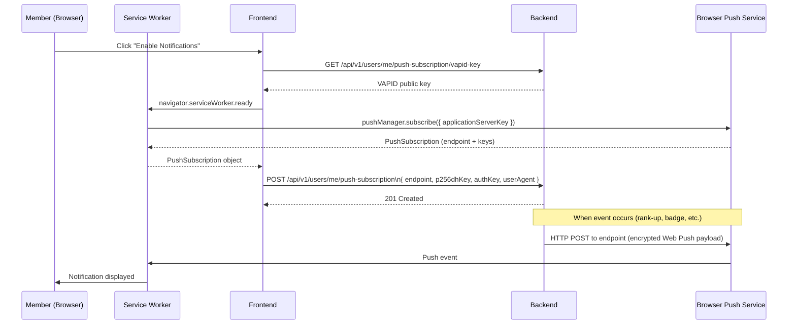

# Push Notifications

## Overview

Members can subscribe to **browser push notifications** to receive real-time alerts about: rank level-ups, peer badge awards, member suspension/reinstatement, new events, and other platform activity. Notifications are sent via the **Web Push Protocol** and work even when the browser is closed (via Service Worker).

---

## Workflow

---

## Step-by-Step: Enable Notifications

1. Log in and navigate to **Profile** → **Notification Settings**.
2. Click **"Enable Push Notifications"**.
3. The browser prompts: **"Allow notifications from renaultclub.bg?"**
4. Click **"Allow"**.
5. Your subscription is saved. You will now receive push notifications.

---

## Step-by-Step: Disable Notifications

1. Navigate to **Profile** → **Notification Settings**.
2. Click **"Disable Push Notifications"**.
3. Your subscription is removed from the server.
4. Alternatively, revoke permission directly in the browser settings.

---

## Notification Types

| Event | Who Receives It |
|-------|----------------|
| Rank level-up (e.g., BRONZE → SILVER) | The member whose rank changed |
| Achievement badge awarded | The member who earned it |
| Peer badge awarded | The recipient member |
| Suspension / warning / reinstatement | The affected member |

---

## Application Properties

| Property | Default | Description | When to Change |
|----------|---------|-------------|---------------|
| `rcb.vapid.public-key` | *(generated)* | VAPID public key — shared with browsers | Rotate if private key is compromised |
| `rcb.vapid.private-key` | *(Jasypt-encrypted)* | VAPID private key — signs push requests | Rotate annually or on compromise |
| `rcb.vapid.subject` | `mailto:admin@renaultclub.bg` | Contact for push service | Change if admin email changes |

---

## Security Notes

- The VAPID private key **never leaves the server** — it only signs push requests sent to the browser's push service.
- Push payloads are **end-to-end encrypted** using the browser's `p256dhKey` and `authKey` — the push service cannot read the content.
- Subscriptions are per-user and per-browser — a member can have multiple subscriptions (desktop + mobile).
- Unsubscribe removes the `PushSubscriptionEntity` — no further pushes are sent to that endpoint.

---

## QA Checklist

- [ ] Click "Enable Notifications" → browser permission prompt appears
- [ ] Allow → subscription saved, confirmation shown
- [ ] Trigger a rank-up → push notification received in browser
- [ ] Click "Disable Notifications" → subscription removed
- [ ] Access `GET /vapid-key` → returns base64 public key (no auth required)
- [ ] Access `POST /push-subscription` without auth → 401 Unauthorized
