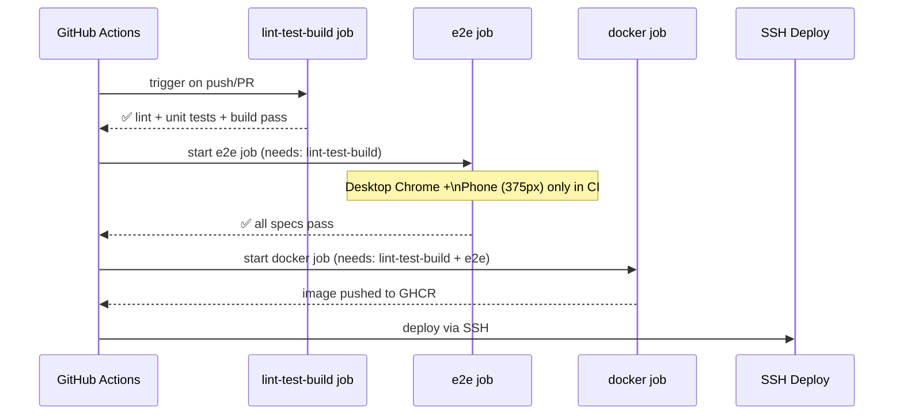

# End-to-End Testing with Playwright

The RCB frontend uses [Playwright](https://playwright.dev/) for end-to-end browser testing. Playwright tests run against a real (or dev server) React application, testing full user flows across multiple real browser engines and device sizes.

---

## Stack

| Component | Version / Details |
|-----------|------------------|
| Playwright | 1.x |
| Browser engines | Chromium, Firefox, WebKit (Safari) |
| Device projects | 6 — from 320px (Phone SE) to 1920px (Wide Desktop) |
| Test runner | `@playwright/test` |
| Auth helper | Keycloak ROPC (Resource Owner Password Credentials) |

---

## Spec Structure

All E2E tests live under the `e2e/` directory in the frontend repository:

```
e2e/
├── fixtures/
│   ├── auth.fixture.ts         ← Keycloak ROPC auth helper (token exchange)
│   └── test.fixture.ts         ← base fixture extending auth + page utilities
├── home.spec.ts                ← home page hero, stats, featured sections
├── events.spec.ts              ← event list, detail modal, responsive layout
├── news.spec.ts                ← news list, article view
├── gallery.spec.ts             ← gallery grid, photo lightbox
├── cars.spec.ts                ← public car catalog — filter chips, pagination (no auth)
├── auth.spec.ts                ← access control: protected vs public routes
├── contact.spec.ts             ← contact form validation and submission
├── newsletter.spec.ts          ← newsletter subscribe / unsubscribe flow
├── membership.spec.ts          ← pricing page responsive, plan selection
├── partners.spec.ts            ← partners grid, advertisement banners
├── campaigns.spec.ts           ← campaigns list, detail, sponsor display
├── admin.spec.ts               ← admin route guards, mobile tables (ADMIN role)
└── responsive.spec.ts          ← cross-device layout + 44×44px touch targets
```

---

## Device Projects

Playwright runs each spec against all configured device projects unless scoped with `--project`:

| Project Name | Viewport | Primary Use |
|-------------|----------|-------------|
| `Phone (320px)` | 320×568 | Smallest supported phone (iPhone SE) |
| `Phone (375px)` | 375×667 | Standard mobile (iPhone SE 2nd gen) |
| `Tablet (768px)` | 768×1024 | iPad portrait |
| `Desktop (1280px)` | 1280×800 | Standard desktop |
| `Wide Desktop (1440px)` | 1440×900 | Wide laptop |
| `Wide Desktop (1920px)` | 1920×1080 | Full HD monitor |

---

## Running Tests

### All Specs — All Device Projects

```bash
npm run e2e
```

### Visible Browser (Debug Mode)

```bash
npm run e2e:headed
```

### Playwright UI Mode (Interactive Test Explorer)

```bash
npm run e2e:ui
```

### Open Last HTML Report

```bash
npm run e2e:report
```

### Specific Device Project

```bash
npx playwright test --project="Phone (375px)"
```

### Specific Spec File

```bash
npx playwright test e2e/cars.spec.ts
```

### Against Staging

```bash
PLAYWRIGHT_BASE_URL=https://staging.rcb.bg npm run e2e
```

### Against Production (smoke test only — read-only specs)

```bash
PLAYWRIGHT_BASE_URL=https://rcb.bg npx playwright test \
  e2e/home.spec.ts e2e/cars.spec.ts e2e/events.spec.ts
```

---

## Auth Fixture — Keycloak ROPC

The `auth.fixture.ts` uses Keycloak's **Resource Owner Password Credentials** (ROPC) grant to obtain a real JWT token for test users. This token is stored in browser localStorage to simulate a logged-in user without going through the full Keycloak login UI.

```typescript
// e2e/fixtures/auth.fixture.ts (simplified)
async function getKeycloakToken(username: string, password: string): Promise<string> {
  const response = await fetch(
    `${process.env.KEYCLOAK_URL}/realms/${process.env.KEYCLOAK_REALM}/protocol/openid-connect/token`,
    {
      method: 'POST',
      headers: { 'Content-Type': 'application/x-www-form-urlencoded' },
      body: new URLSearchParams({
        grant_type: 'password',
        client_id: process.env.KEYCLOAK_CLIENT_ID!,
        username,
        password,
      }),
    }
  );
  const data = await response.json();
  return data.access_token;
}
```

### ROPC Setup Requirements

ROPC must be **enabled only for the test client** in the Keycloak realm:

1. Keycloak Admin Console → Realm `rcb` → Clients → `rcb-frontend-test`
2. Settings → **Direct Access Grants** → Enabled: `ON`
3. The `rcb-frontend` production client must have Direct Access Grants **disabled**

:::warning ROPC Security Note
ROPC bypasses the standard OAuth2 authorization code flow. It must only be enabled for a dedicated test client (`rcb-frontend-test`) — never for the production `rcb-frontend` client. The test client should have no redirect URIs configured in production.
:::

### Required Environment Variables for Auth Fixture

```bash
KEYCLOAK_URL=http://localhost:8180          # Keycloak base URL
KEYCLOAK_REALM=rcb                          # Keycloak realm name
KEYCLOAK_CLIENT_ID=rcb-frontend-test        # Test-only client with ROPC enabled
TEST_USER_USERNAME=testuser@rcb.bg
TEST_USER_PASSWORD=<secret>                 # GitHub secret: TEST_USER_PASSWORD
TEST_ADMIN_USERNAME=testadmin@rcb.bg
TEST_ADMIN_PASSWORD=<secret>                # GitHub secret: TEST_ADMIN_PASSWORD
TEST_MOD_USERNAME=testmod@rcb.bg
TEST_MOD_PASSWORD=<secret>                  # GitHub secret: TEST_MOD_PASSWORD
```

---

## CI Pipeline Integration



In CI (`.github/workflows/ci.yml`), only two device projects run to keep the pipeline fast:

```yaml
e2e:
  needs: lint-test-build
  runs-on: ubuntu-latest
  steps:
    - uses: actions/checkout@v4
    - uses: actions/setup-node@v4
      with:
        node-version: '20'
        cache: 'npm'
    - run: npm ci
    - run: npx playwright install chromium --with-deps
    - name: Run E2E tests
      run: npx playwright test --project="Desktop Chrome" --project="Phone (375px)"
      env:
        PLAYWRIGHT_BASE_URL: http://localhost:5173
        KEYCLOAK_URL: http://localhost:8180
        KEYCLOAK_REALM: rcb
        KEYCLOAK_CLIENT_ID: rcb-frontend-test
        TEST_USER_PASSWORD: ${{ secrets.TEST_USER_PASSWORD }}
        TEST_ADMIN_PASSWORD: ${{ secrets.TEST_ADMIN_PASSWORD }}
        TEST_MOD_PASSWORD: ${{ secrets.TEST_MOD_PASSWORD }}
    - name: Upload Playwright report
      if: always()
      uses: actions/upload-artifact@v4
      with:
        name: playwright-report
        path: playwright-report/
        retention-days: 30
```

:::info Docker Job Dependency
The Docker build job requires **both** `lint-test-build` and `e2e` to pass. This means a failing E2E test prevents the Docker image from being pushed and deployed.
:::

---

## WCAG 2.5.5 Touch Target Compliance

`responsive.spec.ts` verifies that all interactive elements meet the WCAG 2.5.5 minimum touch target size of **44×44 CSS pixels**:

```typescript
// Verify all visible buttons meet minimum touch target size
const buttons = page.locator('button:visible');
const count = await buttons.count();
for (let i = 0; i < count; i++) {
  const box = await buttons.nth(i).boundingBox();
  expect(box?.height).toBeGreaterThanOrEqual(36); // MUI minimum
}

// Hamburger menu must be >= 44px (WCAG strict)
const hamburger = page.locator('[aria-label="menu"]');
const box = await hamburger.boundingBox();
expect(box?.height).toBeGreaterThanOrEqual(44);
expect(box?.width).toBeGreaterThanOrEqual(44);
```

MUI's default button minimum height is 36px. The WCAG 2.5.5 strict requirement is 44px. The project accepts 36px for standard buttons (MUI default) and enforces 44px only for the mobile navigation hamburger, which is the primary touch target on small screens.

---

## Local Dev Server Auto-Start

When `PLAYWRIGHT_BASE_URL` is not set, Playwright automatically starts the Vite dev server before running tests and stops it afterwards:

```typescript
// playwright.config.ts
export default defineConfig({
  webServer: process.env.PLAYWRIGHT_BASE_URL
    ? undefined
    : {
        command: 'npm run dev',
        url: 'http://localhost:5173',
        reuseExistingServer: !process.env.CI,
      },
  use: {
    baseURL: process.env.PLAYWRIGHT_BASE_URL ?? 'http://localhost:5173',
  },
});
```

This means:
- **Local development**: `npm run e2e` starts the dev server automatically — no manual startup needed
- **CI**: dev server is started by the `webServer` config (no `PLAYWRIGHT_BASE_URL` set)
- **Staging/Production**: set `PLAYWRIGHT_BASE_URL` — dev server is skipped

---

## Troubleshooting

### "Target closed" / timeout errors

Usually caused by the dev server not being ready. Try:

```bash
# Start dev server manually first
npm run dev

# In a separate terminal
npm run e2e
```

### Auth fixture returns 401

Check that:
1. Keycloak is running: `curl http://localhost:8180/health/ready`
2. The test client `rcb-frontend-test` has Direct Access Grants enabled
3. The test user credentials in `.env.test` are correct

### Test failures only on Phone (375px) project

This is usually a responsive layout issue — a component visible on desktop is hidden or overlapped on mobile. Use headed mode to inspect:

```bash
npx playwright test --project="Phone (375px)" --headed e2e/failing-spec.spec.ts
```

---

## References

- [Playwright Documentation](https://playwright.dev/docs/intro)
- [Playwright Test Configuration](https://playwright.dev/docs/test-configuration)
- [Keycloak Direct Access Grants](https://www.keycloak.org/docs/latest/server_admin/#_resource_owner_password_credentials_flow)
- [WCAG 2.5.5 Target Size](https://www.w3.org/WAI/WCAG21/Understanding/target-size.html)
