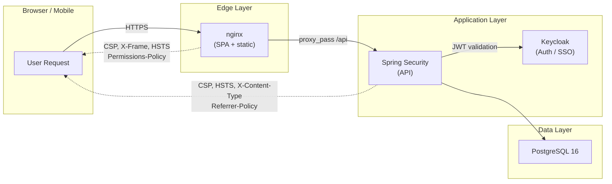
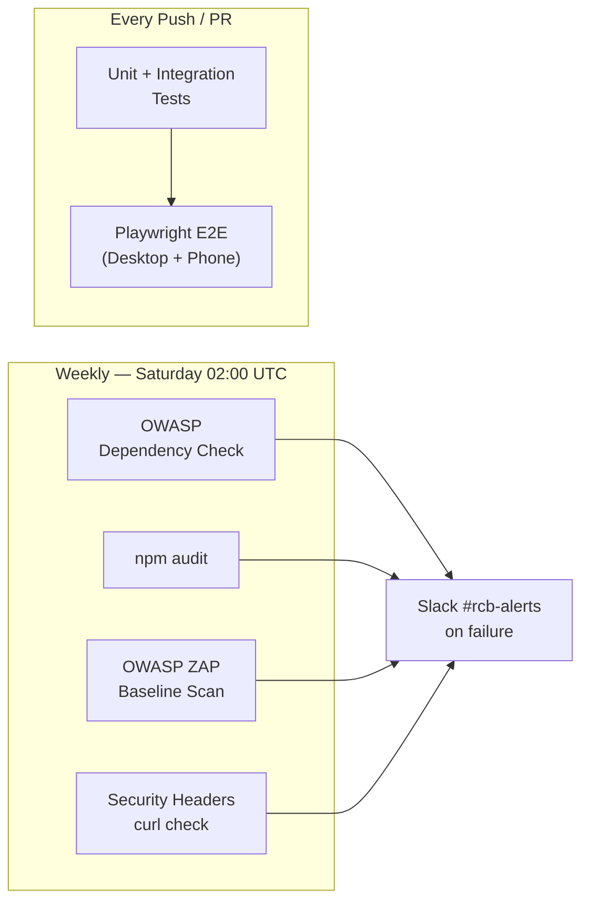

# Security & QA

This section documents the security hardening and quality assurance practices introduced in **Story 018 — QA Security Hardening & Launch**. It covers every layer of the RCB platform: HTTP security headers, automated vulnerability scanning, load testing, end-to-end browser testing, and the operational runbook for migrating the database from MySQL to PostgreSQL.

---

## What Is in This Section

| Document | Description |
|----------|-------------|
| [Security Headers](./security-headers) | Spring Security and nginx HTTP response headers — CSP, HSTS, X-Frame-Options, Permissions-Policy |
| [OWASP Dependency Check](./owasp-dependency-check) | Maven CVE scan — profile, thresholds, false-positive suppression, CI schedule |
| [Gatling Load Tests](./load-testing) | Performance baselines — NFR targets, load shape, ramp profile, reports |
| [OWASP ZAP Scan](./zap-scan) | Automated DAST pen-test — CI schedule, manual trigger, alert triage, suppressions |
| [Playwright E2E Tests](./e2e-testing) | Cross-device browser tests — spec inventory, auth fixture, CI integration |
| [MySQL → PostgreSQL Migration](./migration-cutover) | Cutover runbook — export scripts, import, verify, rollback (critical operational doc) |
| [Weekly Security Scan CI](./weekly-security-scan) | `.github/workflows/security-scan.yml` — 4-job parallel workflow details |

---

## Security Layers



---

## Security Scanning Pipeline



---

## Quick Reference

### Verify headers in production

```bash
curl -sI https://rcb.bg/api/v1/home \
  | grep -iE "x-frame|content-security|x-content-type|strict-transport|referrer|permissions"
```

### Run OWASP dependency scan

```bash
cd /path/to/renault-club-bulgaria-be
./mvnw dependency-check:aggregate -Powasp
# Report: target/dependency-check-reports/dependency-check-report.html
```

### Run Playwright E2E tests

```bash
# In the frontend repo
npm run e2e                        # all specs, all device projects
npm run e2e:ui                     # Playwright UI mode (visual debug)
```

### Trigger weekly security scan manually

```bash
gh workflow run security-scan.yml --field target_url=https://staging.rcb.bg
```

---

## Story 018 Scope

Story 018 delivered the following security and QA improvements:

- Spring Security `.headers()` configuration with CSP, HSTS, Referrer-Policy, Permissions-Policy
- nginx security headers block for SPA responses (aligned but separately tuned for MUI)
- OWASP Dependency Check Maven plugin (`-Powasp` profile, CVSS ≥ 9.0 fails the build)
- Gatling performance tests in `perf-tests/` standalone Maven module
- OWASP ZAP baseline scan integrated in `security-scan.yml`
- Playwright 1.x E2E test suite — 13 spec files, 6 device projects, Keycloak ROPC auth fixture
- Weekly `.github/workflows/security-scan.yml` with 4 parallel security jobs
- MySQL → PostgreSQL migration scripts and cutover runbook
