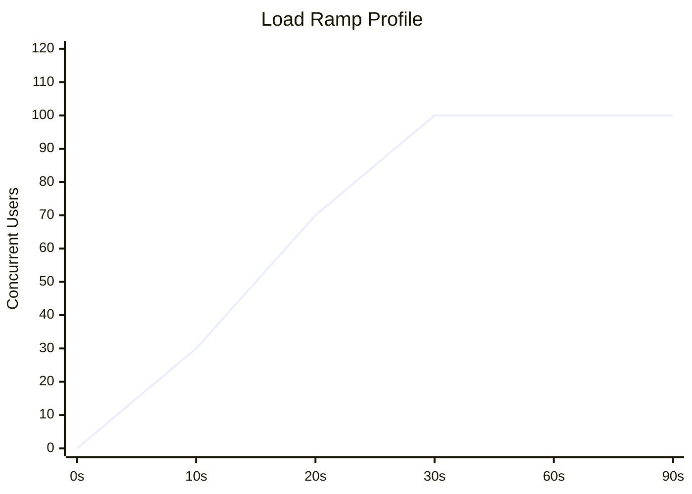

# Gatling Load Tests

[Gatling](https://gatling.io/) is the load testing framework used to validate that the RCB backend meets its non-functional performance requirements (NFRs) before each production release. It is written in Scala/Java and integrates with Maven.

The Gatling tests live in the `perf-tests/` directory — a **standalone Maven module** that is deliberately excluded from the default multi-module build. This ensures that load tests never run accidentally during `mvn clean verify`.

---

## Module Location

```
renault-club-bulgaria-be/
└── perf-tests/
    ├── pom.xml                          ← standalone Maven module (NOT in root modules)
    └── src/
        └── gatling/
            └── scala/
                └── com/rcb/perf/
                    ├── RcbSimulation.scala    ← main simulation
                    └── SecurityHeadersSimulation.scala
```

:::warning Standalone Module
`perf-tests/` is NOT listed in the root `pom.xml` `<modules>` section. Running `./mvnw clean verify` from the repository root does **not** execute load tests. You must `cd perf-tests` and run the Maven wrapper explicitly.
:::

---

## Running the Tests

### Against Local Backend (port 8080)

```bash
# Start the backend first
cd renault-club-bulgaria-be
./mvnw spring-boot:run -pl rest

# In a separate terminal
cd renault-club-bulgaria-be/perf-tests
../mvnw gatling:test
```

### Against Staging

```bash
cd renault-club-bulgaria-be/perf-tests
../mvnw gatling:test -DbaseUrl=https://staging.rcb.bg
```

### Against Production (read-only smoke test)

```bash
cd renault-club-bulgaria-be/perf-tests
../mvnw gatling:test -DbaseUrl=https://rcb.bg -DmaxUsers=10
```

:::caution Production Load Tests
Run production load tests only during low-traffic windows (e.g. weekday 03:00–05:00 EET). Never run the full ramp profile against production.
:::

### Viewing Reports

```bash
# Reports are generated under perf-tests/target/gatling/
ls perf-tests/target/gatling/

# Open the latest report
open perf-tests/target/gatling/*/index.html
```

On Linux:

```bash
python3 -m http.server 8888 --directory perf-tests/target/gatling
# Navigate to http://localhost:8888/<simulation-name>/index.html
```

---

## Non-Functional Requirements (NFRs)

| Metric | Target | Fail Threshold |
|--------|--------|----------------|
| P99 response time | < 500 ms | > 500 ms fails the simulation |
| P95 response time | < 300 ms | — (informational) |
| Mean response time | < 200 ms | — (informational) |
| Error rate | < 1% | ≥ 1% fails the simulation |
| Throughput | ≥ 50 req/s at 100 concurrent users | — |

These thresholds are enforced by Gatling assertions in `RcbSimulation.scala`:

```scala
setUp(scn.inject(
  rampUsersPerSec(1).to(100).during(30.seconds),
  constantUsersPerSec(100).during(60.seconds)
)).assertions(
  global.responseTime.percentile(99).lt(500),
  global.failedRequests.percent.lt(1)
)
```

---

## Endpoints Under Test

All 7 public endpoints are included in the load scenario:

| Endpoint | Description | Auth Required |
|----------|-------------|---------------|
| `GET /api/v1/home` | Home page aggregate | No |
| `GET /api/v1/events` | Events list | No |
| `GET /api/v1/news` | News list | No |
| `GET /api/v1/partners` | Partners list | No |
| `GET /api/v1/campaigns` | Campaigns list | No |
| `GET /api/v1/gallery` | Gallery list | No |
| `GET /api/v1/cars` | Public car catalog | No |

All endpoints are public (no authentication required) — this reflects real-world usage where the majority of traffic comes from unauthenticated visitors.

---

## Load Shape

The simulation uses a two-phase ramp:



| Phase | Duration | Users |
|-------|----------|-------|
| Warm-up ramp | 0–30 s | 1 → 100 users (linear ramp) |
| Steady state | 30–90 s | 100 users constant |
| Total test time | 90 s | — |

The warm-up ramp prevents the JVM and database connection pool from being hit cold at full concurrency.

---

## Security Headers Scenario

A secondary simulation (`SecurityHeadersSimulation.scala`) verifies that security headers are present on all API responses. It is not a load test — it runs with a single virtual user and checks each header:

```scala
val headerChecks = exec(
  http("home - security headers")
    .get("/api/v1/home")
    .check(
      header("X-Content-Type-Options").is("nosniff"),
      header("X-Frame-Options").is("DENY"),
      header("Strict-Transport-Security").exists(),
      header("Content-Security-Policy").exists(),
      header("Referrer-Policy").exists(),
      header("Permissions-Policy").exists()
    )
)
```

Run it separately:

```bash
../mvnw gatling:test -Dgatling.simulationClass=com.rcb.perf.SecurityHeadersSimulation
```

---

## Interpreting Reports

The Gatling HTML report (`index.html`) shows:

- **Response time distribution** — histogram + percentile chart
- **Active users over time** — verifies ramp shape was executed correctly
- **Requests per second** — throughput timeline
- **Errors** — HTTP 4xx/5xx counts and messages

A healthy run looks like:

- P99 stays flat below 500 ms during the steady-state phase
- Active users curve is smooth (no drops indicating failed requests)
- Error rate is 0.0% or well below 1%

---

## Troubleshooting

### "Connection refused" on local run

The backend must be started before running Gatling. Verify it is up:

```bash
curl -s http://localhost:8080/actuator/health | jq .status
# Expected: "UP"
```

### High error rate on staging

Check whether staging has reached its connection pool limit:

```bash
# Check Actuator datasource metrics
curl -s https://staging.rcb.bg/actuator/metrics/hikaricp.connections.active
```

### P99 > 500 ms on otherwise healthy run

This is often caused by:
1. First-request JPA lazy initialization — the warm-up phase should prevent this
2. Database query without an index — check `pg_stat_statements` for slow queries
3. Cold Cloudinary CDN cache — `img-src` requests are not tested directly

---

## References

- [Gatling Documentation](https://docs.gatling.io/)
- [Gatling Maven Plugin](https://docs.gatling.io/reference/integrations/build-tools/maven-plugin/)
- [OWASP Performance Testing Guide](https://owasp.org/www-project-web-security-testing-guide/stable/4-Web_Application_Security_Testing/06-Session_Management_Testing/07-Testing_Session_Timeout)
