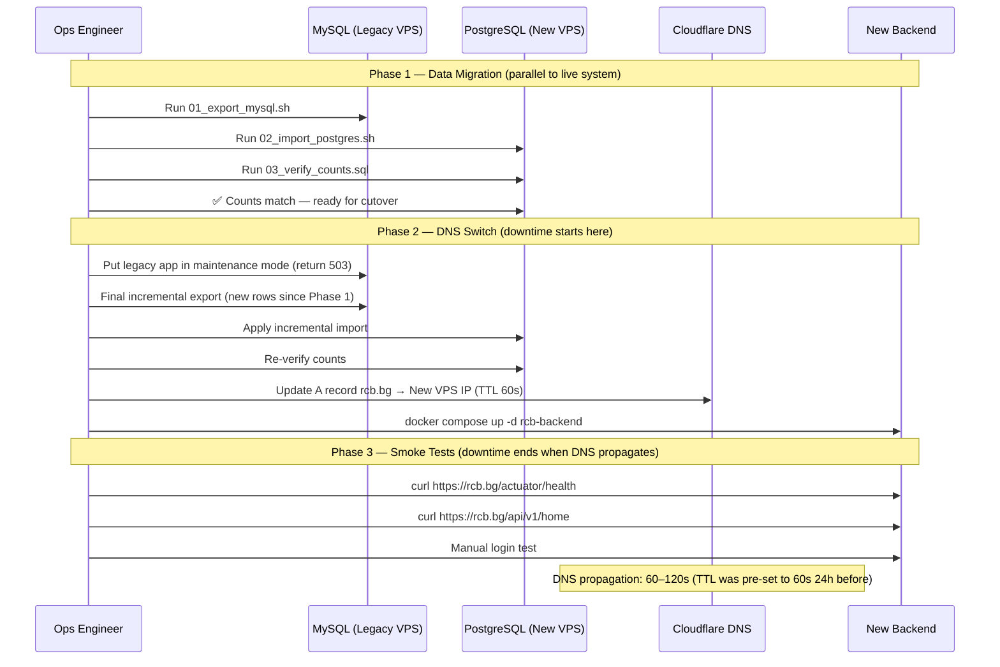

# MySQL → PostgreSQL Migration & Cutover Plan

:::danger Critical Operational Document
This runbook must work at 3am. Read it fully before the maintenance window. Have a second engineer on call to execute rollback if needed. Every command in this document has been tested against the staging environment. **Do not improvise.**
:::

---

## Overview

The RCB platform is migrating from MySQL (legacy) to PostgreSQL 16 (rewrite target). The migration involves:

1. Exporting data from MySQL with type transformations
2. Importing into PostgreSQL using `pgloader`
3. Verifying row counts and spot-checking data integrity
4. DNS cutover from old to new system
5. Monitoring for 24 hours post-cutover

Estimated maintenance window: **30–60 minutes** (data migration can run in parallel; downtime is only DNS cutover + smoke tests).

---

## Pre-Migration Checklist

Complete every item before the maintenance window begins:

```
Infrastructure
[ ] PostgreSQL 16 is running and accepting connections
[ ] pgloader is installed on the migration server: pgloader --version
[ ] MySQL source database is accessible from migration server
[ ] PostgreSQL target database has been created: rcb_db
[ ] All Liquibase migrations have run on PostgreSQL (schema is ready — data only)
[ ] VPS disk has enough space: at minimum 3× the MySQL data size

Backups
[ ] Full MySQL dump taken within the last 6 hours
[ ] PostgreSQL point-in-time recovery (PITR) is enabled
[ ] Backup verified: restore test completed on staging this week

Application
[ ] Backend Docker image is built with PostgreSQL JDBC driver
[ ] application.yaml points to PostgreSQL (not MySQL)
[ ] Keycloak has been migrated to PostgreSQL (separate migration — done earlier)

Monitoring
[ ] Grafana dashboard is open and showing both old and new DB metrics
[ ] Slack #rcb-alerts webhook is working (send a test message)
[ ] PagerDuty / on-call is set for the maintenance window

Team
[ ] Engineer 1 (executor): responsible for running commands in this runbook
[ ] Engineer 2 (verifier): responsible for running verification queries and monitoring
[ ] Rollback decision maker identified (can authorize DNS rollback independently)
[ ] Maintenance window announced to club admins (Slack #rcb-team)
```

---

## Migration Scripts

### Script 01 — Export MySQL

**File:** `scripts/migration/01_export_mysql.sh`

```bash
#!/bin/bash
set -euo pipefail

MYSQL_HOST="${MYSQL_HOST:-localhost}"
MYSQL_PORT="${MYSQL_PORT:-3306}"
MYSQL_USER="${MYSQL_USER:-root}"
MYSQL_DB="${MYSQL_DB:-rcb_legacy}"
EXPORT_DIR="/tmp/rcb-migration"
TIMESTAMP=$(date +%Y%m%d_%H%M%S)

echo "[$(date)] Starting MySQL export..."
mkdir -p "${EXPORT_DIR}"

# Full dump with no-create-db (schema already in PostgreSQL via Liquibase)
mysqldump \
  --host="${MYSQL_HOST}" \
  --port="${MYSQL_PORT}" \
  --user="${MYSQL_USER}" \
  --password="${MYSQL_PASSWORD}" \
  --no-create-info \
  --skip-triggers \
  --skip-add-locks \
  --default-character-set=utf8mb4 \
  "${MYSQL_DB}" \
  > "${EXPORT_DIR}/rcb_legacy_${TIMESTAMP}.sql"

echo "[$(date)] Raw dump size: $(du -sh ${EXPORT_DIR}/rcb_legacy_${TIMESTAMP}.sql)"

# Transformations:
# 1. Backtick identifiers → double-quote (MySQL → ANSI SQL)
# 2. TINYINT(1) values → TRUE/FALSE (MySQL BOOLEAN workaround)
# 3. NULL datetime → NULL (MySQL '0000-00-00' → NULL)
sed -i \
  -e "s/\`/\"/g" \
  -e "s/,1,/,TRUE,/g" \
  -e "s/,0,/,FALSE,/g" \
  -e "s/'0000-00-00 00:00:00'/NULL/g" \
  -e "s/'0000-00-00'/NULL/g" \
  "${EXPORT_DIR}/rcb_legacy_${TIMESTAMP}.sql"

echo "[$(date)] Transformed dump: ${EXPORT_DIR}/rcb_legacy_${TIMESTAMP}.sql"
echo "[$(date)] Export complete."
```

Run:

```bash
MYSQL_PASSWORD=secret bash scripts/migration/01_export_mysql.sh
```

### Script 02 — Import to PostgreSQL with pgloader

**File:** `scripts/migration/02_import_postgres.sh`

pgloader handles type coercions automatically. The configuration file maps MySQL types to PostgreSQL:

```bash
#!/bin/bash
set -euo pipefail

PG_HOST="${PG_HOST:-localhost}"
PG_PORT="${PG_PORT:-5432}"
PG_USER="${PG_USER:-rcb_user}"
PG_DB="${PG_DB:-rcb_db}"

# pgloader configuration file
cat > /tmp/rcb-pgloader.load << 'EOF'
LOAD DATABASE
  FROM mysql://root:${MYSQL_PASSWORD}@${MYSQL_HOST}:3306/${MYSQL_DB}
  INTO postgresql://${PG_USER}:${PG_PASSWORD}@${PG_HOST}:${PG_PORT}/${PG_DB}

WITH include drop,
     create tables,
     create indexes,
     reset sequences,
     foreign keys

CAST
  -- MySQL VARCHAR to PostgreSQL UUID where column name ends in _id or = id
  column id                TYPE uuid    USING (uuid-or-null field-value),
  column user_id           TYPE uuid    USING (uuid-or-null field-value),
  column event_id          TYPE uuid    USING (uuid-or-null field-value),
  column news_id           TYPE uuid    USING (uuid-or-null field-value),
  -- MySQL TINYINT(1) → PostgreSQL BOOLEAN
  type tinyint             to boolean   USING tinyint-to-boolean,
  -- MySQL DATETIME → PostgreSQL TIMESTAMP WITH TIME ZONE
  type datetime            to timestamp with time zone,
  -- MySQL TEXT / LONGTEXT → PostgreSQL TEXT
  type longtext            to text,
  type mediumtext          to text

SET PostgreSQL PARAMETERS
  maintenance_work_mem to '512MB',
  work_mem to '128MB'
;
EOF

echo "[$(date)] Starting pgloader import..."
pgloader /tmp/rcb-pgloader.load
echo "[$(date)] Import complete."
```

### Script 03 — Verify Row Counts

**File:** `scripts/migration/03_verify_counts.sql`

Run this against BOTH MySQL and PostgreSQL and compare the output:

```sql
-- Run this on MySQL first, then on PostgreSQL
-- Output should match exactly

SELECT 'users'           AS table_name, COUNT(*) AS row_count FROM users
UNION ALL
SELECT 'events',                        COUNT(*)              FROM events
UNION ALL
SELECT 'event_applications',            COUNT(*)              FROM event_applications
UNION ALL
SELECT 'news',                          COUNT(*)              FROM news
UNION ALL
SELECT 'galleries',                     COUNT(*)              FROM galleries
UNION ALL
SELECT 'gallery_photos',                COUNT(*)              FROM gallery_photos
UNION ALL
SELECT 'club_partners',                 COUNT(*)              FROM club_partners
UNION ALL
SELECT 'advertisements',                COUNT(*)              FROM advertisements
UNION ALL
SELECT 'campaigns',                     COUNT(*)              FROM campaigns
UNION ALL
SELECT 'campaign_sponsors',             COUNT(*)              FROM campaign_sponsors
UNION ALL
SELECT 'club_products',                 COUNT(*)              FROM club_products
UNION ALL
SELECT 'user_cars',                     COUNT(*)              FROM user_cars
UNION ALL
SELECT 'comments',                      COUNT(*)              FROM comments
ORDER BY table_name;
```

Compare MySQL vs PostgreSQL counts:

```bash
# MySQL
mysql -h "${MYSQL_HOST}" -u root -p"${MYSQL_PASSWORD}" "${MYSQL_DB}" \
  < scripts/migration/03_verify_counts.sql > /tmp/counts_mysql.txt

# PostgreSQL
psql -h "${PG_HOST}" -U "${PG_USER}" -d "${PG_DB}" \
  -f scripts/migration/03_verify_counts.sql > /tmp/counts_postgres.txt

# Compare
diff /tmp/counts_mysql.txt /tmp/counts_postgres.txt
# Expected: no output (files are identical)
```

**If counts differ:** Do NOT proceed. Investigate which tables are missing rows. Common causes: foreign key violations during pgloader import (check pgloader logs), encoding issues (check for invalid UTF-8 characters in MySQL).

### Script 04 — Anonymize Staging Data

**File:** `scripts/migration/04_anonymize_staging.sql`

:::danger ONLY FOR STAGING
This script irreversibly overwrites personal data. NEVER run it against the production database.
:::

```sql
-- Anonymize user personal data for staging environment
-- Run ONLY on staging PostgreSQL database

BEGIN;

-- Pseudonymize email addresses
UPDATE users
SET
  email       = 'user-' || id || '@staging.local',
  first_name  = 'TestUser',
  last_name   = id::text
WHERE deleted_at IS NULL
  AND email NOT LIKE '%@rcb.bg';   -- preserve admin accounts

-- Remove real content from user-generated fields
UPDATE news
SET content = 'Lorem ipsum — staging data placeholder.'
WHERE id IS NOT NULL;

UPDATE comments
SET content = 'Staging comment placeholder.'
WHERE deleted_at IS NULL;

-- Clear sensitive profile data
UPDATE users
SET
  phone_number = NULL,
  birth_date   = NULL
WHERE id IS NOT NULL;

COMMIT;

SELECT 'Anonymization complete. Row count:' AS status, COUNT(*) FROM users;
```

---

## Type Mapping Reference

| MySQL Type | PostgreSQL Type | pgloader Handling |
|-----------|-----------------|-------------------|
| `VARCHAR(255)` | `VARCHAR(255)` | Direct mapping |
| `VARCHAR(36)` (UUID) | `UUID` | Cast via `uuid-or-null` |
| `TINYINT(1)` | `BOOLEAN` | Cast via `tinyint-to-boolean` |
| `TINYINT` (non-boolean) | `SMALLINT` | Direct mapping |
| `INT` | `INTEGER` | Direct mapping |
| `BIGINT` | `BIGINT` | Direct mapping |
| `DATETIME` | `TIMESTAMP WITH TIME ZONE` | Cast + UTC assumption |
| `TIMESTAMP` | `TIMESTAMP WITH TIME ZONE` | Cast + UTC assumption |
| `DATE` | `DATE` | Direct mapping |
| `TEXT` / `LONGTEXT` | `TEXT` | Direct mapping |
| `JSON` | `JSONB` | pgloader JSON cast |
| `DECIMAL(p,s)` | `NUMERIC(p,s)` | Direct mapping |
| `DOUBLE` | `DOUBLE PRECISION` | Direct mapping |
| `ENUM(...)` | `VARCHAR(50)` | Values preserved as strings |

---

## Zero-Downtime Cutover Procedure

The cutover uses a three-phase approach to minimize downtime to under 60 seconds:



### Phase 1 — Data Migration (Run in Advance)

Run 24–48 hours before the maintenance window:

```bash
# 1. Lower DNS TTL to 60s (do this 24 hours before cutover)
# Cloudflare Dashboard → DNS → rcb.bg A record → TTL: 1 min

# 2. Run initial data migration
MYSQL_PASSWORD=xxx bash scripts/migration/01_export_mysql.sh
bash scripts/migration/02_import_postgres.sh
psql -h localhost -U rcb_user -d rcb_db -f scripts/migration/03_verify_counts.sql

# 3. Verify the new backend starts correctly against PostgreSQL
docker run --env-file .env.new ghcr.io/ivelin1936/rcb-backend:sha-XXXXXXX
curl http://localhost:8080/actuator/health
```

### Phase 2 — Cutover Window (Maintenance Window Start)

```bash
# T-00:00 — Enable maintenance mode on legacy app
# (nginx returns 503 with maintenance HTML)
ssh legacy-vps "sudo nginx -s reload -c /etc/nginx/maintenance.conf"

# T-00:01 — Final incremental export (rows added since Phase 1)
MYSQL_PASSWORD=xxx bash scripts/migration/01_export_mysql.sh --incremental

# T-00:03 — Apply incremental import
bash scripts/migration/02_import_postgres.sh --incremental

# T-00:05 — Final count verification
diff <(mysql counts) <(pg counts)
# Must show no difference

# T-00:06 — Switch DNS to new VPS
# Cloudflare Dashboard → DNS → rcb.bg A record → New VPS IP
# Or via CLI:
curl -X PUT "https://api.cloudflare.com/client/v4/zones/${CF_ZONE_ID}/dns_records/${CF_RECORD_ID}" \
  -H "Authorization: Bearer ${CF_API_TOKEN}" \
  -H "Content-Type: application/json" \
  --data '{"type":"A","name":"rcb.bg","content":"NEW_VPS_IP","ttl":60}'

# T-00:07 — Start new backend
ssh new-vps "cd /opt/rcb && docker compose up -d rcb-backend"
```

### Phase 3 — Smoke Tests

```bash
# Wait for DNS to propagate (TTL is 60s)
watch -n 5 "dig +short rcb.bg"

# Run smoke tests as soon as DNS resolves to new IP
curl -sf https://rcb.bg/actuator/health | jq .status
# Expected: "UP"

curl -sf https://rcb.bg/api/v1/home | jq .latestNews | head -5
# Expected: news items

curl -sf https://rcb.bg/api/v1/events | jq '.content | length'
# Expected: > 0

# Manual tests
# [ ] Login with a real club member account
# [ ] View an event detail
# [ ] View a news article
# [ ] Verify Grafana shows metrics from the new backend
```

---

## Rollback Procedure

If smoke tests fail or critical errors appear within 60 minutes of cutover:

```bash
# STEP 1 — Switch DNS back to legacy VPS (< 60 seconds)
curl -X PUT "https://api.cloudflare.com/client/v4/zones/${CF_ZONE_ID}/dns_records/${CF_RECORD_ID}" \
  -H "Authorization: Bearer ${CF_API_TOKEN}" \
  -H "Content-Type: application/json" \
  --data '{"type":"A","name":"rcb.bg","content":"LEGACY_VPS_IP","ttl":60}'

# STEP 2 — Disable maintenance mode on legacy
ssh legacy-vps "sudo nginx -s reload -c /etc/nginx/nginx.conf"

# STEP 3 — Verify legacy is serving traffic
curl -sf https://rcb.bg/actuator/health | jq .status
# Expected: "UP" (from legacy system)

# STEP 4 — Log the incident
echo "[$(date)] Rollback executed. Reason: " >> /opt/rcb/deploy.log

# STEP 5 — Notify team
# Post in #rcb-alerts: "Rollback executed. rcb.bg is back on MySQL."
```

:::tip DNS Rollback is Instant
Because DNS TTL was pre-set to 60 seconds 24 hours before cutover, DNS propagation after rollback is also ~60 seconds. Keep the `LEGACY_VPS_IP` and `CF_RECORD_ID` ready in a separate terminal window before starting Phase 2.
:::

---

## Post-Cutover Tasks (30-Day Period)

| Timeline | Task |
|----------|------|
| Day 0 | Monitor Grafana for error spikes (query latency, 5xx rates) for 24 hours |
| Day 1 | Verify all background jobs ran successfully (scheduler logs) |
| Day 3 | Compare daily active user counts with pre-migration baseline |
| Day 7 | Run full OWASP dependency check and ZAP scan against production |
| Day 14 | Confirm Liquibase migration checksums are consistent: `./mvnw liquibase:validate` |
| Day 30 | Decommission legacy MySQL server after data is confirmed stable |
| Day 30 | Remove `01_export_mysql.sh` and `02_import_postgres.sh` from active use |

---

## Frequently Asked Questions

**Q: Can we do a dry run of the migration?**
Yes — use the staging environment. Run all four scripts against a copy of production MySQL data into the staging PostgreSQL instance. This is the recommended approach.

**Q: What if pgloader fails partway through?**
pgloader is idempotent for `LOAD DATABASE` commands — re-running it will clean up partially imported tables and restart. Check pgloader output for error counts before proceeding.

**Q: What about Keycloak's database?**
Keycloak uses its own PostgreSQL database (`keycloak_db`). It was migrated separately and is not part of this runbook.

**Q: What about the Ghost CMS database?**
Ghost still uses MySQL. It is not being migrated in Story 018.

---

## References

- [pgloader Documentation](https://pgloader.readthedocs.io/)
- [Cloudflare DNS API](https://developers.cloudflare.com/api/operations/dns-records-for-a-zone-update-dns-record)
- [PostgreSQL 16 Migration Guide](https://www.postgresql.org/docs/16/migration.html)
- [Liquibase Validate Command](https://docs.liquibase.com/commands/utility/validate.html)
