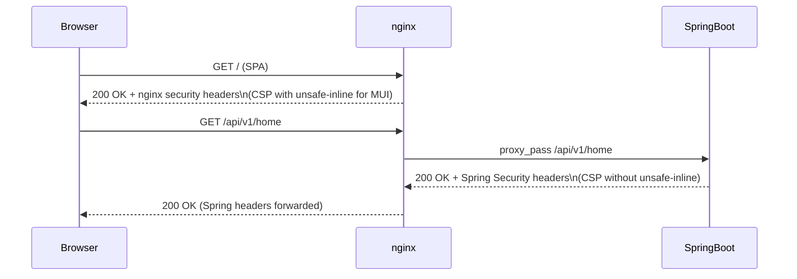

# Security Headers Reference

The RCB platform sets HTTP security headers at two distinct layers: the **Spring Security filter chain** (for all `/api/**` responses) and **nginx** (for the React SPA and static assets). Each layer is tuned independently because their content requirements differ — the SPA needs `unsafe-inline` for MUI's emotion CSS engine while the API never serves inline scripts.

---

## Layer 1 — Spring Security (API Responses)

All API responses from the Spring Boot backend include the following headers, configured via the `.headers()` chain in `SecurityConfig.java`.

### Full Headers Configuration

```java
http.headers(headers -> headers
    .contentSecurityPolicy(csp -> csp
        .policyDirectives(
            "default-src 'self'; " +
            "img-src 'self' res.cloudinary.com data: blob:; " +
            "script-src 'self'; " +
            "style-src 'self' 'unsafe-inline'; " +
            "font-src 'self' data:; " +
            "connect-src 'self'; " +
            "frame-ancestors 'none';"
        )
    )
    .frameOptions(frame -> frame.deny())
    .contentTypeOptions(Customizer.withDefaults())
    .httpStrictTransportSecurity(hsts -> hsts
        .maxAgeInSeconds(31536000)
        .includeSubDomains(true)
    )
    .referrerPolicy(referrer -> referrer
        .policy(ReferrerPolicyHeaderWriter.ReferrerPolicy.STRICT_ORIGIN_WHEN_CROSS_ORIGIN)
    )
    .permissionsPolicy(permissions -> permissions
        .policy("camera=(), microphone=(), geolocation=(self), payment=(), usb=(), fullscreen=(self)")
    )
);
```

### Header Values and Rationale

| Header | Value | OWASP Category | Purpose |
|--------|-------|----------------|---------|
| `Content-Security-Policy` | `default-src 'self'; img-src 'self' res.cloudinary.com data: blob:; script-src 'self'; style-src 'self' 'unsafe-inline'; font-src 'self' data:; connect-src 'self'; frame-ancestors 'none';` | A05 Security Misconfiguration | Restricts resource loading to trusted origins; `frame-ancestors 'none'` prevents clickjacking |
| `X-Frame-Options` | `DENY` | A05 Security Misconfiguration | Legacy clickjacking prevention for older browsers that do not support CSP `frame-ancestors` |
| `X-Content-Type-Options` | `nosniff` | A05 Security Misconfiguration | Prevents browsers from MIME-sniffing responses away from the declared Content-Type |
| `Strict-Transport-Security` | `max-age=31536000; includeSubDomains` | A02 Cryptographic Failures | Forces HTTPS for 1 year on all subdomains; prevents SSL stripping attacks |
| `Referrer-Policy` | `strict-origin-when-cross-origin` | A05 Security Misconfiguration | Sends full path only for same-origin requests; only the origin for cross-origin; nothing for downgrade |
| `Permissions-Policy` | `camera=(), microphone=(), geolocation=(self), payment=(), usb=(), fullscreen=(self)` | A05 Security Misconfiguration | Disables unused browser APIs (camera, mic, NFC, payment) at the browser level |

---

## Layer 2 — nginx (SPA and Static Responses)

The `nginx.conf` in the `rcb-frontend` container sets a separate `add_header` block for all responses from the React application and static files.

### nginx Security Headers Block

```nginx
# Security headers
add_header X-Content-Type-Options    "nosniff"                              always;
add_header X-Frame-Options           "DENY"                                 always;
add_header Referrer-Policy           "strict-origin-when-cross-origin"      always;
add_header Permissions-Policy        "camera=(), microphone=(), geolocation=(self), payment=(), usb=(), fullscreen=(self)" always;
add_header Content-Security-Policy
    "default-src 'self'; "
    "script-src 'self' 'unsafe-inline'; "
    "style-src 'self' 'unsafe-inline'; "
    "img-src 'self' res.cloudinary.com data: blob:; "
    "font-src 'self' data:; "
    "connect-src 'self' https://auth.rcb.bg; "
    "frame-ancestors 'none';"
    always;
```

### Why nginx CSP Differs from the API CSP

| Directive | API (Spring Security) | SPA (nginx) | Reason for Difference |
|-----------|----------------------|-------------|----------------------|
| `script-src` | `'self'` | `'self' 'unsafe-inline'` | React is server-rendered as static JS bundles; no inline scripts needed. **However**, some build tool polyfills and MUI may inject inline event handlers in older setups. Evaluate removing `unsafe-inline` after full Vite migration. |
| `style-src` | `'self' 'unsafe-inline'` | `'self' 'unsafe-inline'` | **MUI requires `unsafe-inline`** — emotion CSS-in-JS injects `<style>` tags at runtime. See [Tightening CSP for MUI](#tightening-csp-for-mui-with-nonces). |
| `connect-src` | `'self'` | `'self' https://auth.rcb.bg` | The SPA makes XHR/fetch calls to Keycloak for token refresh. The API never calls Keycloak from the browser. |

---

## Request / Response Flow



:::note Header Precedence
nginx does not override Spring Security headers for API routes — it only `proxy_pass` them through. Spring Security headers take precedence for all `/api/**` responses. nginx only adds its own headers for non-proxied responses (SPA HTML, static JS/CSS/images).
:::

---

## Verifying Headers in Production

### Quick Check — All Security Headers

```bash
curl -sI https://rcb.bg/api/v1/home \
  | grep -iE "x-frame|content-security|x-content-type|strict-transport|referrer|permissions"
```

Expected output (trimmed):

```
content-security-policy: default-src 'self'; img-src 'self' res.cloudinary.com data: blob:; ...
x-frame-options: DENY
x-content-type-options: nosniff
strict-transport-security: max-age=31536000; includeSubDomains
referrer-policy: strict-origin-when-cross-origin
permissions-policy: camera=(), microphone=(), geolocation=(self), payment=(), usb=(), fullscreen=(self)
```

### Check SPA Headers

```bash
curl -sI https://rcb.bg/ \
  | grep -iE "x-frame|content-security|x-content-type|referrer|permissions"
```

### Automated Security Headers Check (CI)

The weekly `security-scan.yml` includes a `security-headers` job that runs the `curl` check and fails the workflow if any required header is missing. See [Weekly Security Scan](./weekly-security-scan).

---

## OWASP References

The following OWASP Top 10 (2021) categories are addressed by these headers:

| OWASP Category | Headers That Address It |
|----------------|------------------------|
| **A02 — Cryptographic Failures** | `Strict-Transport-Security` (forces HTTPS) |
| **A05 — Security Misconfiguration** | All headers — CSP, X-Frame-Options, X-Content-Type-Options, Referrer-Policy, Permissions-Policy |
| **A07 — Identification and Authentication Failures** | `frame-ancestors 'none'` (prevents clickjacking on login form) |

---

## Tightening CSP for MUI with Nonces

Currently `style-src 'unsafe-inline'` is required because MUI's emotion library injects styles at runtime. This is the most common XSS mitigation gap in React applications using CSS-in-JS.

**Future hardening path:**

1. Configure emotion to use a `nonce` attribute: [MUI CSP Guide](https://mui.com/material-ui/guides/content-security-policy/)
2. Generate a per-request nonce in Spring Boot and pass it as a response header
3. Configure nginx to forward the nonce to the React app via a `meta` tag injection or SSR
4. Replace `'unsafe-inline'` with `'nonce-<value>'` in the CSP `style-src` directive

This is tracked as a future hardening task — it requires coordination between FE (emotion config) and BE (nonce generation middleware).

---

## References

- [OWASP Secure Headers Project](https://owasp.org/www-project-secure-headers/)
- [MDN Content Security Policy](https://developer.mozilla.org/en-US/docs/Web/HTTP/CSP)
- [MDN Strict-Transport-Security](https://developer.mozilla.org/en-US/docs/Web/HTTP/Headers/Strict-Transport-Security)
- [Spring Security HTTP Headers](https://docs.spring.io/spring-security/reference/servlet/exploits/headers.html)
- [MUI Content Security Policy](https://mui.com/material-ui/guides/content-security-policy/)
