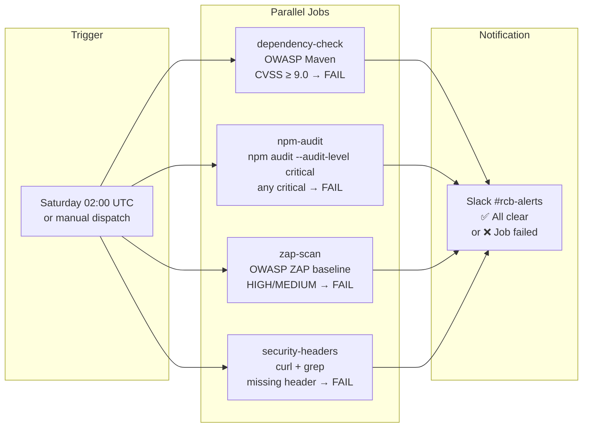

# Weekly Security Scan CI Workflow

The RCB platform runs a comprehensive security scan every Saturday at 02:00 UTC. This automated workflow catches newly disclosed CVEs in dependencies, verifies security headers are present, and runs a DAST scan against the staging environment.

**Workflow file:** `.github/workflows/security-scan.yml` (in the BE repository)

---

## Schedule and Trigger

```yaml
on:
  schedule:
    - cron: '0 2 * * 6'   # Every Saturday at 02:00 UTC
  workflow_dispatch:
    inputs:
      target_url:
        description: 'Target URL for ZAP scan and header check'
        required: false
        default: 'https://staging.rcb.bg'
```

The workflow can also be triggered manually via the GitHub Actions UI or CLI:

```bash
# Default (staging)
gh workflow run security-scan.yml

# Custom target
gh workflow run security-scan.yml --field target_url=https://staging.rcb.bg
```

---

## Workflow Overview

The workflow runs 4 jobs in parallel — all 4 must pass for the workflow to succeed:



---

## Job Details

### Job 1 — `dependency-check`

Runs the OWASP Dependency Check Maven plugin against the backend codebase.

```yaml
dependency-check:
  runs-on: ubuntu-latest
  steps:
    - uses: actions/checkout@v4

    - uses: actions/setup-java@v4
      with:
        java-version: '21'
        distribution: 'temurin'
        cache: maven

    - name: Cache NVD database
      uses: actions/cache@v4
      with:
        path: ~/.m2/repository/org/owasp/dependency-check-data
        key: nvd-${{ runner.os }}-${{ hashFiles('pom.xml') }}
        restore-keys: nvd-${{ runner.os }}-

    - name: Run OWASP Dependency Check
      run: ./mvnw dependency-check:aggregate -Powasp -DskipTests
      env:
        NVD_API_KEY: ${{ secrets.NVD_API_KEY }}

    - name: Upload report
      if: always()
      uses: actions/upload-artifact@v4
      with:
        name: dependency-check-report
        path: target/dependency-check-reports/
        retention-days: 30
```

**Pass / Fail:** Fails if any dependency has a CVSS score ≥ 9.0 (CRITICAL). See [OWASP Dependency Check](./owasp-dependency-check) for the full configuration.

| Outcome | Trigger |
|---------|---------|
| FAIL | Any CRITICAL CVE (CVSS ≥ 9.0) in production dependencies |
| PASS | No CRITICAL CVEs, or all flagged CVEs have suppressions |

---

### Job 2 — `npm-audit`

Runs `npm audit` against the frontend dependencies.

```yaml
npm-audit:
  runs-on: ubuntu-latest
  steps:
    - uses: actions/checkout@v4
      with:
        repository: ivelin1936/renault-club-bulgaria-fe

    - uses: actions/setup-node@v4
      with:
        node-version: '20'
        cache: 'npm'

    - run: npm ci --prefer-offline

    - name: Run npm audit
      run: npm audit --audit-level critical --json > npm-audit-report.json || true

    - name: Check for critical vulnerabilities
      run: |
        CRITICAL=$(jq '.metadata.vulnerabilities.critical' npm-audit-report.json)
        if [ "$CRITICAL" -gt 0 ]; then
          echo "❌ Found $CRITICAL critical npm vulnerabilities"
          npm audit --audit-level critical
          exit 1
        fi
        echo "✅ No critical npm vulnerabilities"

    - name: Upload npm audit report
      if: always()
      uses: actions/upload-artifact@v4
      with:
        name: npm-audit-report
        path: npm-audit-report.json
        retention-days: 30
```

**Pass / Fail:** Fails if `npm audit` finds any `critical` severity vulnerabilities.

| Outcome | Trigger |
|---------|---------|
| FAIL | Any `critical` vulnerability in npm dependencies |
| PASS | No `critical` vulnerabilities (high/medium/low are warnings only) |

---

### Job 3 — `zap-scan`

Runs the OWASP ZAP baseline scan against the target URL.

```yaml
zap-scan:
  runs-on: ubuntu-latest
  steps:
    - uses: actions/checkout@v4

    - name: Run ZAP baseline scan
      uses: zaproxy/action-baseline@v0.12.0
      with:
        target: ${{ github.event.inputs.target_url || 'https://staging.rcb.bg' }}
        rules_file_name: '.zap/rules.tsv'
        cmd_options: '-I'
        artifact_name: 'zap-report'
        allow_issue_writing: false

    - name: Upload ZAP report
      if: always()
      uses: actions/upload-artifact@v4
      with:
        name: zap-report
        path: zap-report.html
        retention-days: 30
```

**Pass / Fail:** Fails if ZAP finds any alerts configured as `FAIL` in `.zap/rules.tsv`. Alerts configured as `WARN` produce warnings but do not fail the job.

See [OWASP ZAP Scan](./zap-scan) for the full alert severity guide and suppression configuration.

---

### Job 4 — `security-headers`

Verifies that all required security headers are present on API responses.

```yaml
security-headers:
  runs-on: ubuntu-latest
  steps:
    - name: Check security headers
      run: |
        TARGET="${{ github.event.inputs.target_url || 'https://staging.rcb.bg' }}"
        HEADERS=$(curl -sI "${TARGET}/api/v1/home")

        check_header() {
          local header=$1
          if echo "$HEADERS" | grep -qi "$header"; then
            echo "✅ $header present"
          else
            echo "❌ $header MISSING"
            FAILED=1
          fi
        }

        FAILED=0
        check_header "x-frame-options"
        check_header "content-security-policy"
        check_header "x-content-type-options"
        check_header "strict-transport-security"
        check_header "referrer-policy"
        check_header "permissions-policy"

        if [ "$FAILED" -eq 1 ]; then
          echo "❌ Security header check failed"
          exit 1
        fi
        echo "✅ All security headers present"
```

**Pass / Fail:** Fails if any of the 6 required headers is missing from the response.

| Required Header | Expected Value |
|-----------------|---------------|
| `X-Frame-Options` | `DENY` |
| `Content-Security-Policy` | must be present (value not checked) |
| `X-Content-Type-Options` | `nosniff` |
| `Strict-Transport-Security` | must include `max-age` |
| `Referrer-Policy` | must be present |
| `Permissions-Policy` | must be present |

---

## NVD Database Cache

The OWASP Dependency Check downloads the NVD vulnerability database on first run. This is ~200 MB and would take several minutes on every workflow run.

The workflow caches the NVD database under `~/.m2/repository/org/owasp/dependency-check-data`. Cache invalidation is tied to the `pom.xml` hash:

```yaml
- name: Cache NVD database
  uses: actions/cache@v4
  with:
    path: ~/.m2/repository/org/owasp/dependency-check-data
    key: nvd-${{ runner.os }}-${{ hashFiles('pom.xml') }}
    restore-keys: nvd-${{ runner.os }}-
```

The cache typically reduces the NVD update step from 3–5 minutes to under 30 seconds.

:::info NVD_API_KEY Secret
Add `NVD_API_KEY` to GitHub Actions secrets in the BE repository. Without it, NVD downloads are rate-limited, which can cause the dependency-check job to time out. See [OWASP Dependency Check — NVD API Key Setup](./owasp-dependency-check#nvd-api-key-setup).
:::

---

## Notifications

When any job fails, GitHub Actions sends a notification to the repository's **Security** tab and triggers a Slack notification via the existing `SLACK_WEBHOOK_URL` secret:

```yaml
notify-slack:
  needs: [dependency-check, npm-audit, zap-scan, security-headers]
  if: always()
  runs-on: ubuntu-latest
  steps:
    - name: Notify Slack on failure
      if: contains(needs.*.result, 'failure')
      uses: slackapi/slack-github-action@v2.0.0
      with:
        webhook: ${{ secrets.SLACK_WEBHOOK_URL }}
        webhook-type: incoming-webhook
        payload: |
          {
            "text": "❌ *RCB Weekly Security Scan FAILED*\n• Repository: `${{ github.repository }}`\n• Run: <${{ github.server_url }}/${{ github.repository }}/actions/runs/${{ github.run_id }}|View Details>"
          }

    - name: Notify Slack on success
      if: "!contains(needs.*.result, 'failure')"
      uses: slackapi/slack-github-action@v2.0.0
      with:
        webhook: ${{ secrets.SLACK_WEBHOOK_URL }}
        webhook-type: incoming-webhook
        payload: |
          {
            "text": "✅ *RCB Weekly Security Scan passed* — no critical issues found."
          }
```

Notifications are sent to `#rcb-alerts` (configured via `SLACK_WEBHOOK_URL` secret).

---

## Required GitHub Secrets

The following secrets must be set in the BE repository (`ivelin1936/Renault-Club-Bulgaria`):

| Secret | Required By | Description |
|--------|-------------|-------------|
| `SLACK_WEBHOOK_URL` | All jobs (notify step) | Slack incoming webhook for #rcb-alerts |
| `NVD_API_KEY` | `dependency-check` | NVD API key for faster database updates (optional but recommended) |

---

## Interpreting Workflow Results

### Viewing Artifacts

After each workflow run, HTML reports are uploaded as artifacts:

1. Navigate to: `Actions → security-scan → [run] → Artifacts`
2. Download:
   - `dependency-check-report` → open `dependency-check-report.html`
   - `zap-report` → open `zap-report.html`
   - `npm-audit-report` → view `npm-audit-report.json`

### When a Job Fails

| Failing Job | First Step |
|-------------|-----------|
| `dependency-check` | Download and open `dependency-check-report.html`. Find the CRITICAL CVEs. Check if a fixed version is available. See [OWASP Dependency Check](./owasp-dependency-check). |
| `npm-audit` | Run `npm audit` locally in the FE repo. Identify the critical packages. Run `npm audit fix` if a safe upgrade is available. |
| `zap-scan` | Download `zap-report.html`. Review HIGH/MEDIUM alerts. Determine if they are real vulnerabilities or false positives. See [OWASP ZAP Scan](./zap-scan). |
| `security-headers` | Run the header check manually: `curl -sI https://staging.rcb.bg/api/v1/home`. Identify which header is missing and check Spring Security config. |

---

## References

- [OWASP Dependency Check](./owasp-dependency-check)
- [OWASP ZAP Scan](./zap-scan)
- [Security Headers Reference](./security-headers)
- [GitHub Actions — Workflow Syntax](https://docs.github.com/en/actions/using-workflows/workflow-syntax-for-github-actions)
- [ZAP GitHub Action](https://github.com/zaproxy/action-baseline)
